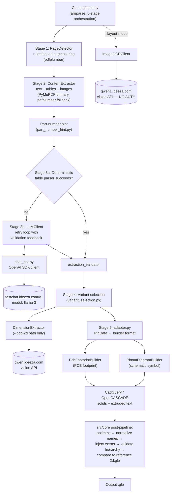
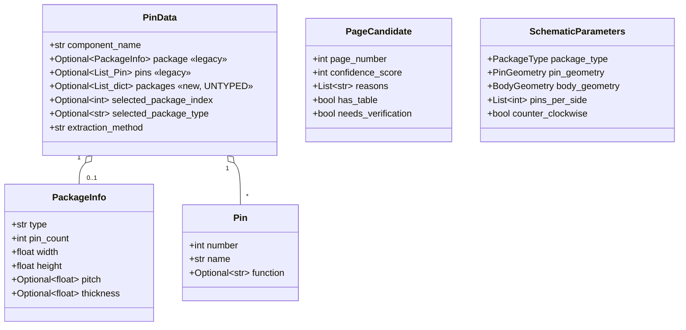
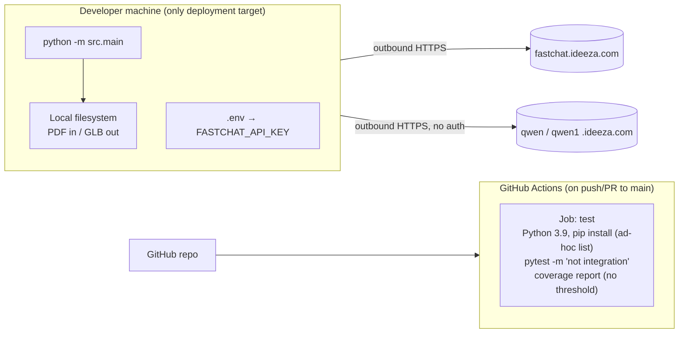
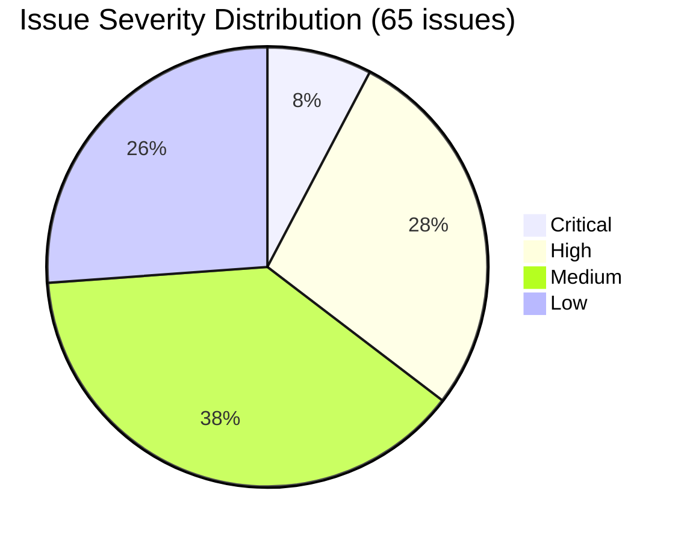
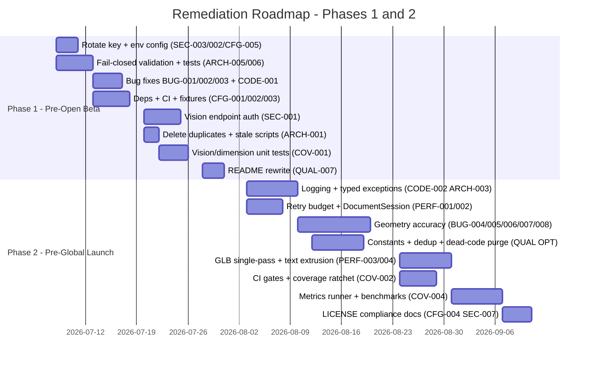

# Engineering Review — `datasheet-parser-new`

**Date of review:** 2026-07-07
**Reviewer:** Claude Code — AI Engineering Review
**Project phase:** Alpha Testing
**Scope:** Full repository — all source, configuration, CI, tests, and documentation

---

## Table of Contents

1. [Repository & Project Overview](#section-1--repository--project-overview)
2. [Architecture Overview](#section-2--architecture-overview)
3. [What Is Done Well](#section-3--what-is-done-well)
4. [Issue Analysis](#section-4--issue-analysis)
   - [4.1 Overall Issues](#41--overall-issues-cross-cutting--architectural)
   - [4.2 Optimization Issues](#42--optimization-issues)
   - [4.3 Security Issues](#43--security-issues)
   - [4.4 Standard Coding Practice Issues](#44--standard-coding-practice-issues)
   - [4.5 Quality & Maintainability Issues](#45--quality--maintainability-issues)
   - [4.6 Performance Issues](#46--performance-issues)
   - [4.7 Configuration & Dependency Issues](#47--configuration--dependency-issues)
   - [4.8 Coverage Issues](#48--coverage-issues)
   - [Issue Summary Table](#issue-summary-table)
5. [Performance Audit](#section-5--performance-audit)
6. [How to Solve Issues: Recommended Fix Precedence](#section-6--how-to-solve-issues-recommended-fix-precedence)
7. [Testing Setup & Recommendations](#section-7--testing-setup--recommendations)
8. [Recommended Remediation Roadmap](#section-8--recommended-remediation-roadmap)
9. [Additional Recommendations](#section-9--additional-recommendations)
10. [Executive Summary & Final Scorecard](#section-10--executive-summary--final-scorecard)

---

## Executive Summary (for the impatient reader)

`datasheet-parser-new` is a ~13,200-line Python CLI that converts electronic-component PDF datasheets into GLB 3D models (schematic symbols and PCB footprints). The core pipeline design is sound — a deterministic-first, LLM-fallback extraction strategy feeding a CadQuery/pygltflib geometry pipeline — and the consolidated test suite (`tests/test_suite.py`, 957 lines, with disciplined LLM mocking) is genuinely good for an alpha project. However, the project currently carries five critical defects: extraction validation **fails open** (invalid pin data flows silently into geometry generation, contradicting the project's own fail-closed spec); the `--api-key` CLI flag is **functionally dead** due to import-time client construction; a latent `NameError` in the vision-response parser; datasheet images are uploaded to an **unauthenticated** external vision endpoint; and a **clean clone cannot build or pass tests** because dependency declarations disagree across three files and a required test fixture (`2d.glb`) is gitignored. Repo hygiene debt is significant (a committed virtualenv, three parallel copies of the pipeline entry point, ~25 broken ad-hoc test scripts, a 2.1 GB working tree). None of this is fatal — the fixes are mostly small and well-localized — but the critical items must land before any external beta exposure.

---

# SECTION 1 — Repository & Project Overview

## 1.1 Purpose

The tool reads a PDF datasheet for an electronic component (e.g., NE555, ATmega328P, L293D), identifies the pages that contain pinout information, extracts pin numbers/names/functions and package mechanical data, and generates:

- **Schematic symbols** (`PinoutDiagramBuilder`) — circuit-diagram symbols as GLB with extruded 3D text.
- **PCB footprints** (`PcbFootprintBuilder`) — manufacturing layouts with copper pads, solder mask, drill holes, fab/silk/courtyard layers, and viewer-interactivity metadata injected as GLTF `extras`.

## 1.2 Tech Stack

| Layer | Technology | Notes |
|---|---|---|
| Language | Python (≥3.8 claimed; venvs and CI use 3.9) | `pyproject.toml:10`, `.github/workflows/ci.yml:19` |
| PDF text/tables | `pdfplumber`, `PyMuPDF` (fitz) | PyMuPDF primary table path, pdfplumber fallback |
| LLM (text) | FastChat endpoint via **OpenAI SDK** | `https://fastchat.ideeza.com/v1`, model `llama-3` (`src/chat_bot.py:17,29`) |
| LLM (vision/OCR) | Qwen HTTP endpoints via `requests` | `https://qwen1.ideeza.com/describe_image_llm` (`src/llm/image_ocr_client.py:54`), `https://qwen.ideeza.com/describe_image/` (`src/pdf_extractor/dimension_extractor.py:41`) |
| Geometry | CadQuery (OpenCASCADE kernel) | solids, extruded text, `cq.Assembly` |
| GLB post-processing | `pygltflib` | hierarchy optimization, node renaming, extras/material injection, validation |
| Config | `python-dotenv` (`.env` with `FASTCHAT_API_KEY`) | |
| Testing | pytest (+ `integration` marker), GitHub Actions CI | |
| Lint/format/type (configured, not enforced) | ruff, black, mypy | configured in `pyproject.toml:69-95`, absent from CI |

## 1.3 Annotated Directory Tree

```
datasheet-parser-new/                 (2.1 GB working tree; 185 git-tracked files)
├── src/                              # All production code (~13,200 LOC)
│   ├── main.py                       # Maintained CLI entry point; 5-stage pipeline (1,099 lines)
│   ├── main_layout.py                # STALE: older parallel CLI, duplicates main.py (508 lines)
│   ├── main.py.backup                # STALE: tracked backup of an older main (516 lines)
│   ├── chat_bot.py                   # LLM transport (OpenAI SDK → FastChat) + giant prompt builders
│   ├── exceptions.py                 # Exception hierarchy + ErrorCodes (partially unused)
│   ├── models/pin_data.py            # Pin / PackageInfo / PinData dataclasses (dual format)
│   ├── pdf_extractor/                # Page detection, content/table extraction, validation
│   │   ├── page_detector.py          # Rules-based page scorer (5 weighted signals)
│   │   ├── content_extractor.py      # Text/table/image extraction, LLM formatting
│   │   ├── deterministic_table_parser.py  # Rule-based pin-table parser (pre-LLM)
│   │   ├── dimension_extractor.py    # Vision-API mechanical dimension extraction
│   │   ├── extraction_validator.py   # Structural PinData validation + retry feedback
│   │   ├── pinout_filter.py          # Table/text relevance filtering
│   │   ├── part_number_hint.py       # Part-number inference from text/filename
│   │   ├── variant_selection.py      # Package-variant selection logic
│   │   ├── image_detector.py         # DEAD: 294 lines, imported nowhere
│   │   └── non_pin_features.py       # Thermal/exposed-pad rejection patterns
│   ├── llm/
│   │   ├── client.py                 # Pin-extraction orchestration + retry/validation loop
│   │   ├── image_ocr_client.py       # Vision/OCR HTTP client (unauthenticated endpoint)
│   │   └── page_verifier.py          # LLM yes/no page verification fallback
│   ├── schematic_generator/
│   │   ├── pinout_diagram_builder.py # Schematic symbol GLB builder (CadQuery)
│   │   ├── pcb_footprint_builder.py  # PCB footprint GLB builder (CadQuery)
│   │   ├── pin_layout.py             # Dual-row / quad / BGA / custom pin positioning
│   │   ├── adapter.py                # PinData → builder-format bridge
│   │   ├── schematic_builder.py      # 9-line backward-compat re-export shim
│   │   ├── pcb_2d_builder.py         # 9-line backward-compat re-export shim
│   │   └── schematic_builder.py.bak  # UNTRACKED, BROKEN old builder (references undefined vars)
│   ├── core/                         # pygltflib post-export pipeline
│   │   ├── glb_optimizer.py          # Collapses identity wrapper nodes
│   │   ├── pcb_footprint_hierarchy.py# Node renaming + spec validation
│   │   ├── pcb_footprint_extras.py   # GLTF extras/material injection (viewer metadata)
│   │   ├── reference_glb_hierarchy.py# Structural comparison against reference 2d.glb
│   │   └── clean_output.py           # Human-readable pin-data summary
│   ├── package_types/package_geometry.py  # 12 package types; geometry parameter factories (856 lines)
│   └── utils/package_detector.py     # Heuristic package-type detection/validation
├── tests/test_suite.py               # THE test suite: 957 lines, 17 sections, LLM fully mocked
├── test_scripts/                     # 25 ad-hoc __main__ scripts; several have broken imports; not collected
├── benchmarks/                       # manifest.json with 3 regression cases + README
├── docs/                             # 5 specs (variant selection, metrics, hierarchy, root-cause analyses)
├── pdfs/                             # ~50 committed datasheet PDFs (~98 MB) incl. pdfs/noTOC/ duplicates
├── pins/                             # Pin-data JSON fixtures
├── datasheet/                        # COMMITTED virtualenv (985 MB; 32 files tracked incl. bin/python)
├── chandra_env/                      # Untracked virtualenv (761 MB)
├── compare/, schematic_tests/, output/  # Untracked GLB output artifacts (~190 MB)
├── 2d.glb                            # Reference GLB — REQUIRED by tests but gitignored
├── *.glb / *.gltf / *.stl (root)     # ~15 loose untracked output artifacts
├── .github/workflows/ci.yml          # Single CI job: pytest unit tests + coverage report
├── pyproject.toml / requirements.txt # Mutually inconsistent dependency declarations
├── .env                              # Local secrets (FASTCHAT_API_KEY) — untracked, but present
└── README.md, plan.md, daily_log.md, MAIN_PY_UPDATES.md, VISION_API_INTEGRATION.md
```

## 1.4 Development Environment & Tooling

- **Entry point:** `python -m src.main <input.pdf> <output.glb>` with flags `--api-key`, `--model` (default `llama-3`), `--part-number`, `--min-confidence` (default 5), `--layout-mode`, `--pcb-2d`, `--both`, `--package-index`, `--verbose` (`src/main.py:907-1008`).
- **CI:** one GitHub Actions job (Python 3.9) running non-integration tests plus a coverage report with no threshold (`.github/workflows/ci.yml`). No lint, no type-check, no security scanning.
- **Local tooling:** ruff/black/mypy configured in `pyproject.toml` but not wired into CI or pre-commit. `setup_env.sh` sets `JAVA_HOME` for a Homebrew Apple-Silicon path only (legacy of the removed OpenDataLoader integration).

## 1.5 Current State Assessment

**Fully built and working:**
- The 5-stage pipeline in `src/main.py` (detection → extraction → deterministic-parse/LLM → variant selection → GLB build), including `--both` dual-output mode.
- Deterministic table parsing with LLM fallback and a validation-feedback retry loop.
- Both GLB builders with the full post-export pipeline (optimize → normalize → inject extras → validate against `docs/PCB_FOOTPRINT_HIERARCHY.md` → compare with reference).
- The consolidated test suite and a small benchmark manifest.

**Scaffolded / partially built:**
- `docs/EXTRACTION_METRICS_SPEC.md` defines an accuracy scorecard (pin-map F1 ≥ 0.95, noise leakage, etc.) — **no scoring runner exists**.
- Vision-based layout extraction exists in three divergent copies (`main.py:322`, `main_layout.py:114`, `main.py.backup:115`).
- BGA/custom pin layouts are explicitly "simplified" and drop or misorder pins (`src/schematic_generator/pin_layout.py:289,377`).

**Dead / stale:**
- `src/pdf_extractor/image_detector.py` (entire module), `src/main_layout.py`, `src/main.py.backup`, `src/schematic_generator/schematic_builder.py.bak` (broken), most of `test_scripts/`, and numerous dead functions/constants catalogued in §4.2.

**Missing entirely:**
- Logging framework (100% `print()`-based), LICENSE file, `.env.example`, CONTRIBUTING guide, lockfile, coverage/lint CI gates, observability of any kind, and the accuracy-metrics runner the project's own spec calls for.

---

# SECTION 2 — Architecture Overview

## 2.1 High-Level System Architecture



The system is a **single-process, layered pipeline monolith** invoked per-PDF from the command line. Three external network dependencies exist (one FastChat text-LLM endpoint, two Qwen vision endpoints), all hardcoded to `ideeza.com` hosts.

## 2.2 Data Flow Diagram

```mermaid
flowchart LR
    PDF["input.pdf"] --> A["List of PageCandidate<br/>page_number, confidence_score,<br/>reasons, text, has_table"]
    A --> B["ExtractedContent<br/>pages, tables, images,<br/>text_content"]
    B --> C{"deterministic parse"}
    C -- pass --> D["PinData<br/>(dual format:<br/>legacy package+pins OR<br/>packages: List of dict)"]
    C -- fail --> E["LLM prompt<br/>(full table/page text<br/>embedded in prompt)"]
    E --> F["JSON response<br/>→ _parse_llm_response"]
    F --> D
    D --> G["validate_pin_data_extraction<br/>⚠ fails OPEN on exhausted retries"]
    G --> H["builder dict<br/>(pin_data_to_builder_format)"]
    H --> I["cq.Assembly tree"]
    I --> J["output.glb"]
    J --> K["5-6 pygltflib<br/>load/save passes"]
    K --> L["final .glb with extras"]
```



Key observation: `PinData` carries **two competing representations** — legacy `package: PackageInfo` + `pins: List[Pin]` and the newer `packages: Optional[List[dict]]` of raw untyped dicts (`src/models/pin_data.py:29-39`) — forcing every consumer to branch on both (`src/main.py:489-548`, `src/schematic_generator/adapter.py:14-84`).

## 2.3 Module Dependency Map

```mermaid
flowchart TD
    subgraph entry ["Entry points"]
        MAIN["main.py"]
        ML["main_layout.py<br/>(STALE duplicate)"]
        BAK["main.py.backup<br/>(STALE, tracked)"]
    end
    subgraph pdfx ["pdf_extractor"]
        PGD["page_detector"]
        CEX["content_extractor"]
        DTP2["deterministic_table_parser"]
        EXV["extraction_validator"]
        PNF["pinout_filter"]
        PNH2["part_number_hint"]
        VSL["variant_selection"]
        DIM2["dimension_extractor"]
        IMD["image_detector<br/>(DEAD — imported nowhere)"]
        NPF["non_pin_features"]
    end
    subgraph llm ["llm"]
        LC["client (LLMClient)"]
        IOC["image_ocr_client"]
        PV["page_verifier"]
    end
    CBOT["chat_bot<br/>(module-level OpenAI client)"]
    subgraph gen ["schematic_generator"]
        ADP2["adapter"]
        PDB["pinout_diagram_builder"]
        PFB["pcb_footprint_builder"]
        PLY["pin_layout"]
        SHIM1["schematic_builder (shim)"]
        SHIM2["pcb_2d_builder (shim)"]
    end
    subgraph core ["core"]
        OPT["glb_optimizer"]
        HIER["pcb_footprint_hierarchy"]
        EXTRA["pcb_footprint_extras"]
        REF["reference_glb_hierarchy"]
    end
    PKG["package_types.package_geometry"]
    DET["utils.package_detector"]
    MODELS["models.pin_data"]

    MAIN --> PGD & CEX & DTP2 & EXV & PNH2 & VSL & DIM2 & LC & IOC & ADP2
    CEX --> PGD & PNF
    DTP2 --> PNH2 & NPF & DET & MODELS
    EXV --> NPF & DET & MODELS
    VSL --> DET & MODELS
    LC --> CBOT & MODELS
    PV --> CBOT & CEX
    ADP2 --> PDB & MODELS
    PDB --> PLY & PKG & OPT
    PFB --> PLY & PKG & OPT & HIER & EXTRA & REF
    SHIM1 -.-> PDB
    SHIM2 -.-> PFB
    DTP2 -. "protected-member access<br/>_detect_from_text" .-> DET
```



## 2.4 Data Model Overview

There is **no database** in this project — no ERD applies. State lives in in-memory dataclasses and file artifacts (PDF in, GLB out). The core model:



The untyped `packages: List[dict]` branch is the model's structural weakness (see ARCH-002).

## 2.5 External API Surface Map

The tool exposes **no server API**. Its network surface is outbound:

| Direction | Endpoint | Auth | Purpose | Payload | Where |
|---|---|---|---|---|---|
| Outbound | `POST https://fastchat.ideeza.com/v1/chat/completions` (OpenAI SDK) | Bearer `FASTCHAT_API_KEY` | Pin extraction, page verification | Full datasheet page/table text embedded in prompts; JSON expected back | `src/chat_bot.py:17-57` |
| Outbound | `POST https://qwen1.ideeza.com/describe_image_llm` | **None** (`accept` header only) | Vision pinout/table OCR | Multipart PNG of rendered page + prompts | `src/llm/image_ocr_client.py:54,221-235,573-587` |
| Outbound | `POST https://qwen.ideeza.com/describe_image/` | **None** | Mechanical dimension extraction | Multipart PNG of rendered page + prompt | `src/pdf_extractor/dimension_extractor.py:41,243-250` |

## 2.6 CLI Surface Map

| Flag | Default | Status |
|---|---|---|
| `input`, `output` (positional) | — | working |
| `--api-key` | env fallback | **broken** — set after import-time client creation (BUG-001) |
| `--model` | `llama-3` | working |
| `--part-number` | inferred | working |
| `--min-confidence` | 5 (dynamically adjusted by page count) | working |
| `--layout-mode` | off | working (vision path) |
| `--pcb-2d` | off | working (footprint path) |
| `--both` | off | working; mutually exclusive with `--pcb-2d` |
| `--package-index` | auto | working |
| `--format step` / `--verify-ambiguity` (README) | — | **do not exist** — README is stale |

## 2.7 Infrastructure & Deployment Architecture



There is no packaging/release pipeline, no Dockerfile, and no runtime deployment — the tool runs wherever it is cloned. Notably, **CI does not install `cadquery`**, the core geometry dependency, so the geometry integration path is never exercised in CI (CFG-001).

## 2.8 Architectural Pattern Assessment

The pattern is a **layered pipeline monolith** with a hybrid **rules-first / LLM-fallback** extraction strategy and a **post-export rewrite pipeline** for GLB conformance. Distinctive traits:

- *Deterministic-first extraction* (`src/main.py:235`) with the LLM only as fallback is the right call: cheaper, faster, reproducible, and the retry loop feeds structured validation feedback back into the prompt (`src/main.py:274-299`) — a genuinely good design.
- *Post-export GLB rewriting* (optimize → rename → inject extras → validate) exists because CadQuery cannot emit GLTF extras. It works, but performs 5–6 full load/parse/save passes per export (PERF-003) and duplicates geometry constants between builder and injector (QUAL-003).
- *Compatibility shims* (`schematic_builder.py`, `pcb_2d_builder.py`) cleanly preserve old import paths after a rename — good practice — but the *old entry points themselves* (`main_layout.py`, `main.py.backup`) were left in the tree rather than deleted.

## 2.9 Fitness for Purpose

For a single-user CLI in alpha, the monolith is **appropriate** — microservices or queues would be over-engineering. The architecture's real risks are not structural but disciplinary: dual data formats, triplicated entry points, fail-open validation, and hardcoded external endpoints. At the expected next scale (batch processing many datasheets, or exposure as a service for beta users), the first things to break will be: (1) LLM endpoint latency/throughput (up to 9 sequential 120 s calls per document worst case), (2) the per-run cold cost of opening the same PDF 4–5 times, and (3) the absence of any logging/metrics to diagnose extraction failures at volume.

---

# SECTION 3 — What Is Done Well

Specific, earned recognition — these are patterns worth preserving through the remediation work:

1. **Deterministic-first extraction with LLM fallback** (`src/main.py:186-319`). The pipeline tries `parse_pin_data_from_tables` (`src/pdf_extractor/deterministic_table_parser.py:360`) before spending an LLM call, and only falls back when rule-based parsing fails validation. This is the correct cost/reproducibility trade-off and many LLM-era tools get it backwards.

2. **Validation-feedback retry loop** (`src/main.py:274-299`, `src/llm/client.py:139-186`). When extraction fails validation, the structured feedback string from `ExtractionValidationResult.feedback` (`src/pdf_extractor/extraction_validator.py:27`) is injected into the retry prompt. Closing the loop between validator and prompt is a sophisticated touch.

3. **Test suite discipline** (`tests/test_suite.py`, 957 lines). Seventeen well-organized sections; LLM calls are *provably* never made in integration tests — `src.main.LLMClient.extract_pin_data` is monkeypatched to raise `AssertionError` if touched (`tests/test_suite.py:807-808,820,841,902,936`). Assertions check exact pin names, sides, node hierarchies, and GLB validity rather than "didn't crash." The consolidation of 14 scattered test files into one suite (commit `8169801`) was the right move.

4. **Spec-driven GLB conformance** (`docs/PCB_FOOTPRINT_HIERARCHY.md` + `src/core/pcb_footprint_hierarchy.py:88-246` + `src/core/reference_glb_hierarchy.py:75-215`). The output hierarchy is documented, validated against the spec at export time, and structurally compared to a golden reference file. Output-contract validation of this kind is rare in alpha-stage tooling.

5. **Timeout hygiene on network calls.** Every outbound call sets an explicit timeout (`src/chat_bot.py:55`, `src/llm/image_ocr_client.py:235,587`, `src/pdf_extractor/dimension_extractor.py:243`) and `raise_for_status()` is used in the dimension extractor. No `verify=False` anywhere; no hardcoded secrets anywhere (grep-verified).

6. **Thoughtful exception design** (`src/exceptions.py`). A proper hierarchy with `error_code`, `details`, and an `is_retryable` property consumed by the transport retry loop (`src/chat_bot.py:75`). The flaw is incomplete *adoption* (ARCH-004), not the design itself.

7. **Backward-compatibility shims done right** (`src/schematic_generator/schematic_builder.py`, `pcb_2d_builder.py`) — 9-line re-export modules that preserved old import paths through a rename instead of breaking consumers.

8. **Honest internal documentation.** `docs/PIN_EXTRACTION_ROOT_CAUSE_AND_TEST_PLAN.md` and `docs/VARIANT_SELECTION_SPEC.md` candidly identify the system's real failure modes (thermal pads counted as pins, wrong variant selected, fail-open geometry) and prescribe fail-closed behavior — the specs are ahead of the code, which is the right direction for the docs to err.

---

# SECTION 4 — Issue Analysis

Issue ID prefixes: `ARCH` (architectural), `BUG` (functional defects, listed under 4.1), `OPT`, `SEC`, `CODE`, `QUAL`, `PERF`, `CFG`, `COV`. Severity: 🔴 Critical / 🟠 High / 🟡 Medium / 🟢 Low. Fix Priority: Pre-Beta / Pre-Launch / Post-Launch.

## 4.1 — Overall Issues (cross-cutting or architectural)

| Field | Detail |
|---|---|
| **Issue ID** | ARCH-001 |
| **Category** | Architecture |
| **Severity** | 🟠 High |
| **Location** | `src/main_layout.py` (all 508 lines), `src/main.py.backup` (516 lines, git-tracked), vs `src/main.py` |
| **Description** | Three parallel copies of the pipeline entry point exist. `main_layout.py` reimplements argument parsing, validation, API-key handling, and the full pipeline inline using the *legacy* single-package API; `main.py.backup` is a tracked stale backup. Three divergent copies of `extract_layout_with_vision`/`parse_layout_text` exist (`main.py:322`, `main_layout.py:114`, `main.py.backup:115`). |
| **Impact** | Bug fixes land in one copy and not the others (already true: bare `except:` fixed in `main.py.backup:70` but still present in `main_layout.py:69`). New contributors cannot tell which entry point is real. |
| **Recommended Fix** | Delete `src/main_layout.py` and `src/main.py.backup` (`git rm`). If the vision-layout variant in `main_layout.py` has unique behavior worth keeping, fold it into `main.py` behind `--layout-mode`. |
| **Fix Priority** | Pre-Beta |
| **Status** | ⬜ Not handled |

| Field | Detail |
|---|---|
| **Issue ID** | ARCH-002 |
| **Category** | Architecture / Data model |
| **Severity** | 🟠 High |
| **Location** | `src/models/pin_data.py:29-39` — `PinData` |
| **Description** | `PinData` carries two competing representations: legacy `package: PackageInfo` + `pins: List[Pin]`, and new `packages: Optional[List[dict]]` holding **raw untyped dicts**. Every consumer branches on both formats: `normalize_package` (`src/main.py:489-510`), `_print_pin_data_summary` (`src/main.py:522-548`, incl. `pin.get(...) if isinstance(pin, dict) else pin.number` at 544-546), `pin_data_to_builder_format` (`src/schematic_generator/adapter.py:14-84`), `_iter_packages` (`src/pdf_extractor/extraction_validator.py:94`). |
| **Impact** | Combinatorial branch growth; type-checker blindness inside `packages` dicts; format-specific bugs (the docs record a real `"SOIC-20-20"` malformation bug). |
| **Recommended Fix** | Introduce a typed `PackageVariant` dataclass, migrate `packages: List[PackageVariant]`, and delete the legacy fields after migrating the two builders and validator. Mechanical refactor, well covered by existing tests. |
| **Fix Priority** | Pre-Launch |
| **Status** | ⬜ Not handled |

| Field | Detail |
|---|---|
| **Issue ID** | ARCH-003 |
| **Category** | Architecture / Error handling |
| **Severity** | 🟠 High |
| **Location** | `src/main.py:155,225,783-823,1018,1081`; `src/main_layout.py:319-504` (12+ sites) |
| **Description** | `sys.exit(1)` is used as in-function control flow deep inside pipeline stages (e.g., `detect_relevant_pages` prints and exits at `src/main.py:153-155` instead of raising `PageDetectionError`). |
| **Impact** | The pipeline cannot be embedded as a library, batch-processed, or tested for failure paths without the process dying. Errors go to stdout, not stderr, so shell pipelines capture error text as data. |
| **Recommended Fix** | Raise the already-defined exceptions from `src/exceptions.py`; catch them **once** in `main()` and translate to exit codes there. |
| **Fix Priority** | Pre-Launch |
| **Status** | ⬜ Not handled |

| Field | Detail |
|---|---|
| **Issue ID** | ARCH-004 |
| **Category** | Architecture / Error handling |
| **Severity** | 🟡 Medium |
| **Location** | `src/exceptions.py:26-108` |
| **Description** | `PageDetectionError`, `ContentExtractionError`, `SchematicGenerationError`, and `FileError` are defined but never raised anywhere; many `ErrorCodes` constants (`NO_RELEVANT_PAGES`, `EXPORT_FAILED`, `FILE_WRITE_FAILED`, `LLM_PARSE_ERROR`) are unused. |
| **Impact** | Dead surface area that misleads readers into believing structured error handling exists; combined with ARCH-003 the hierarchy is decorative. |
| **Recommended Fix** | Adopt the hierarchy at the sites listed in ARCH-003, or prune unused classes/codes. |
| **Fix Priority** | Pre-Launch |
| **Status** | ⬜ Not handled |

| Field | Detail |
|---|---|
| **Issue ID** | ARCH-005 |
| **Category** | Correctness / Data integrity |
| **Severity** | 🔴 Critical |
| **Location** | `src/main.py:312-319` — `extract_pin_data()`; `src/llm/client.py:174-176` — `extract_pin_data()`; `src/utils/package_detector.py:255` — `_validate_package_type()` |
| **Description** | Validation **fails open** at three layers: (1) after exhausting LLM retries, `main.extract_pin_data` prints a warning and returns the last *invalid* `pin_data` anyway; (2) `LLMClient.extract_pin_data` does the same at its layer; (3) `_validate_package_type` returns `True` whenever dimension data is absent ("unvalidatable" ⇒ "valid"). This directly contradicts the project's own fail-closed contract in `docs/PIN_EXTRACTION_ROOT_CAUSE_AND_TEST_PLAN.md` and `docs/VARIANT_SELECTION_SPEC.md`. |
| **Impact** | A datasheet whose pins could not be validly extracted still produces a **plausible-looking but wrong GLB** — the worst failure mode for a CAD tool, because the error surfaces only when a physical PCB is fabricated with a wrong footprint. |
| **Recommended Fix** | Raise `ValidationError` (or return a typed failure) when retries are exhausted; require an explicit `--force-best-effort` flag to emit unvalidated output, and watermark such output in GLB extras (e.g. `"validated": false`). |
| **Fix Priority** | Pre-Beta |
| **Status** | ✅ Handled (2026-07-07 — Option B: fail-closed + --force-best-effort + GLB watermark; 4 regression tests in test_suite.py §18) |

| Field | Detail |
|---|---|
| **Issue ID** | ARCH-006 |
| **Category** | Correctness / Silent fallback |
| **Severity** | 🟠 High |
| **Location** | `src/package_types/package_geometry.py:707` — `parse_package_type()`; `:753` — `get_schematic_parameters()` |
| **Description** | Unknown package strings silently default to **DIP** geometry. Related: several distinct physical packages are collapsed by alias (TSOP/SSOP/MSOP/SOP → SOIC at `:663-665`; LGA → BGA at `:684`), and `utils/package_detector.package_family` (`src/utils/package_detector.py:407-441`) maps families differently (DFN/WSON/SON → "QFN") than the geometry module does — two inconsistent taxonomies. |
| **Impact** | A component in an unrecognized package renders as a DIP footprint with no warning — same silent-wrong-output class as ARCH-005. |
| **Recommended Fix** | Make unknown package types an error by default (fail closed); unify the alias/family mapping into one table imported by both modules. |
| **Fix Priority** | Pre-Beta |
| **Status** | ⬜ Not handled |

| Field | Detail |
|---|---|
| **Issue ID** | ARCH-007 |
| **Category** | Architecture |
| **Severity** | 🟡 Medium |
| **Location** | `src/schematic_generator/adapter.py:89-119` — `build_schematic_from_pin_data()` |
| **Description** | The adapter layer only wires the *pinout diagram* path; the PCB-footprint path bypasses it — `main.py` calls `pin_data_to_builder_format` + `build_pcb_2d_schematic` directly and duplicates the dimension-extraction block twice (`src/main.py:723-740` vs `:1047-1070`, including the copy-pasted `target_pkg_type` derivation at `:727-730`/`:1057-1060`). |
| **Impact** | The `--pcb-2d` and `--both` code paths drift independently; a fix to one branch (as happened with dimension handling) must be manually mirrored. |
| **Recommended Fix** | Extract a `build_footprint_from_pin_data(...)` adapter mirroring the schematic one; call it from both branches. |
| **Fix Priority** | Pre-Launch |
| **Status** | ⬜ Not handled |

| Field | Detail |
|---|---|
| **Issue ID** | BUG-001 |
| **Category** | Functional defect |
| **Severity** | 🔴 Critical |
| **Location** | `src/chat_bot.py:19-26` (module-level `client = OpenAI(...)`) vs `src/main.py:90` — `get_api_key()` |
| **Description** | The OpenAI client is constructed **at import time** from whatever `FASTCHAT_API_KEY` is in the environment. `main.py` imports `LLMClient` (→ `chat_bot`) at module top (`src/main.py:20`), so by the time `get_api_key()` writes the CLI-provided key into `os.environ` at `:90`, the singleton client is already bound. `LLMClient.__init__` stores its `api_key` parameter and never uses it (`src/llm/client.py:97-99`). |
| **Impact** | The documented `--api-key` flag and `DATASHEET_PARSER_API_KEY` env var silently do nothing unless `FASTCHAT_API_KEY` was already exported. Users without a `.env` file get authentication failures despite passing a valid key. |
| **Recommended Fix** | Construct the OpenAI client lazily inside `get_completion_from_messages` (or a cached factory) reading the key at call time; make `LLMClient` pass its key through. |
| **Fix Priority** | Pre-Beta |
| **Status** | ✅ Handled (2026-07-07 — lazy `_get_client()` in chat_bot.py reading FASTCHAT_API_KEY at call time with clear APICredentialsError; dead `--api-key`/`DATASHEET_PARSER_API_KEY` path removed per decision to use FASTCHAT_API_KEY only; 3 regression tests in test_suite.py §19) |

| Field | Detail |
|---|---|
| **Issue ID** | BUG-002 |
| **Category** | Functional defect |
| **Severity** | 🔴 Critical |
| **Location** | `src/llm/image_ocr_client.py:367-390` — `_parse_api_response()`, `raw_text` branch |
| **Description** | `json_str` is only assigned inside the two `if json_match:` blocks (`:369-375`). If neither regex matches, `if json_str:` at `:377` raises `NameError: name 'json_str' is not defined`. The sibling branch at `:658-664` was fixed with an explicit `else: json_str = None`; this one was not. |
| **Impact** | Any vision-API response whose `raw_text` lacks a JSON block crashes the parser. The broad `except Exception` at `:253` then swallows it into an empty result — so the bug manifests as "vision extraction mysteriously returns nothing," which is exactly the hard-to-diagnose failure the logs can't currently explain. |
| **Recommended Fix** | Initialize `json_str = None` before the match attempts (one line), and add a parse-branch unit test with a JSON-free `raw_text` payload. |
| **Fix Priority** | Pre-Beta |
| **Status** | ✅ Handled (2026-07-07 — `json_str = None` initialized at the top of the raw_text branch, fixing both the NameError and the stale-leak from the description branch; 3 regression tests in test_suite.py §20) |

| Field | Detail |
|---|---|
| **Issue ID** | BUG-003 |
| **Category** | Functional defect / Resource leak |
| **Severity** | 🟠 High |
| **Location** | `src/pdf_extractor/dimension_extractor.py:236-241` — `_render_page()` |
| **Description** | `_render_page` calls `doc = fitz.open(pdf_path)` on **every page render** and never closes the document. The scan phase calls it once per page. |
| **Impact** | One leaked file handle + full document parse per page; a 60-page datasheet leaks 60 `fitz.Document` handles and re-parses the PDF 60 times. Risk of `Too many open files` in batch runs; significant wasted I/O. |
| **Recommended Fix** | Open the document once in `extract()`, pass the handle to `_render_page`, close in a `finally`. |
| **Fix Priority** | Pre-Beta |
| **Status** | ✅ Handled (2026-07-07 — extract() opens once and closes in a finally; _scan_pages/_extract_page/_render_page take the shared handle; 2 lifecycle regression tests in test_suite.py §23) |

| Field | Detail |
|---|---|
| **Issue ID** | BUG-004 |
| **Category** | Functional defect / Geometry accuracy |
| **Severity** | 🟠 High |
| **Location** | `src/package_types/package_geometry.py:419,475` (QFN/TQFP `pitch = 2.5`); `:742-743` (LQFP routed to TQFP factory); `:123` vs `:616` (DIP pitch 2.50 vs CDIP 2.54) |
| **Description** | QFN/TQFP factories hardcode a 2.5 mm pin pitch while the adjacent comment (`:473`) correctly states real parts are 0.4–0.5 mm. LQFP has no factory of its own. DIP uses 2.50 while CDIP uses the correct 2.54, with a comment claiming 2.54. |
| **Impact** | If these parameters are used for footprint dimensions (they feed `SchematicParameters` consumed by the builders), generated quad-package geometry is off by ~5× — unusable for manufacturing. Even for schematic symbols, the inconsistency indicates untracked hand-tuning (the file is littered with "FIXED: was Y" comments at `:438-455,492-505`). |
| **Recommended Fix** | Separate *schematic symbol* spacing (stylized) from *physical footprint* dimensions (datasheet-driven) explicitly; source physical pitches from `DimensionExtractor` output or IPC-7351 defaults; give LQFP its own parameters. |
| **Fix Priority** | Pre-Launch |
| **Status** | ⬜ Not handled |

| Field | Detail |
|---|---|
| **Issue ID** | BUG-005 |
| **Category** | Functional defect |
| **Severity** | 🟡 Medium |
| **Location** | `src/schematic_generator/pin_layout.py:100,144` — `_layout_dual_row_pins()` |
| **Description** | `pins_per_side = min(left_count, right_count)` and right-side pins get `pin_index = pins_per_side + i`. For asymmetric dual-row parts (left_count ≠ right_count) indices collide or skip. |
| **Impact** | Wrong pin-number-to-position mapping for asymmetric packages — silent geometry corruption. |
| **Recommended Fix** | Index right-side pins from `left_count + i`; add a parametrized test with asymmetric counts. |
| **Fix Priority** | Pre-Launch |
| **Status** | ⬜ Not handled |

| Field | Detail |
|---|---|
| **Issue ID** | BUG-006 |
| **Category** | Functional defect |
| **Severity** | 🟡 Medium |
| **Location** | `src/schematic_generator/pin_layout.py:289-303` — `_layout_bga_pins()` |
| **Description** | BGA layout is a perimeter approximation, and `perimeter_pins = min(pin_count, int(body_width+body_height)*2)` can silently **truncate pins**. `_layout_custom_pins` (`:465`) contains an admitted ordering ambiguity ("or bottom to top depending on data"). |
| **Impact** | High-pin-count BGAs render with missing balls; custom layouts may order pins wrongly — both without any warning. |
| **Recommended Fix** | Implement a true grid layout for BGA (rows × columns from pin count); log a hard warning (or fail, per ARCH-005 policy) when pins would be dropped. |
| **Fix Priority** | Pre-Launch |
| **Status** | ⬜ Not handled |

| Field | Detail |
|---|---|
| **Issue ID** | BUG-007 |
| **Category** | Functional defect / Dead logic |
| **Severity** | 🟡 Medium |
| **Location** | `src/package_types/package_geometry.py:761-856` — `calculate_pin_position()`; `:98-101` vs `:114,173` |
| **Description** | The dual-row `elif` at `:837-845` re-lists DIP/SOIC/CDIP, but those are already consumed by earlier dedicated branches (`:781,794`) — unreachable code. Separately, `get_dip_parameters`'s docstring says numbering is "counter-clockwise" (`:114`), the module contract says DIP is clockwise (`:98-101`), and the code sets `counter_clockwise=True` (`:173`) — three mutually inconsistent statements. |
| **Impact** | Maintainers cannot determine the intended pin-numbering direction from the source; the unreachable branch masks which code path actually executes. |
| **Recommended Fix** | Delete the unreachable branch; pick one numbering convention, assert it in a test against a known part (NE555 DIP-8 pin 1 position), and fix docstrings. |
| **Fix Priority** | Pre-Launch |
| **Status** | ⬜ Not handled |

| Field | Detail |
|---|---|
| **Issue ID** | BUG-008 |
| **Category** | Functional defect / Input trust |
| **Severity** | 🟡 Medium |
| **Location** | `src/schematic_generator/pcb_footprint_builder.py:111-123` — `_apply_extracted_dims()` |
| **Description** | Extracted dimensions are applied assuming a fixed datasheet convention (`pin_pitch = dims["e"]`, `body_width = E`, `body_height = D`) with no unit sanity checks (e.g., mm vs inches, min/max vs nominal) and no plausibility bounds. |
| **Impact** | A vision-API misread (e.g., returning mils, or the body height in the pitch field) silently produces a distorted footprint. |
| **Recommended Fix** | Add plausibility bounds per package family (pitch 0.3–2.6 mm; body 1–60 mm), reject/flag out-of-range dims, and cross-check `D ≈ pins_per_side × pitch + margin`. |
| **Fix Priority** | Pre-Launch |
| **Status** | ⬜ Not handled |

## 4.2 — Optimization Issues

| Field | Detail |
|---|---|
| **Issue ID** | OPT-001 |
| **Category** | Optimization / Dead code |
| **Severity** | 🟡 Medium |
| **Location** | `src/pdf_extractor/image_detector.py` (entire module, 294 lines) |
| **Description** | The module (`ImageDetector`, `ImageInfo`, `PageImageCandidate`) is imported **nowhere** in the repository (grep-verified), and is not exported from `src/pdf_extractor/__init__.py`. |
| **Impact** | 294 lines of maintenance surface, duplicate caption-keyword lists, and reader confusion about which image path is live. |
| **Recommended Fix** | `git rm src/pdf_extractor/image_detector.py`. |
| **Fix Priority** | Pre-Launch |
| **Status** | ⬜ Not handled |

| Field | Detail |
|---|---|
| **Issue ID** | OPT-002 |
| **Category** | Optimization / Dead code |
| **Severity** | 🟡 Medium |
| **Location** | `src/pdf_extractor/page_detector.py:322` (`get_low_confidence_pages`); `src/pdf_extractor/pinout_filter.py:167,330` (`filter_text_content`, `format_for_llm`); `src/pdf_extractor/variant_selection.py:151` (`pin_data_to_selected_package`, exported but unused); `src/pdf_extractor/deterministic_table_parser.py:117` (`_table_text`); `src/schematic_generator/pinout_diagram_builder.py:145` (`build_pin_markers`, never called by `build_schematic`); `src/core/pcb_footprint_extras.py:169` (`_grandparent_name`); `src/llm/image_ocr_client.py:735-749` (`encode_image_base64`, `DummyImageOCRClient` alias); `src/schematic_generator/pcb_footprint_builder.py:61,67-68` (`TINY_HEIGHT`, `BODY_HALF_WIDTH`, `BODY_HALF_HEIGHT` — never referenced) |
| **Description** | At least nine dead functions/constants across live modules, several exported in `__init__.py` as if public API. |
| **Impact** | Inflated review/maintenance surface; dead exports invite new callers of unmaintained code paths. |
| **Recommended Fix** | Delete all listed symbols; run `ruff --select F401,F841` and a vulture pass to catch stragglers. |
| **Fix Priority** | Pre-Launch |
| **Status** | ⬜ Not handled |

| Field | Detail |
|---|---|
| **Issue ID** | OPT-003 |
| **Category** | Optimization / Dead computation |
| **Severity** | 🟡 Medium |
| **Location** | `src/pdf_extractor/content_extractor.py:104-111` — `extract_content()` |
| **Description** | `detected_tables`, `extracted_tables`, `no_images`, and `tables_only` are computed and never used or returned; `src/main.py:214` independently recomputes `tables_only_mode`. An adjacent comment at `:95` says "TEMPORARILY DISABLED:" about a filter that is **not** disabled. |
| **Impact** | Wasted work per run and, worse, a misleading comment that will cause a future maintainer to mis-reason about filtering behavior. |
| **Recommended Fix** | Delete the dead block; fix or remove the stale comment. |
| **Fix Priority** | Pre-Launch |
| **Status** | ⬜ Not handled |

| Field | Detail |
|---|---|
| **Issue ID** | OPT-004 |
| **Category** | Optimization / Dead configuration |
| **Severity** | 🟢 Low |
| **Location** | `src/llm/image_ocr_client.py:122` (`output_token` stored, never sent in any request); unused imports `PackageType`, `SchematicParameters` in both builders (`src/schematic_generator/pinout_diagram_builder.py:20-24`, `pcb_footprint_builder.py:24-28`); `src/llm/client.py:99-101` (`self.api_key`, `self.config` stored, unused) |
| **Description** | Configuration knobs and imports that look meaningful but have no effect. |
| **Impact** | A user tuning `output_token` sees no behavior change; misleading API surface. |
| **Recommended Fix** | Send `output_token` in the request payload or remove the parameter; delete unused imports/attributes. |
| **Fix Priority** | Post-Launch |
| **Status** | ⬜ Not handled |

| Field | Detail |
|---|---|
| **Issue ID** | OPT-005 |
| **Category** | Optimization / Stale scripts |
| **Severity** | 🟡 Medium |
| **Location** | `test_scripts/` (25 files); root-level `test_dimension_api.py`, `test_tssop_investigation.py`, `compare_dims.py`, `run_batch_2d_test.py`, `test_pygltflib_hierarchy.py` |
| **Description** | 25 ad-hoc `__main__` scripts predating the consolidated suite; several have **broken imports** against the current layout (e.g., `test_scripts/test_package_validation.py:8` and `test_scripts/test_pin_layout_mock.py:8-10` import `package_geometry` from `src.schematic_generator`, which moved to `src/package_types/` in commit `f0d0ecd`). None are collected by pytest (`testpaths = ["tests"]`). |
| **Impact** | ~30 files of rot that cannot run; they shadow the real suite and confuse onboarding ("which tests do I run?"). |
| **Recommended Fix** | Delete `test_scripts/` wholesale (its coverage was consolidated into `tests/test_suite.py` per commit `8169801`); promote any still-useful root scripts (e.g., `compare_dims.py`) into `tools/` with working imports, delete the rest. |
| **Fix Priority** | Pre-Launch |
| **Status** | ⬜ Not handled |

## 4.3 — Security Issues

*OWASP Top 10 applicability:* the tool has no server surface, so injection/authz categories apply mainly to its **outbound** integrations and supply chain. No `eval`/`exec`/`subprocess`/`shell=True` anywhere (grep-verified); SSL verification is never disabled; no secrets are hardcoded in tracked source.

| Field | Detail |
|---|---|
| **Issue ID** | SEC-001 |
| **Category** | Security / Authentication |
| **Severity** | 🔴 Critical |
| **Location** | `src/llm/image_ocr_client.py:54,221-235,573-587`; `src/pdf_extractor/dimension_extractor.py:41,243-250` |
| **Description** | Both vision endpoints (`qwen1.ideeza.com/describe_image_llm`, `qwen.ideeza.com/describe_image/`) are called with **no authentication whatsoever** — the only header sent is `accept: application/json`. The text-LLM path, by contrast, uses a bearer key. |
| **Impact** | If these are internet-reachable (they resolve publicly), anyone can consume the GPU inference service — cost abuse and DoS exposure for the service owner — and there is no client identity to audit or revoke. If auth exists server-side (e.g., IP allowlisting), that constraint is undocumented and will break for beta users. |
| **Recommended Fix** | Add API-key auth (header) to both vision endpoints, sourced from `.env` alongside `FASTCHAT_API_KEY`; document the requirement. This needs a coordinated server-side change — flag to the platform team now. |
| **Fix Priority** | Pre-Beta |
| **Status** | ⬜ Not handled |

| Field | Detail |
|---|---|
| **Issue ID** | SEC-002 |
| **Category** | Security / Data egress |
| **Severity** | 🟠 High |
| **Location** | `src/chat_bot.py:17` (full page/table text into prompts); `src/llm/image_ocr_client.py:221-235` and `src/pdf_extractor/dimension_extractor.py:243-250` (rendered page images uploaded); endpoints hardcoded, not configurable |
| **Description** | Full datasheet content (text and page images) leaves the machine to three hardcoded external hosts. Endpoints cannot be redirected via configuration (only `IMAGE_AI_URL` exists in `.env` and **the code does not read it** — the URLs are class constants). The hosts appear to be company infrastructure (`ideeza.com`), but nothing in the code or docs establishes or enforces that trust boundary. |
| **Impact** | Processing NDA-covered or pre-release datasheets exfiltrates them to whatever those DNS names resolve to. A DNS takeover or endpoint change silently redirects proprietary content. |
| **Recommended Fix** | Move all three base URLs to environment configuration with the current values as documented defaults; state the data-egress behavior in the README; consider an `--offline` mode that hard-fails instead of calling out (deterministic parsing already works offline). |
| **Fix Priority** | Pre-Beta |
| **Status** | ⬜ Not handled |

| Field | Detail |
|---|---|
| **Issue ID** | SEC-003 |
| **Category** | Security / Secrets management |
| **Severity** | 🟠 High |
| **Location** | `.env` (repo root, untracked); no `.env.example`; `src/llm/client.py:434-443` (`set_api_key` writes into `os.environ`) |
| **Description** | A live-looking `FASTCHAT_API_KEY` sits in the working-tree `.env`. It is correctly gitignored and absent from git history, but it has been exposed to local tooling during development (including this review's tooling). There is no `.env.example`, so onboarding requires copying a real key around. |
| **Impact** | Key sprawl with no rotation story; new developers learn to share the real key. |
| **Recommended Fix** | **Rotate `FASTCHAT_API_KEY` now**; commit a `.env.example` with placeholder values (`FASTCHAT_API_KEY=`, `IMAGE_AI_URL=`); document rotation in the README. |
| **Fix Priority** | Pre-Beta |
| **Status** | 🟡 Partially handled (2026-07-07 — `.env.example` committed with placeholders, README onboarding/rotation note added, placeholder-only test in test_suite.py §22; **key rotation deliberately deferred by owner — still pending**) |

| Field | Detail |
|---|---|
| **Issue ID** | SEC-004 |
| **Category** | Security / Input validation |
| **Severity** | 🟡 Medium |
| **Location** | `src/main_layout.py:212-239` (no status-code check before `json.loads(response.text)`; raw `response.text` returned on failure); `src/llm/image_ocr_client.py:421-452` (`_convert_side_layout_to_pins` trusts arbitrary `pin_num`/`name` values); `src/main.py:420-449` (trusts `result.notes`/`result.pins` shape) |
| **Description** | Network responses from the LLM/vision services are parsed without shape/bounds validation; arbitrary strings and numbers flow into pin names, counts, and geometry parameters. |
| **Impact** | A malformed or hostile response yields crashes (see BUG-002) or absurd geometry (e.g., `pin_num = 10**9`). Bounded blast radius (no eval), but it undermines output integrity. |
| **Recommended Fix** | Validate responses against a schema (pydantic or hand-rolled bounds: pin numbers 1–1000, names ≤ 32 chars, dims within family bounds per BUG-008) before acceptance; check `response.status_code` before parsing. Deleting `main_layout.py` (ARCH-001) removes the worst site. |
| **Fix Priority** | Pre-Launch |
| **Status** | ⬜ Not handled |

| Field | Detail |
|---|---|
| **Issue ID** | SEC-005 |
| **Category** | Security / Input validation |
| **Severity** | 🟡 Medium |
| **Location** | `src/main.py:38-60` — `validate_input_file()` |
| **Description** | Input validation checks only existence and a `.pdf` suffix — no size cap, no magic-byte check, no page-count limit before the file is fully parsed by pdfplumber/PyMuPDF (both of which have had parser CVEs historically). Output paths are used as given (`mkdir(parents=True)` at `:105`) with no normalization. |
| **Impact** | A crafted or pathological PDF can exhaust memory/CPU (decompression bombs); acceptable for a personal CLI, not for a beta service ingesting user uploads. |
| **Recommended Fix** | Before beta exposure: enforce a size limit (e.g., 100 MB), page limit, and parse inside a resource-limited worker; keep PyMuPDF/pdfplumber patched (see CFG-006). |
| **Fix Priority** | Pre-Launch |
| **Status** | ⬜ Not handled |

| Field | Detail |
|---|---|
| **Issue ID** | SEC-006 |
| **Category** | Security / Least privilege |
| **Severity** | 🟢 Low |
| **Location** | `.claude/settings.local.json:4-10` |
| **Description** | The local agent-permission allowlist grants `Bash(pip install:*)`, `Bash(python:*)`, `Bash(python3:*)`, `Bash(source:*)` — effectively arbitrary code execution for any assistant session in this repo. |
| **Impact** | Larger blast radius than needed for routine sessions; local-only file, low exposure. |
| **Recommended Fix** | Narrow to the specific invocations actually used (e.g., `Bash(python -m pytest:*)`). |
| **Fix Priority** | Post-Launch |
| **Status** | ⬜ Not handled |

| Field | Detail |
|---|---|
| **Issue ID** | SEC-007 |
| **Category** | Security / Compliance |
| **Severity** | 🟢 Low |
| **Location** | `pdfs/` — ~50 tracked vendor datasheets (TI, ST, Microchip, Espressif, Analog Devices…), duplicated under `pdfs/noTOC/` |
| **Description** | Vendor datasheets are copyrighted documents; most vendors permit personal use but not redistribution. Committing them to a repo that may become public redistributes them. |
| **Impact** | Low legal risk while private; becomes a takedown/compliance issue on open-sourcing (the README already declares MIT and invites contributions). |
| **Recommended Fix** | Replace committed PDFs with a fetch script (URLs + checksums) or move them to private release assets/LFS before any public exposure. |
| **Fix Priority** | Pre-Launch |
| **Status** | ⬜ Not handled |

## 4.4 — Standard Coding Practice Issues

| Field | Detail |
|---|---|
| **Issue ID** | CODE-001 |
| **Category** | Coding practice / Error handling |
| **Severity** | 🟠 High |
| **Location** | `src/main_layout.py:69,102`; `src/pdf_extractor/pinout_filter.py:194,272` (bare `except:`); `src/schematic_generator/pinout_diagram_builder.py:280,331` (`except (IndexError, Exception): pass`) |
| **Description** | Four bare `except:` clauses (catching `KeyboardInterrupt`/`SystemExit`) and two redundant `(IndexError, Exception)` handlers that **silently drop any character CadQuery fails to render** — pin labels can be partially or fully missing from output with no log line. |
| **Impact** | Uninterruptible code paths; silently incomplete text in generated models. |
| **Recommended Fix** | Replace with `except Exception` at minimum; in the builders, log the dropped character at WARNING with pin context. Enable `ruff` rule `E722` in CI. |
| **Fix Priority** | Pre-Beta |
| **Status** | ⬜ Not handled |

| Field | Detail |
|---|---|
| **Issue ID** | CODE-002 |
| **Category** | Coding practice / Logging |
| **Severity** | 🟠 High |
| **Location** | Project-wide: `src/main.py`, `src/llm/client.py:169,175,183`, `src/llm/image_ocr_client.py` (many), `src/llm/page_verifier.py:106,183`, `src/pdf_extractor/content_extractor.py:236,286`, etc. |
| **Description** | Status, warnings, and errors are emitted via `print()` to stdout throughout; verbosity is manual `if verbose:` scattered across dozens of sites. The only `logging` usage (builders/core) formats eagerly with `%` interpolation applied before the call. Errors go to stdout, not stderr. |
| **Impact** | No log levels, no timestamps, no way to diagnose extraction failures in batch runs or a future service; shell consumers capture error text as data. |
| **Recommended Fix** | Adopt `logging` module-wide (one `logging.getLogger(__name__)` per module); map `--verbose` to level DEBUG; route WARNING+ to stderr. Mechanical but high-leverage. |
| **Fix Priority** | Pre-Launch |
| **Status** | ⬜ Not handled |

| Field | Detail |
|---|---|
| **Issue ID** | CODE-003 |
| **Category** | Coding practice / Magic numbers |
| **Severity** | 🟡 Medium |
| **Location** | Representative: `src/main.py:582-587` (page-count cutoffs 10/50, thresholds 2/3/4), `:410` (0.5 confidence); `src/pdf_extractor/page_detector.py:200,244,268,288,302` (score weights 3/4/2/2/1); `src/schematic_generator/pcb_footprint_builder.py:236` (`+ 10.0`), `:281` (`+ 5.0`), `:431-432` (text 0.8/0.2); `src/schematic_generator/pinout_diagram_builder.py:292` (`bbox_fixed_h = 1.24`); `src/core/pcb_footprint_extras.py:471,482` (z-offsets 0.015/0.15); `src/utils/package_detector.py:79-118` (dimension ranges, no provenance) |
| **Description** | Scoring weights, geometry offsets, and dimension tables are inline literals with no named constants or source citations; several duplicate each other across files (see QUAL-003). |
| **Impact** | Tuning one heuristic requires a grep-hunt; duplicated copies drift (already happened: DIP 2.50 vs 2.54). |
| **Recommended Fix** | Hoist into named module-level constants with unit/provenance comments; centralize shared geometry constants in one module. |
| **Fix Priority** | Pre-Launch |
| **Status** | ⬜ Not handled |

| Field | Detail |
|---|---|
| **Issue ID** | CODE-004 |
| **Category** | Coding practice / Anti-pattern |
| **Severity** | 🟡 Medium |
| **Location** | `src/pdf_extractor/deterministic_table_parser.py:345` (`re.search(r"6050\b", part_number)` — MPU-6050-specific `choose_last` hack); `:44-91` (`_KNOWN_PIN_LABELS` containing device-specific labels `AUX_DA`, `AUX_CL`, `AD0`) |
| **Description** | Part-number-specific special cases are baked into the generic parser to make one benchmark PDF pass. |
| **Impact** | The parser's behavior is silently coupled to specific test components; generalization claims are overstated; the next multi-table datasheet needs another hack. |
| **Recommended Fix** | Replace the `6050` hack with a general rule (e.g., prefer the table whose page has the highest detector confidence, or the most complete pin set); move device-specific labels into a data-driven allowlist file if genuinely needed. |
| **Fix Priority** | Pre-Launch |
| **Status** | ⬜ Not handled |

| Field | Detail |
|---|---|
| **Issue ID** | CODE-005 |
| **Category** | Coding practice / Imports |
| **Severity** | 🟢 Low |
| **Location** | `src/main.py:264,339,433,577,692,725,821,1049`; `src/llm/client.py:142` (`import` inside the retry loop), `:277,422,442`; `src/llm/image_ocr_client.py:277,621` (`import re` per response parse); `src/pdf_extractor/image_detector.py:203` |
| **Description** | Function-local imports scattered throughout, including inside loops and per-call parse paths. |
| **Impact** | Hidden dependencies, minor repeated overhead, harder static analysis. |
| **Recommended Fix** | Hoist to module top except where a genuine optional-dependency guard exists. |
| **Fix Priority** | Post-Launch |
| **Status** | ⬜ Not handled |

| Field | Detail |
|---|---|
| **Issue ID** | CODE-006 |
| **Category** | Coding practice / Style |
| **Severity** | 🟢 Low |
| **Location** | `src/pdf_extractor/content_extractor.py:96` (`filter = PinoutFilter()` shadows builtin); `src/main.py:229,231,453,517` (f-strings without placeholders); `src/main.py:484` (`[4]` step label overlapping stage numbering), `src/main_layout.py:436,447` (`[5/4]`, `[6/4]` nonsensical progress labels); `src/package_types/package_geometry.py:419` (`pitch =  2.5 ` stray whitespace), `:503` (`-1.` trailing-dot literal) |
| **Description** | Assorted style debris that ruff/black would catch — none currently enforced in CI. |
| **Impact** | Cosmetic, but signals absent lint gating (see COV-002). |
| **Recommended Fix** | Run `ruff --fix` and `black`; wire both into CI. |
| **Fix Priority** | Post-Launch |
| **Status** | ⬜ Not handled |

| Field | Detail |
|---|---|
| **Issue ID** | CODE-007 |
| **Category** | Coding practice / Error-handling idiom |
| **Severity** | 🟢 Low |
| **Location** | `src/llm/client.py:230-237` (duplicate-pin check via `seen.add()` side effect inside a list comprehension); `src/exceptions.py:57-72` (`is_retryable` substring-matches `"500"`, `"timeout"` etc. against stringified errors) |
| **Description** | The retryability check is fragile — an error message merely containing "500" (e.g., a part number) classifies as retryable; `details` falsy ⇒ never retryable. The comprehension side-effect trick is correct but hostile to readers. |
| **Impact** | Occasional wrong retry decisions; reduced readability. |
| **Recommended Fix** | Classify retryability from exception *types*/status codes at the transport layer (`chat_bot.py` sees the real `openai` exceptions) instead of string matching. |
| **Fix Priority** | Post-Launch |
| **Status** | ⬜ Not handled |

| Field | Detail |
|---|---|
| **Issue ID** | CODE-008 |
| **Category** | Coding practice / Copy-paste artifact |
| **Severity** | 🟢 Low |
| **Location** | `src/llm/client.py:300-306` — `packages = data["packages"]` and its comment duplicated back-to-back |
| **Description** | Literal duplicated statement from a copy-paste. Harmless today, but the kind of artifact that later diverges. |
| **Recommended Fix** | Delete the duplicate lines. |
| **Fix Priority** | Post-Launch |
| **Status** | ⬜ Not handled |

## 4.5 — Quality & Maintainability Issues

| Field | Detail |
|---|---|
| **Issue ID** | QUAL-001 |
| **Category** | Quality / Duplication |
| **Severity** | 🟠 High |
| **Location** | `src/schematic_generator/pinout_diagram_builder.py:342,396,431,506` vs `pcb_footprint_builder.py:442,219,261,550` — `build_all_pins`, `build_designator`, `build_package_value`, `save_glb` |
| **Description** | The two builders share near-identical method bodies (the bbox-width formula `max(len(name)*size*0.6, size*2)` is verbatim at `pinout:456` / `pcb:294`; the pin-map loop and its `logger.warning("No layout position...")` are identical), plus shared color constants and dict-access idioms. |
| **Impact** | Every symbol/footprint behavior fix must be applied twice; the copies have already begun to drift (designator offsets configured in one, hardcoded in the other — `pcb_footprint_builder.py:236,281`). |
| **Recommended Fix** | Extract a `GlbModelBuilder` base class holding the shared methods; keep geometry-specific overrides in subclasses. Existing hierarchy tests make this refactor safe. |
| **Fix Priority** | Pre-Launch |
| **Status** | ⬜ Not handled |

| Field | Detail |
|---|---|
| **Issue ID** | QUAL-002 |
| **Category** | Quality / Duplication |
| **Severity** | 🟠 High |
| **Location** | `src/pdf_extractor/deterministic_table_parser.py:102-136,162` vs `src/pdf_extractor/pinout_filter.py:74-136` — `_normalize_cell_text`, `_normalize_table`, `_looks_like_pin_label`, `_table_text`, `_KNOWN_PIN_LABELS`; page-marker split loop duplicated within `pinout_filter.py:186-200` vs `:264-278` |
| **Description** | Two divergent copies of the cell-normalization and pin-label heuristics live in sibling modules; the pin-label copies have already drifted. |
| **Impact** | A pin-label pattern fixed in the parser but not the filter (or vice versa) produces inconsistent accept/reject decisions between filtering and parsing — a data-quality bug factory. |
| **Recommended Fix** | Extract a shared `table_text_utils.py`; both modules import from it. |
| **Fix Priority** | Pre-Launch |
| **Status** | ⬜ Not handled |

| Field | Detail |
|---|---|
| **Issue ID** | QUAL-003 |
| **Category** | Quality / Duplication (correctness coupling) |
| **Severity** | 🟠 High |
| **Location** | `src/schematic_generator/pcb_footprint_builder.py:56-75` vs `src/core/pcb_footprint_extras.py:28-30,208,213` |
| **Description** | Pad/hole geometry constants (copper pad Ø1.25, hole Ø0.83, radii 0.625/0.415/0.1, solder-mask margin 0.102) are independently hardcoded in the builder (which creates the meshes) and the extras injector (which writes the viewer metadata `points`/`pinData`). |
| **Impact** | Changing a pad size in the builder silently desynchronizes the rendered geometry from the interactivity metadata — the viewer would highlight regions that don't match the visible pads. |
| **Recommended Fix** | Single `footprint_constants.py` imported by both; add a test asserting extras radii match built mesh dimensions. |
| **Fix Priority** | Pre-Launch |
| **Status** | ⬜ Not handled |

| Field | Detail |
|---|---|
| **Issue ID** | QUAL-004 |
| **Category** | Quality / Duplication |
| **Severity** | 🟡 Medium |
| **Location** | `src/core/pcb_footprint_hierarchy.py:12,21` vs `src/core/reference_glb_hierarchy.py:12,17` (`_child_names`, `_find_named_child` defined twice); `src/pdf_extractor/dimension_extractor.py:274` (`_matches_target`) vs `src/pdf_extractor/variant_selection.py:49` (`_matches_package_type`) — overlapping package-family matching; caption/keyword lists triplicated across `page_detector.py:67`, `image_detector.py`, `pinout_filter.py:27-72` |
| **Description** | Helper and heuristic duplication across the core and extractor packages. |
| **Impact** | Same drift risk as QUAL-002 at smaller scale. |
| **Recommended Fix** | Consolidate into shared helpers alongside the ARCH-006 taxonomy unification. |
| **Fix Priority** | Post-Launch |
| **Status** | ⬜ Not handled |

| Field | Detail |
|---|---|
| **Issue ID** | QUAL-005 |
| **Category** | Quality / Function size |
| **Severity** | 🟡 Medium |
| **Location** | `src/main.py:604-823` (`process_datasheet`, ~220 lines), `:186-319` (`extract_pin_data`, ~133), `:322-469` (`extract_layout_with_vision`, ~147); `src/llm/image_ocr_client.py:260-419` (`_parse_api_response`, ~160); `src/core/pcb_footprint_extras.py:253-491` (`inject_pcb_footprint_extras`, ~240-line name-dispatch); `src/schematic_generator/pcb_footprint_builder.py:550-649` (`save_glb` mixing build/optimize/inject/validate); `src/schematic_generator/pin_layout.py:164-289,377-530` (per-side blocks copy-pasted 4×) |
| **Description** | Seven functions in the 100–240-line range mixing multiple concerns. |
| **Impact** | Hard to unit-test failure branches (a direct cause of the COV-003 gap); high change risk. |
| **Recommended Fix** | Decompose along the stage boundaries the verbose print labels already imply. |
| **Fix Priority** | Post-Launch |
| **Status** | ⬜ Not handled |

| Field | Detail |
|---|---|
| **Issue ID** | QUAL-006 |
| **Category** | Quality / Encapsulation |
| **Severity** | 🟡 Medium |
| **Location** | `src/pdf_extractor/deterministic_table_parser.py:232,235` — calls `detector._detect_from_text` and `detector._get_default_package` with `pylint: disable=protected-access` |
| **Description** | Cross-class access to another module's private methods, acknowledged with a lint suppression rather than fixed. |
| **Impact** | `PackageDetector` internals cannot be refactored without breaking the parser. |
| **Recommended Fix** | Promote the needed operations to public `PackageDetector` methods. |
| **Fix Priority** | Post-Launch |
| **Status** | ⬜ Not handled |

| Field | Detail |
|---|---|
| **Issue ID** | QUAL-007 |
| **Category** | Quality / Documentation drift |
| **Severity** | 🟡 Medium |
| **Location** | `README.md:16,148-174` (describes `src/llm/client.py` as an unimplemented "placeholder"); `README.md:120-144,189` (project tree lists nonexistent `src/model_generator/cadquery_builder.py`, omits `src/core/`, `src/package_types/`, `chat_bot.py`); `README.md:71-84` (documents nonexistent `--format step`, `--verify-ambiguity` flags); `VISION_API_INTEGRATION.md:11-136` (documents nonexistent `src/llm/vision_client.py`, `src/pdf_extractor/image_pinout_extractor.py`); `docs/PIN_EXTRACTION_ROOT_CAUSE_AND_TEST_PLAN.md:38-41` (commands reference test files consolidated away) |
| **Description** | The primary onboarding document describes a project that no longer exists; a feature doc describes files that were never committed or were removed. |
| **Impact** | New contributors implement against fictional APIs; users invoke flags that don't exist. This is the single largest onboarding hazard. |
| **Recommended Fix** | Rewrite README against actual CLI (`--pcb-2d`, `--both`, `--part-number`, `--layout-mode`) and actual architecture; delete or archive `VISION_API_INTEGRATION.md`; refresh doc commands. |
| **Fix Priority** | Pre-Beta |
| **Status** | ⬜ Not handled |

| Field | Detail |
|---|---|
| **Issue ID** | QUAL-008 |
| **Category** | Quality / Repo hygiene |
| **Severity** | 🟢 Low |
| **Location** | `src/schematic_generator/schematic_builder.py.bak` (untracked, in working tree) |
| **Description** | A 473-line broken backup: references undefined `components` (`:198,228,261`), has a dead indented loop body (`:314-316`), leftover debug prints (`:242-244`), and imports a module path that no longer exists (`:14`). |
| **Impact** | Working-tree noise; a grep for `SchematicBuilder` hits broken code. |
| **Recommended Fix** | Delete the file; add `*.bak` to `.gitignore` (`*.bak` is already listed — enforce by deleting strays). |
| **Fix Priority** | Pre-Launch |
| **Status** | ⬜ Not handled |

| Field | Detail |
|---|---|
| **Issue ID** | QUAL-009 |
| **Category** | Quality / Silent success |
| **Severity** | 🟡 Medium |
| **Location** | `src/schematic_generator/pinout_diagram_builder.py:533`; `src/schematic_generator/pcb_footprint_builder.py:597` |
| **Description** | If hierarchy optimization or extras injection throws, the builders log a warning and still report the export as successful — the GLB may lack all extras, materials, and normalized names yet return `True`. Similarly `DimensionExtractor.extract` swallows every error into `logger.debug` and returns `None` (`src/pdf_extractor/dimension_extractor.py:120`). |
| **Impact** | Downstream consumers (viewers relying on extras) receive structurally degraded files marked as success; dimension-extraction outages are invisible. |
| **Recommended Fix** | Distinguish optional-enhancement failures (warn, mark in extras) from contract failures (fail the export); log dimension-extractor failures at WARNING. |
| **Fix Priority** | Pre-Launch |
| **Status** | ⬜ Not handled |

| Field | Detail |
|---|---|
| **Issue ID** | QUAL-010 |
| **Category** | Quality / Consistency |
| **Severity** | 🟢 Low |
| **Location** | `src/llm/image_ocr_client.py:4` (docstring says `qwen.ideeza.com`) vs `:54` (code targets `qwen1.ideeza.com`); `daily_log.md` vs `MAIN_PY_UPDATES.md` (contradictory success rates 80% vs 100%); linear backoff in `src/llm/client.py:171` vs exponential in `src/chat_bot.py:79` |
| **Description** | Small internal inconsistencies that individually cost minutes and collectively erode trust in the docs. |
| **Recommended Fix** | Fix the docstring; pick one backoff strategy (transport-layer only, per CODE-007). |
| **Fix Priority** | Post-Launch |
| **Status** | ⬜ Not handled |

## 4.6 — Performance Issues

| Field | Detail |
|---|---|
| **Issue ID** | PERF-001 |
| **Category** | Performance / Redundant I/O |
| **Severity** | 🟠 High |
| **Location** | `src/main.py:578` (page count), `:144` (PageDetector), `:175` (ContentExtractor), `:357` (vision re-extraction), `:731,1061` (DimensionExtractor); `src/pdf_extractor/dimension_extractor.py:130,237` (fresh `fitz.open` per page render — see BUG-003) |
| **Description** | One run opens and parses the same PDF **4–5+ separate times**, and the dimension scan re-opens it per page. Page text extracted during detection is stored on `PageCandidate.text` but `ContentExtractor` re-extracts from scratch (`content_extractor.py:134`); `_check_diagram` calls `extract_text()` a second time per page (`page_detector.py:263`). |
| **Impact** | For large datasheets (ATmega328P: 8.4 MB, 600+ pages) the redundant parses dominate non-LLM runtime. |
| **Recommended Fix** | Introduce a `DocumentSession` owning one pdfplumber + one fitz handle, passed through all stages; reuse `PageCandidate.text` downstream. |
| **Fix Priority** | Pre-Launch |
| **Status** | ⬜ Not handled |

| Field | Detail |
|---|---|
| **Issue ID** | PERF-002 |
| **Category** | Performance / Latency |
| **Severity** | 🟠 High |
| **Location** | `src/llm/client.py:139-186` (outer retry ×3) × `src/chat_bot.py:48-93` (inner retry ×3, `timeout=120`, `max_tokens=8192`) |
| **Description** | `max_retries` is passed to **both** nested loops (`client.py:160`), so one extraction can make up to 9 sequential blocking calls of up to 120 s each (~18 min worst case), plus backoff sleeps. The retry re-sends the full formatted content each attempt. |
| **Impact** | Pathological wall-clock times on a degraded endpoint; no overall deadline exists. |
| **Recommended Fix** | Keep transport-level retries (network errors) in `chat_bot`; keep validation-level retries (bad JSON/pins) in `client`; give the *combination* a total budget (e.g., 3 total LLM calls, 5-minute deadline). |
| **Fix Priority** | Pre-Launch |
| **Status** | ⬜ Not handled |

| Field | Detail |
|---|---|
| **Issue ID** | PERF-003 |
| **Category** | Performance / Redundant serialization |
| **Severity** | 🟡 Medium |
| **Location** | `src/schematic_generator/pcb_footprint_builder.py:550-649` — `save_glb()` orchestrating `glb_optimizer.py:196-198`, `pcb_footprint_hierarchy.py:62-84`, `pcb_footprint_extras.py:287,490`, `:240`, `reference_glb_hierarchy.py:211-212` |
| **Description** | Each footprint export performs 5–6 full pygltflib load/parse/save passes over the same file; the reference `2d.glb` is additionally fully loaded for every DIP/CDIP export; `glb_optimizer` builds a complete dict mirror of the node graph (2× memory transiently). |
| **Impact** | Export time and memory scale with file size × passes; wasteful in batch mode. |
| **Recommended Fix** | Load once, apply optimize→rename→inject in memory, save once, validate on the in-memory object; cache the parsed reference hierarchy at module level. |
| **Fix Priority** | Pre-Launch |
| **Status** | ⬜ Not handled |

| Field | Detail |
|---|---|
| **Issue ID** | PERF-004 |
| **Category** | Performance / Compute |
| **Severity** | 🟡 Medium |
| **Location** | `src/schematic_generator/pinout_diagram_builder.py:271-279,322-330` — per-character `.text()` extrusion for top/bottom pins |
| **Description** | Vertical labels are built by extruding one OpenCASCADE text solid **per character** (rotation is not used), so cost scales with total characters, not pins. Combined with per-pin assemblies (`pinout:389`, `pcb:470`), this is the dominant CPU cost for high-pin-count packages. |
| **Impact** | LQFP-144-class parts multiply hundreds of OCC boolean/text operations; generation time grows superlinearly with label length. |
| **Recommended Fix** | Extrude the label once and rotate the solid 90°; profile with `py-spy` to confirm (Section 5). |
| **Fix Priority** | Pre-Launch |
| **Status** | ⬜ Not handled |

| Field | Detail |
|---|---|
| **Issue ID** | PERF-005 |
| **Category** | Performance / Network fan-out |
| **Severity** | 🟡 Medium |
| **Location** | `src/pdf_extractor/dimension_extractor.py:128-148` (`_scan_pages`: render + API call + `time.sleep(0.3)` for **every** page when no hints); `src/llm/image_ocr_client.py:484-491,724-731` (best-of-N sequential image calls, no early exit) |
| **Description** | The dimension fallback scan makes one vision round-trip per page of the document sequentially; the OCR best-of-N loop never exits early on a high-confidence hit. |
| **Impact** | A 60-page datasheet without pipeline hints incurs 60 network round-trips plus 18 s of pure sleeps before extraction begins. |
| **Recommended Fix** | The hint path already mitigates this (commit `b87af66`) — make hints mandatory or cap the fallback scan (e.g., last 15 pages, where mechanical drawings live); add an early-exit confidence threshold to best-of-N. |
| **Fix Priority** | Pre-Launch |
| **Status** | ⬜ Not handled |

| Field | Detail |
|---|---|
| **Issue ID** | PERF-006 |
| **Category** | Performance / Algorithmic |
| **Severity** | 🟢 Low |
| **Location** | `src/pdf_extractor/extraction_validator.py:174-177` — membership test `num not in pin_numbers` (list) inside a comprehension over expected numbers |
| **Description** | O(n²) missing-pin check. Trivial for ≤ 208-pin parts, but a one-line `set()` fix. |
| **Recommended Fix** | `pin_numbers = set(...)`. |
| **Fix Priority** | Post-Launch |
| **Status** | ⬜ Not handled |

| Field | Detail |
|---|---|
| **Issue ID** | PERF-007 |
| **Category** | Performance / Missing infrastructure |
| **Severity** | 🟢 Low |
| **Location** | Pipeline-wide |
| **Description** | No caching of LLM/vision responses (same PDF re-processed = full re-spend), no parallelism for independent per-page vision calls, no rate limiting toward the shared LLM endpoints. |
| **Impact** | Repeated dev runs are slow and burn shared GPU capacity; batch mode would hammer the endpoints. |
| **Recommended Fix** | Content-hash-keyed on-disk response cache (also makes tests of the LLM path reproducible); modest concurrency (4 workers) for vision scans. |
| **Fix Priority** | Post-Launch |
| **Status** | ⬜ Not handled |

| Field | Detail |
|---|---|
| **Issue ID** | PERF-008 |
| **Category** | Performance / Startup |
| **Severity** | 🟢 Low |
| **Location** | `src/chat_bot.py:10-26` — `load_dotenv()`, `nest_asyncio.apply()`, and OpenAI client construction at import time |
| **Description** | Import-time side effects run for every consumer of the package — including `--help` and unit tests that never touch the LLM. `nest_asyncio` is applied though the code is fully synchronous. |
| **Impact** | Slower imports, test pollution, and the root cause of BUG-001. |
| **Recommended Fix** | Lazy client factory (shared fix with BUG-001); remove `nest_asyncio` unless something actually needs it. |
| **Fix Priority** | Pre-Beta (falls out of BUG-001) |
| **Status** | ⬜ Not handled |

## 4.7 — Configuration & Dependency Issues

| Field | Detail |
|---|---|
| **Issue ID** | CFG-001 |
| **Category** | Config / Dependency integrity |
| **Severity** | 🔴 Critical |
| **Location** | `requirements.txt:1-21` vs `pyproject.toml:30-55` vs `.github/workflows/ci.yml:24-35` |
| **Description** | Three mutually inconsistent dependency declarations. The code hard-imports `openai` (`src/chat_bot.py:3`), `fitz`/PyMuPDF (`content_extractor.py`, `dimension_extractor.py`), `pygltflib`, `nest_asyncio`, and `requests` — but `requirements.txt` comments out openai/PyMuPDF/trimesh/pygltflib and `pyproject.toml`'s `llm` extra is empty. CI installs its own ad-hoc list that **omits `cadquery`** — the core geometry engine — so every CadQuery-dependent test can only be skipped or trivially passed in CI. No lockfile exists; nothing is version-pinned. |
| **Impact** | `pip install -r requirements.txt` on a clean clone produces a broken installation (`ModuleNotFoundError: openai` on first run). CI green ≠ geometry works. Unpinned PDF parsers are also the project's largest CVE surface (SEC-005). |
| **Recommended Fix** | Make `pyproject.toml` the single source of truth with all real runtime deps; generate `requirements.txt` from it (or delete it); CI installs `pip install -e ".[dev,glb]"` including cadquery; add a lockfile (`uv lock` or `pip-compile`). |
| **Fix Priority** | Pre-Beta |
| **Status** | ✅ Handled (2026-07-07 — pyproject.toml now declares all 9 hard-imported runtime deps and is the single source of truth; requirements.txt regenerated as a fully pinned lockfile via `uv pip compile`; CI installs the pinned manifest incl. cadquery + editable package; packages.find fixed for `src` layout; 3 manifest-consistency tests in test_suite.py §21) |

| Field | Detail |
|---|---|
| **Issue ID** | CFG-002 |
| **Category** | Config / Test fixture |
| **Severity** | 🟠 High |
| **Location** | `.gitignore:45` (`*.glb`) vs `tests/test_suite.py:780` and `src/core/reference_glb_hierarchy.py:202` (both require repo-root `2d.glb`) |
| **Description** | The golden reference file `2d.glb` is a hard test and runtime dependency (DIP/CDIP exports validate against it) but is excluded by the blanket `*.glb` ignore — it exists only in this working copy. |
| **Impact** | A clean clone fails `test_reference_file_is_self_similar` and all reference-similarity tests, and DIP footprint validation cannot run. Reproducibility is broken for every collaborator. |
| **Recommended Fix** | Move it to `tests/fixtures/2d.glb` and force-add (`.gitignore` already whitelists `tests/fixtures/*.stl` — extend the pattern), or store via Git LFS; update the two path references. |
| **Fix Priority** | Pre-Beta |
| **Status** | ⬜ Not handled |

| Field | Detail |
|---|---|
| **Issue ID** | CFG-003 |
| **Category** | Config / Repo hygiene |
| **Severity** | 🟠 High |
| **Location** | `datasheet/` — 32 tracked virtualenv files incl. `datasheet/bin/python`, `bin/pip`, `bin/activate`, `pyvenv.cfg` |
| **Description** | A Python 3.9 virtualenv is committed to git. The `.gitignore:68-71` rules for it were added *after* the files were tracked, so they are no-ops. Working tree also carries a second untracked venv (`chandra_env/`, 761 MB) and ~190 MB of untracked GLB artifacts (`compare/`, `schematic_tests/`, root `*.glb`), for a 2.1 GB checkout. |
| **Impact** | Machine-specific binaries in history (75 MB `.git`); clone bloat; venv symlinks break on other machines. |
| **Recommended Fix** | `git rm -r --cached datasheet/`; delete both venvs from the working tree (recreate locally); sweep untracked artifacts into an ignored `artifacts/` directory or delete. History rewrite optional while the repo is private. |
| **Fix Priority** | Pre-Beta |
| **Status** | ⬜ Not handled |

| Field | Detail |
|---|---|
| **Issue ID** | CFG-004 |
| **Category** | Config / Licensing metadata |
| **Severity** | 🟡 Medium |
| **Location** | Missing `LICENSE` file vs `README.md:203` and `pyproject.toml:11` (MIT claimed); `pyproject.toml:12-13,60-64` (author "Your Name" / `your.email@example.com`, `yourusername` GitHub URLs) |
| **Description** | The project claims MIT licensing with no license text, and ships template placeholder metadata. |
| **Impact** | Legally the code is unlicensed (all rights reserved) despite the README; package metadata is unusable. |
| **Recommended Fix** | Add the MIT `LICENSE` file; fill in real author/URL metadata. |
| **Fix Priority** | Pre-Launch |
| **Status** | ⬜ Not handled |

| Field | Detail |
|---|---|
| **Issue ID** | CFG-005 |
| **Category** | Config / Environment |
| **Severity** | 🟡 Medium |
| **Location** | No `.env.example`; `IMAGE_AI_URL` present in `.env` but **read nowhere** in the code (endpoints are class constants — `src/llm/image_ocr_client.py:54`, `src/pdf_extractor/dimension_extractor.py:41`, `src/chat_bot.py:17`) |
| **Description** | Required configuration is undocumented, and the one URL variable that exists in `.env` is dead — changing it does nothing. |
| **Impact** | Onboarding requires tribal knowledge; endpoint migration requires a code change and release (see SEC-002). |
| **Recommended Fix** | Commit `.env.example`; read all three base URLs from env with current values as defaults. |
| **Fix Priority** | Pre-Beta (shared with SEC-002/SEC-003) |
| **Status** | ⬜ Not handled |

| Field | Detail |
|---|---|
| **Issue ID** | CFG-006 |
| **Category** | Config / Supply chain |
| **Severity** | 🟢 Low |
| **Location** | All dependency files — no version pins, no lockfile, no `pip-audit`/`dependabot` |
| **Description** | Floating `>=` constraints on PDF parsers and the OpenAI SDK; no automated vulnerability scanning. |
| **Impact** | Non-reproducible builds; unpatched parser CVEs would go unnoticed. |
| **Recommended Fix** | Lockfile (per CFG-001) + `pip-audit` step in CI + Dependabot config. |
| **Fix Priority** | Pre-Launch |
| **Status** | ⬜ Not handled |

| Field | Detail |
|---|---|
| **Issue ID** | CFG-007 |
| **Category** | Config / Portability |
| **Severity** | 🟢 Low |
| **Location** | `setup_env.sh:4-12` — hardcoded Apple-Silicon Homebrew `openjdk@17` path |
| **Description** | The script serves the removed OpenDataLoader integration (replaced by PyMuPDF in commit `765bd64`; `daily_log.md:280` records Java being unavailable anyway) and only works on ARM Macs. |
| **Impact** | Dead setup step that fails on Intel/Linux. |
| **Recommended Fix** | Delete `setup_env.sh`. |
| **Fix Priority** | Post-Launch |
| **Status** | ⬜ Not handled |

| Field | Detail |
|---|---|
| **Issue ID** | CFG-008 |
| **Category** | Config / Repo weight |
| **Severity** | 🟢 Low |
| **Location** | `pdfs/` (~98 MB, ~50 tracked PDFs) with `pdfs/noTOC/` duplicating six of them byte-for-byte-similar; junk names `pdfs/foo.pdf`, `pdfs/test.pdf`, `pdfs/pages.pdf`; stray tracked `2026-07-06-implement-the-following-plan.txt` (a raw AI session transcript) |
| **Description** | Test-corpus PDFs are committed wholesale with duplicates and unexplained junk files; a terminal transcript is tracked at root. |
| **Impact** | Repo weight and clutter; overlaps SEC-007 redistribution concern. |
| **Recommended Fix** | Deduplicate `noTOC/` (symlink or manifest), rename/remove junk PDFs, delete the transcript; longer-term move the corpus to LFS or a fetch manifest. |
| **Fix Priority** | Post-Launch |
| **Status** | ⬜ Not handled |

## 4.8 — Coverage Issues

| Field | Detail |
|---|---|
| **Issue ID** | COV-001 |
| **Category** | Coverage / Untested modules |
| **Severity** | 🟠 High |
| **Location** | Zero direct tests for: `src/llm/image_ocr_client.py` (749 lines — contains BUG-002), `src/llm/page_verifier.py`, `src/pdf_extractor/dimension_extractor.py` (contains BUG-003), `src/schematic_generator/pinout_diagram_builder.py` (the schematic-symbol half of the product), `src/core/pcb_footprint_extras.py` (492 lines of viewer-metadata contract), `src/core/clean_output.py`, `src/main_layout.py`, `src/package_types/package_geometry.py` (indirect only) |
| **Description** | The suite covers the footprint path, extraction heuristics, and LLM validation logic well, but the vision clients, dimension extraction, extras injection, and the *entire schematic-symbol builder* have no direct tests. Both critical parser bugs (BUG-002, BUG-003) live in untested modules — not a coincidence. |
| **Impact** | The highest-defect-density code is exactly the unmeasured code. |
| **Recommended Fix** | Priority order: (1) `_parse_api_response`/`_parse_table_api_response` branch tests with canned payloads incl. JSON-free `raw_text`; (2) `DimensionExtractor` with mocked `requests.post` (asserting handle closure); (3) `PinoutDiagramBuilder` hierarchy test mirroring the existing footprint one; (4) extras-injection round-trip asserting radii match builder constants (ties to QUAL-003). |
| **Fix Priority** | Pre-Beta (items 1–2), Pre-Launch (3–4) |
| **Status** | ⬜ Not handled |

| Field | Detail |
|---|---|
| **Issue ID** | COV-002 |
| **Category** | Coverage / CI gates |
| **Severity** | 🟡 Medium |
| **Location** | `.github/workflows/ci.yml:37-44`; `pyproject.toml:69-95` |
| **Description** | CI runs tests and *prints* coverage but enforces no threshold; ruff, black, and mypy are configured in `pyproject.toml` yet absent from CI; integration tests never run anywhere (no scheduled job), and CI can't run geometry tests at all (CFG-001). |
| **Impact** | Coverage can silently regress to zero; the configured linters are decorative; the GLB pipeline is effectively untested in CI. |
| **Recommended Fix** | Add `--cov-fail-under=60` (raise over time per Section 7), `ruff check`, `black --check`, `mypy src/` jobs; add a nightly/weekly integration job with cadquery installed. |
| **Fix Priority** | Pre-Launch |
| **Status** | ⬜ Not handled |

| Field | Detail |
|---|---|
| **Issue ID** | COV-003 |
| **Category** | Coverage / Error paths |
| **Severity** | 🟡 Medium |
| **Location** | `tests/test_suite.py` (no tests exercise: LLM returning malformed JSON through the full retry loop, network exceptions, validation-exhaustion behavior at `src/main.py:312-319`, corrupt/empty PDF input, or `process_datasheet_both` partial failure at `src/main.py:864-893`) |
| **Description** | Tests cover happy paths and pure-function edge cases; the failure behavior of the pipeline — precisely where ARCH-005's fail-open bug lives — is unasserted. |
| **Impact** | The fail-open fix (ARCH-005) cannot land safely without these tests; regressions in error handling are invisible. |
| **Recommended Fix** | Add failure-path tests using the existing `_no_llm_call`-style monkeypatching: mock `get_completion_from_messages` to return garbage/raise, assert the pipeline fails closed. |
| **Fix Priority** | Pre-Beta (alongside ARCH-005) |
| **Status** | ⬜ Not handled |

| Field | Detail |
|---|---|
| **Issue ID** | COV-004 |
| **Category** | Coverage / Benchmarks |
| **Severity** | 🟢 Low |
| **Location** | `benchmarks/manifest.json` (3 cases); `docs/EXTRACTION_METRICS_SPEC.md` (unimplemented scorecard) |
| **Description** | The regression benchmark holds three components; the metrics spec (pin-map precision/recall/F1 ≥ 0.95, variant accuracy, noise leakage) has no runner. The ~20 GLBs in `schematic_tests/` suggest a larger informal corpus exists but isn't wired to assertions. |
| **Impact** | Extraction-accuracy regressions across the broader corpus go unmeasured; the project cannot substantiate its own quality bar. |
| **Recommended Fix** | Implement the metrics runner against the manifest; grow the manifest toward the 20-component corpus (one case per package family minimum). |
| **Fix Priority** | Pre-Launch |
| **Status** | ⬜ Not handled |

---

## Issue Summary Table

| Category | 🔴 Critical | 🟠 High | 🟡 Medium | 🟢 Low | Total |
|---|---|---|---|---|---|
| Overall (ARCH + BUG) | 3 | 6 | 6 | 0 | 15 |
| Optimization | 0 | 0 | 4 | 1 | 5 |
| Security | 1 | 2 | 2 | 2 | 7 |
| Coding Practice | 0 | 2 | 2 | 4 | 8 |
| Quality & Maintainability | 0 | 3 | 4 | 3 | 10 |
| Performance | 0 | 2 | 3 | 3 | 8 |
| Config & Dependency | 1 | 2 | 2 | 3 | 8 |
| Coverage | 0 | 1 | 2 | 1 | 4 |
| **Total** | **5** | **18** | **25** | **17** | **65** |

**Severity Distribution:**



---

# SECTION 5 — Performance Audit

## 5.1 Performance-Critical Paths

Per-run cost, in descending order of typical impact:

1. **LLM round-trips** (network, dominant when the deterministic parser fails) — 1–9 blocking calls × up to 120 s (`src/chat_bot.py:48-93`, `src/llm/client.py:139-186`).
2. **Vision-API fan-out** (`--pcb-2d`/`--layout-mode` paths) — up to one call per page in fallback scans, sequential, with `time.sleep` pacing (`src/pdf_extractor/dimension_extractor.py:128-148`).
3. **CadQuery solid generation** (CPU-bound) — per-pin assemblies plus per-character text extrusion (`src/schematic_generator/pinout_diagram_builder.py:271-330`); OCC boolean unions for the body border (`:203`).
4. **PDF parsing** — the same document is opened 4–5+ times per run; table extraction runs on every page during detection (`src/pdf_extractor/page_detector.py:96-134`).
5. **GLB post-pipeline I/O** — 5–6 full pygltflib load/save passes per footprint export, plus a full reference-file load for DIP/CDIP (`src/schematic_generator/pcb_footprint_builder.py:550-649`).

## 5.2 Complexity Analysis of Key Operations

| Operation | Cost | Notes |
|---|---|---|
| Page detection | O(P) pages × (text + table + image extraction) | Table extraction per page dominates; `_check_diagram` re-extracts text (`page_detector.py:263`); no early exit once enough candidates found |
| Deterministic table parse | O(tables × rows × cells) | Fine; regexes reviewed — no catastrophic backtracking anywhere in the codebase |
| Extraction validation | O(n²) pin-sequence check (`extraction_validator.py:174-177`) | Trivial n, one-line fix (PERF-006) |
| LLM extraction | O(attempts × prompt-size) network | Full content re-sent per retry; worst case 9 calls (PERF-002) |
| Dimension scan (no hints) | O(P) network calls + O(P) full document re-opens | `_render_page` re-opens the PDF per page and leaks the handle (BUG-003) |
| Pin layout | O(n) pins | Correct |
| GLB build | O(pins × characters) OCC text ops | Per-character extrusion is the hot spot (PERF-004) |
| GLB post-processing | O(passes × file-size) I/O + 2× node graph in memory (`glb_optimizer.py:53-116`) | 5–6 passes (PERF-003) |

## 5.3 Concrete Bottlenecks Identified

- **Worst-case wall clock:** a degraded FastChat endpoint turns one extraction into ~18 minutes of sequential blocking retries with no overall deadline (PERF-002).
- **Large-document scans:** a 60-page fallback dimension scan performs 60 network round-trips + 60 document re-opens + 18 s of sleeps before extracting anything (PERF-005, BUG-003). The `hint_pages` optimization (commit `b87af66`) fixes the common case; the fallback remains pathological.
- **High-pin-count parts:** per-character text extrusion means an LQFP-144 with 4-character pin names costs ~576 OCC text operations plus 144 assembly unions (PERF-004).
- **Batch amplification:** every inefficiency above is per-document; `run_batch_2d_test.py`-style batch runs multiply them with zero caching (PERF-007).

## 5.4 Missing Performance Infrastructure

| Missing | Relevance | Verdict |
|---|---|---|
| Caching (LLM/vision responses, parsed pages) | Repeated dev/batch runs re-spend everything | **Add** — content-hash keyed disk cache |
| Connection pooling | `requests.post` creates a new connection per vision call | Add a `requests.Session` (one line) |
| Pagination / lazy loading | N/A — no API/UI surface | Not applicable |
| Rate limiting (outbound) | Shared GPU endpoints, no client-side throttle beyond fixed sleeps | Add token-bucket before batch mode ships |
| CDN / asset optimization | N/A — local file output | Not applicable; GLB extras `points` arrays do inflate file size linearly with pin count (acceptable) |
| Memory guard on PDF ingestion | Decompression-bomb exposure (SEC-005) | Add size/page caps pre-beta-service |

## 5.5 Memory & Resource-Leak Risks

- **Confirmed leak:** `fitz.Document` handles in `dimension_extractor._render_page` (BUG-003) — one per rendered page.
- **Transient 2× memory:** `glb_optimizer` mirrors the full node graph into dicts and rebuilds it (`glb_optimizer.py:53,116`).
- **Full-buffer loads:** every pygltflib pass holds the entire GLB in memory; the reference `2d.glb` is additionally loaded per DIP export (`reference_glb_hierarchy.py:211-212`).
- Contained: pdfplumber handles are properly closed via context managers in `main.py:144,175,357`.

## 5.6 Recommended Profiling Strategy

1. `py-spy record -- python -m src.main pdfs/NE555.PDF out.glb --pcb-2d` — flame graph; expect OCC text/boolean ops and pygltflib serialization to dominate CPU.
2. `python -X importtime -m src.main --help` — quantifies the import-time side-effect cost (PERF-008).
3. Wrap the 5 pipeline stages with `time.perf_counter` logging (trivial once CODE-002's logging lands) and record per-stage timings into the benchmark manifest — turning `benchmarks/` into a performance-regression harness too.
4. `tracemalloc` snapshot around `save_glb` to size the post-pipeline passes before/after the PERF-003 single-pass refactor.

---

# SECTION 6 — How to Solve Issues: Recommended Fix Precedence

**Ordering rationale:** (1) stop *silently wrong output* first — for a CAD tool, a wrong footprint that looks right is worse than a crash; (2) security/data-egress items that gate any external exposure; (3) reproducibility blockers, because every later fix needs trustworthy CI; (4) structural debt whose removal makes the remaining fixes cheaper (deleting duplicates before refactoring them); (5) performance; (6) polish. Effort: S < 1 day, M 1–3 days, L 3–7 days, XL > 1 week.

| # | Issue(s) | Fix | Effort | Impact | Owner |
|---|---|---|---|---|---|
| 1 | SEC-003 | Rotate `FASTCHAT_API_KEY`; commit `.env.example` | S | High | DevOps |
| 2 | ARCH-005, COV-003 | Fail-closed validation + failure-path tests (land together) | M | High | Backend |
| 3 | BUG-001, PERF-008 | Lazy LLM-client construction; `--api-key` actually works | S | High | Backend |
| 4 | BUG-002 | Initialize `json_str`; add parse-branch test | S | High | AI Team |
| 5 | BUG-003 | Fix fitz handle leak; open document once per extraction | S | High | Backend |
| 6 | CFG-001 | Unify deps in `pyproject.toml`; CI installs cadquery; lockfile | M | High | DevOps |
| 7 | CFG-002 | Move `2d.glb` to `tests/fixtures/`, force-add | S | High | Backend |
| 8 | ARCH-006 | Fail closed on unknown package types; unify taxonomy | M | High | Backend |
| 9 | SEC-001 | Add auth to vision endpoints (coordinate server-side) | M | High | Security + AI Team |
| 10 | SEC-002, CFG-005 | Endpoints → env config; document data egress | S | Medium | Backend |
| 11 | ARCH-001, QUAL-008, CFG-007 | Delete `main_layout.py`, `main.py.backup`, `.bak`, `setup_env.sh` | S | Medium | Any |
| 12 | CFG-003 | Untrack venv; sweep artifacts | S | Medium | DevOps |
| 13 | CODE-001 | Eliminate bare excepts; log dropped glyphs | S | Medium | Any |
| 14 | QUAL-007 | Rewrite README; delete stale feature doc | M | Medium | Any |
| 15 | COV-001 (1–2) | Tests for vision parsers + dimension extractor | M | High | AI Team |
| 16 | COV-002 | CI gates: ruff, black, mypy, coverage floor, nightly integration | M | High | DevOps |
| 17 | CODE-002 | `logging` adoption project-wide | M | High | Backend |
| 18 | PERF-002 | Retry budget: split transport vs validation retries, total deadline | S | Medium | AI Team |
| 19 | PERF-001 | `DocumentSession` shared PDF handle | M | Medium | Backend |
| 20 | ARCH-003, ARCH-004 | Raise typed exceptions; single exit-code translation in `main()` | M | Medium | Backend |
| 21 | QUAL-003 | Shared footprint constants + sync test | S | High | Backend |
| 22 | QUAL-002, QUAL-004 | Consolidate duplicated parsing helpers | M | Medium | Backend |
| 23 | BUG-004 | Real pitches for QFN/TQFP/LQFP; symbol-vs-footprint dimension split | L | High | Backend |
| 24 | BUG-005, BUG-006, BUG-007 | Pin-layout correctness (asymmetric, BGA grid, numbering direction) | M | Medium | Backend |
| 25 | BUG-008, SEC-004 | Bounds validation on extracted dims and API responses | M | Medium | AI Team |
| 26 | QUAL-009 | Distinguish enhancement vs contract failures in `save_glb` | S | Medium | Backend |
| 27 | OPT-001, OPT-002, OPT-003, OPT-005 | Dead-code and stale-script purge | M | Medium | Any |
| 28 | CODE-004 | Remove part-specific hacks; general table-choice rule | M | Medium | AI Team |
| 29 | PERF-003 | Single-pass GLB post-processing; cache reference | M | Medium | Backend |
| 30 | PERF-004 | Rotate-once label extrusion; profile | M | Medium | Backend |
| 31 | PERF-005 | Cap fallback dimension scan; early-exit best-of-N | S | Medium | AI Team |
| 32 | ARCH-002 | Typed `PackageVariant`; retire dual format | L | High | Backend |
| 33 | ARCH-007, QUAL-001 | Footprint adapter + builder base-class refactor | L | Medium | Backend |
| 34 | QUAL-005, QUAL-006 | Decompose god-functions; public detector API | L | Medium | Backend |
| 35 | COV-004 | Metrics runner per `EXTRACTION_METRICS_SPEC.md`; grow benchmark corpus | L | High | AI Team |
| 36 | CFG-004 | LICENSE + real metadata | S | Low | Any |
| 37 | SEC-007, CFG-008 | PDF corpus → fetch manifest/LFS; dedupe | M | Low | DevOps |
| 38 | CFG-006 | pip-audit + Dependabot | S | Medium | DevOps |
| 39 | SEC-005 | Ingestion size/page caps | S | Low | Backend |
| 40 | PERF-006, PERF-007, CODE-005–008, QUAL-010, OPT-004, SEC-006 | Remaining low-severity cleanups | M | Low | Any |

Items 1–14 constitute the **Pre-Beta blocker set** (~2–3 engineer-weeks). Items 15–31 are Pre-Launch. Items 32–40 are Post-Launch except where noted.

---

# SECTION 7 — Testing Setup & Recommendations

## 7.1 Current State

**What exists and works:**
- `tests/test_suite.py` (957 lines, 17 sections, ~60 tests): data models, page-detector scoring (mocked pdfplumber), package detection/normalization, layout families, prompt builders, `LLMClient` validation/parsing, variant selection, GLB optimizer, footprint hierarchy + reference similarity, deterministic parsing (integration), full pipeline E2E incl. `--both` (integration).
- **Exemplary network discipline:** zero real LLM calls; integration tests monkeypatch `LLMClient.extract_pin_data` to *raise* if touched (`tests/test_suite.py:807-808`).
- `benchmarks/manifest.json`: 3 regression cases with expected pins.
- CI runs the non-integration suite on push/PR.

**What is missing:**
- Direct coverage of 8 modules (COV-001), including both modules where this review found critical bugs.
- Error-path tests (COV-003), coverage threshold, lint/type gates, and any CI execution of integration or geometry tests (COV-002, CFG-001).
- A clean clone cannot pass the suite (`2d.glb` — CFG-002).
- Fixtures/factories: pin-data construction is repeated inline across tests; no `conftest.py` with shared factories.
- No load/performance tests, no security scanning (SAST/dependency audit).

## 7.2 Recommended Test Additions (priority order)

**Unit tests (most urgent):**
1. `image_ocr_client._parse_api_response` / `_parse_table_api_response` — one test per response shape ×5, plus the JSON-free `raw_text` case that currently raises `NameError` (BUG-002).
2. `dimension_extractor` — mocked `requests.post`; assert parsing, `_matches_target` package gating, hint-page path, and that no file handles leak (BUG-003).
3. Failure-path pipeline tests — LLM returns malformed JSON / raises through the full retry loop; assert fail-closed once ARCH-005 lands.
4. `pinout_diagram_builder` — hierarchy/name assertions mirroring the existing footprint tests; glyph-drop logging (CODE-001).
5. `pcb_footprint_extras` — extras radii == builder constants (locks QUAL-003); z-offsets present.
6. `pin_layout` — asymmetric dual-row (BUG-005), BGA pin-count preservation (BUG-006), pin-1 position convention (BUG-007).

**Integration tests:** variant-selection failure modes from `docs/VARIANT_SELECTION_SPEC.md` (ambiguity must error, part-number priority); corrupt/empty/oversized PDF handling; `--both` partial-failure behavior.

**E2E tests:** one golden GLB per package family (DIP, SOIC, TSSOP, QFN, DFN/WSON) checked via the existing similarity validator — extending what commit `dbfac11` started.

**Performance/load tests:** per-stage timing budget recorded in the benchmark manifest; a batch-of-10 smoke run with a wall-clock ceiling. Tools: pytest-benchmark or plain `perf_counter` assertions with generous margins.

**Security tests:** `pip-audit` (dependency CVEs), `bandit -r src/` (SAST — will also flag the bare excepts), `gitleaks` (secret scanning) — all as CI steps. DAST is not applicable (no server).

## 7.3 Recommended CI/CD Gates

| Gate | When | Blocking? |
|---|---|---|
| `ruff check` + `black --check` | every PR | yes |
| `mypy src/` | every PR | yes (start permissive, ratchet) |
| Unit tests (`-m "not integration"`) | every PR | yes |
| `--cov-fail-under=60` → raise to 75 → 85 | every PR | yes |
| `pip-audit`, `gitleaks` | every PR | yes |
| Integration + geometry suite (with cadquery) | nightly + before release | yes for release |
| Benchmark accuracy (metrics runner, once built) | nightly | alert on regression |

## 7.4 Coverage Targets

- **Before open beta:** ≥ 70% line coverage on `src/`, with the hard requirement that `llm/`, `pdf_extractor/dimension_extractor.py`, and both builders have *some* direct coverage (the current gap is concentration, not just percentage).
- **Before global launch:** ≥ 85% on `src/`, 100% of error-handling branches in the pipeline orchestration, and the metrics runner enforcing pin-map F1 ≥ 0.95 on the benchmark corpus per the project's own spec.

## 7.5 Testing Patterns for This Stack

Keep the existing patterns — they're good: monkeypatched fail-loud LLM stubs, `MagicMock` pdfplumber pages, structural GLB assertions. Add: a `conftest.py` with `make_pin_data()`/`make_package()` factories; `responses` or `requests-mock` for the vision HTTP clients; `tmp_path` for all GLB outputs (some tests currently write into the repo tree, which is where the root-level `.glb` clutter comes from); and parametrize package families instead of copy-pasting per-family tests.

---

# SECTION 8 — Recommended Remediation Roadmap

## Phase 1 — Pre-Open Beta ✅ Must Complete (~3 weeks, 2026-07-08 → 2026-07-31)

Non-negotiable before any external user touches the system:

- **Security hardening:** rotate `FASTCHAT_API_KEY` + `.env.example` (SEC-003); vision-endpoint authentication coordinated with the platform team (SEC-001); endpoints moved to configuration and data egress documented (SEC-002, CFG-005).
- **Correctness:** fail-closed validation with failure-path tests (ARCH-005 + COV-003); fail-closed unknown-package handling (ARCH-006); fix `--api-key`/import-time client (BUG-001), vision-parser `NameError` (BUG-002), fitz handle leak (BUG-003); eliminate bare excepts (CODE-001).
- **Reproducibility:** single dependency source + cadquery in CI + lockfile (CFG-001); `2d.glb` into tracked fixtures (CFG-002); untrack the committed venv (CFG-003).
- **Debt removal that de-risks everything else:** delete the duplicate pipelines and stale scripts (ARCH-001, QUAL-008).
- **Minimum testing bar:** vision-parser and dimension-extractor unit tests (COV-001 items 1–2); clean-clone `pip install -e ".[dev,glb]" && pytest` green.
- **Documentation floor:** README rewritten to match reality (QUAL-007) so beta users can actually install and run.

## Phase 2 — Pre-Global Launch 🚀 Must Complete (~6 weeks, 2026-08-03 → 2026-09-11)

- **Remaining High/Medium correctness:** real QFN/TQFP/LQFP dimensions and symbol-vs-footprint split (BUG-004); pin-layout fixes (BUG-005/006/007); bounds validation on extracted dimensions and API responses (BUG-008, SEC-004); enhancement-vs-contract failure semantics in exports (QUAL-009).
- **Performance & scalability:** retry budget (PERF-002); shared `DocumentSession` (PERF-001); single-pass GLB post-processing (PERF-003); label-extrusion fix (PERF-004); capped vision scans (PERF-005); ingestion size caps (SEC-005).
- **Observability:** project-wide `logging` (CODE-002); per-stage timing; typed exceptions with one exit-code boundary (ARCH-003/004) so failures are diagnosable at volume.
- **Quality consolidation:** shared footprint constants (QUAL-003); deduplicated parsing helpers (QUAL-002/004); dead-code purge (OPT-001/002/003/005); part-specific hacks removed (CODE-004).
- **Testing & CI:** full gate set (COV-002); schematic-builder and extras tests (COV-001 items 3–4); metrics runner + expanded benchmark corpus (COV-004).
- **Compliance & docs:** LICENSE file + real metadata (CFG-004); PDF-corpus redistribution decision (SEC-007); CONTRIBUTING.md; pip-audit/Dependabot (CFG-006). GDPR/privacy-policy/ToS/accessibility apply only if the tool ships as a hosted service — decide the delivery model at the start of this phase, since a hosted beta adds upload handling, retention policy, and rate limiting to this list.

## Phase 3 — Post-Launch / Long-Term 🔭 Recommended

- Retire the dual `PinData` format for a typed `PackageVariant` model (ARCH-002).
- Footprint adapter symmetry + `GlbModelBuilder` base class (ARCH-007, QUAL-001); decompose the 100–240-line functions (QUAL-005).
- Data-driven package geometry (parameters from IPC-7351 tables / extracted dimensions rather than hand-tuned constants), true BGA grid layout.
- LLM/vision response caching and modest concurrency for batch workloads (PERF-007); `requests.Session` pooling.
- Benchmark corpus growth toward the full ~20-component test set with accuracy dashboards.
- Remaining low-severity cleanups (CODE-005–008, QUAL-010, OPT-004, SEC-006, CFG-007/008).

**Visual Roadmap:**



---

# SECTION 9 — Additional Recommendations

**Observability & Monitoring.** The project is blind: no logging framework, no metrics, no way to answer "which extraction stage failed and why" for a batch of 100 datasheets. After CODE-002 lands, add: per-stage structured log events (stage, duration, page count, confidence, extraction method used, validation result), a per-run JSON summary artifact (the `EXTRACTION_METRICS_SPEC.md` scorecard is the natural schema), and — if a hosted service ships — Sentry-style error aggregation. The `extraction_method` field on `PinData` already exists; log it, since deterministic-vs-LLM ratio is the tool's key health metric.

**DevOps & CI/CD Maturity.** Current maturity is "tests run on push." Missing: lint/type/security gates (Section 7.3), any release process (no tags, no versioning discipline — `pyproject.toml` says 0.1.0 forever), and packaging (the `datasheet-parser` console script is declared at `pyproject.toml:57` but the broken dependency metadata means `pip install .` yields a non-working tool). Add a release workflow building a wheel and running the integration suite. A Dockerfile would eliminate the CadQuery/OCC install pain that likely motivated the committed venvs.

**Scalability.** At 10× (batch of dozens of PDFs) the binding constraints are the sequential LLM/vision round-trips and redundant PDF parsing — addressed by PERF-001/002/005/007. At 100× (hosted service), the architecture needs a queue-and-worker split: the CadQuery/OCC stage is CPU-heavy and not thread-safe-friendly, so process-pool workers with the LLM calls made async around them. The LLM endpoint itself will break first — it is shared, unauthenticated on the vision side, and has no client-side rate limiting. None of this needs building now, but avoid decisions that preclude it (the `sys.exit` removal in ARCH-003 is the main enabler).

**API Design.** The CLI is the only API and it has already drifted from its documentation (README documents flags that don't exist; `MAIN_PY_UPDATES.md` is the only accurate reference). Treat the CLI as a contract: document every flag in `--help` and README from one source, and version the GLB extras schema — the viewer metadata injected by `pcb_footprint_extras.py` is an implicit contract with the downstream viewer and currently has no version marker, so any change silently breaks consumers.

**Developer Experience.** A new contributor today faces: a README describing a different project, three entry points, ~30 broken scripts, a 2.1 GB checkout, dependencies that don't install, and tests that fail on a clean clone. The Phase 1 items fix most of this; additionally add a CONTRIBUTING.md with the three-command bootstrap (`pip install -e ".[dev,glb]"`, `pytest -m "not integration"`, `python -m src.main pdfs/NE555.PDF out.glb`) and a `Makefile`/`justfile` for the common tasks.

**Licensing & Compliance.** Three items: (1) the missing LICENSE file (CFG-004) means contributors have no legal basis to contribute despite the README's invitation; (2) committed vendor datasheets (SEC-007) are a redistribution problem the moment the repo goes public; (3) dependency licenses are compatible (pdfplumber MIT, PyMuPDF **AGPL-3.0/commercial** — flag this one: AGPL is fine for internal tooling but has copyleft implications if the tool ships as a service or product; Artifex sells commercial licenses). WCAG is not applicable to a CLI, but becomes relevant if a web viewer front-end ships.

**Documentation Gaps.** Beyond the README rewrite: an architecture doc capturing what Section 2 of this review documents (the docs/ specs cover slices but nothing shows the whole pipeline); operational runbook (what to do when the FastChat endpoint is down — currently the answer is "read 18 minutes of retry stack traces"); and pruning of the contradictory progress logs (`daily_log.md` vs `MAIN_PY_UPDATES.md`) into a single CHANGELOG.

**Project-specific concern — extraction accuracy as a first-class metric.** This tool's entire value is "the GLB matches the datasheet." The repo contains the spec for measuring that (`docs/EXTRACTION_METRICS_SPEC.md`), a seed corpus (`benchmarks/`), and ~20 informally-generated comparison GLBs (`compare/`, `schematic_tests/`) — but no runner connecting them. Until pin-map F1 is measured continuously, every refactor above carries unquantified accuracy risk. Building the metrics runner (item 35) is the highest-leverage *strategic* investment in the whole list.

---

# SECTION 10 — Executive Summary & Final Scorecard

## Final Scorecard

| Category | Score (1–10) | Summary |
|---|---|---|
| Architecture | 6 | Sound pipeline design (deterministic-first, validation feedback, spec-driven output) undermined by triplicated entry points, a dual data format, and fail-open validation. |
| Code Quality | 5 | Well-annotated, mostly documented code with substantial duplication, dead modules, magic-number sprawl, and part-specific hacks in generic paths. |
| Security | 4 | No hardcoded secrets, timeouts everywhere, SSL intact — but an unauthenticated vision endpoint, unconfigurable data egress of proprietary datasheets, and a key needing rotation. |
| Performance | 5 | Acceptable single-run behavior; 4–5× redundant PDF parsing, up-to-9-call retry blow-ups, 5–6× GLB re-serialization, and a confirmed handle leak cap it. |
| Test Coverage | 6 | A genuinely strong consolidated suite with exemplary LLM mocking — but 8 untested modules (containing both critical bugs), no error-path tests, and a suite that fails on clean clone. |
| Documentation | 3 | Good internal specs; a README that describes a project that no longer exists, a feature doc for files that don't exist, and contradictory progress logs. |
| DevOps / CI/CD | 4 | CI exists and runs unit tests, but installs the wrong dependencies (no cadquery), enforces no coverage/lint/security gates, and there is no release process. |
| Maintainability | 5 | Clear module boundaries and type hints help; duplication, god-functions, dead code, and print-based diagnostics hurt; repo hygiene (venv, 2.1 GB tree) is the worst offender. |
| **Overall** | **5** | Solid alpha with the right core design; blocked from beta by 5 critical, well-localized defects and reproducibility debt. |

## Executive Summary

`datasheet-parser-new` has the right bones: a deterministic-first extraction pipeline that treats the LLM as a validated fallback rather than an oracle, a spec-driven GLB output contract enforced at export time, and a consolidated test suite whose network discipline (LLM calls provably mocked) exceeds what most alpha projects achieve. The risks are equally concrete. Three defects can silently ship wrong CAD data — validation that fails open, unknown packages defaulting to DIP geometry, and quad-package dimensions hardcoded ~5× off — which for a footprint generator is the failure mode that costs users a PCB fabrication run. Two more break trust in the tool itself: the documented `--api-key` flag does nothing, and a clean clone can neither install its dependencies nor pass its tests. Security posture is mixed: secrets handling is fundamentally correct, but datasheet content flows to hardcoded external endpoints — one of them entirely unauthenticated — which is untenable once external beta users process NDA-covered documents. The remediation is not a rewrite: the Pre-Beta blocker set is roughly two to three engineer-weeks of well-localized fixes, and the codebase's existing test infrastructure makes most of them safe to land. The strategic gap to close next is measurement — the project has a written accuracy spec and a benchmark corpus but no runner connecting them, so extraction quality is currently a matter of anecdote rather than metric.

## Top 5 Most Important Actions Right Now

1. **Make the pipeline fail closed** (ARCH-005, ARCH-006, with COV-003 tests) — a plausible-but-wrong GLB is this product's worst possible output, and today it is the default behavior on extraction failure.
2. **Rotate the API key and gate the vision endpoints** (SEC-003, SEC-001, SEC-002) — the key has been exposed to local tooling, and the unauthenticated GPU endpoints are an open door that must close before external users generate traffic patterns you can't attribute.
3. **Make a clean clone work** (CFG-001, CFG-002, CFG-003) — until `pip install` + `pytest` succeed from scratch with cadquery in CI, every other fix lands on unverifiable ground.
4. **Fix the three mechanical bugs** (BUG-001 dead `--api-key`, BUG-002 `NameError`, BUG-003 handle leak) — each is under a day, each currently produces the misleading "it silently didn't work" failures that dominate debugging time.
5. **Delete the duplicates and rewrite the README** (ARCH-001, QUAL-007, OPT-005) — removing ~1,500 lines of stale pipeline copies and 30 broken scripts, and documenting the real CLI, converts the repo from "maintainer-only" to "contributor-ready" in roughly two days.

---

*End of report. Generated 2026-07-07 by Claude Code — AI Engineering Review. All file paths and line numbers reference the working tree at commit `5d68faf`.*


