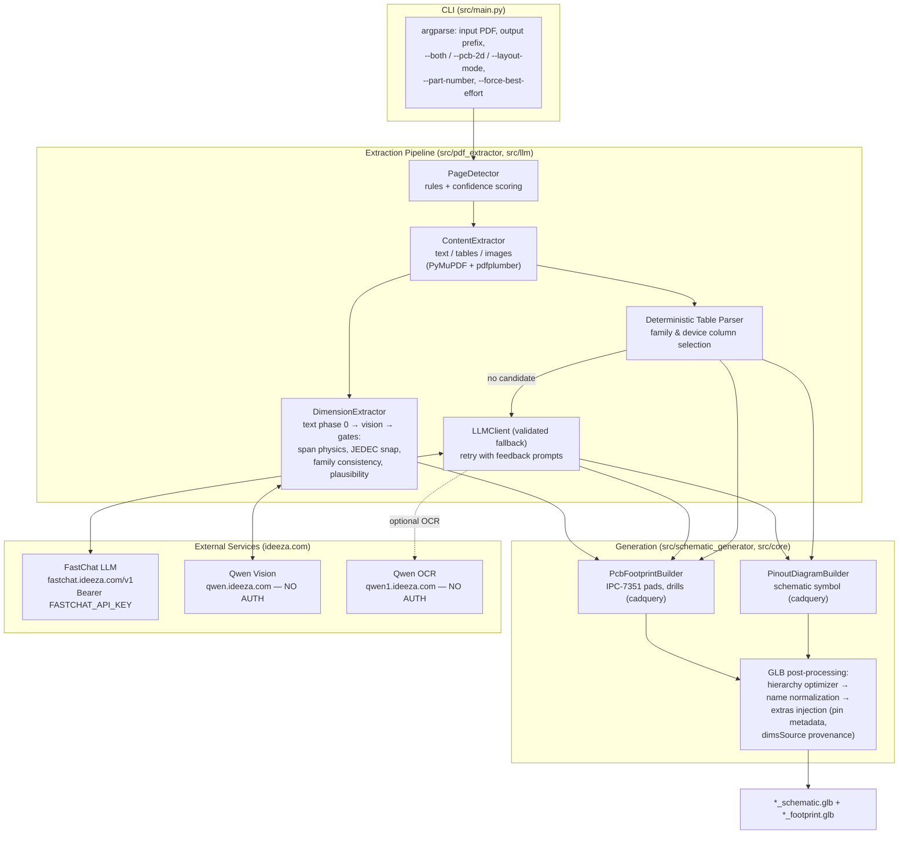
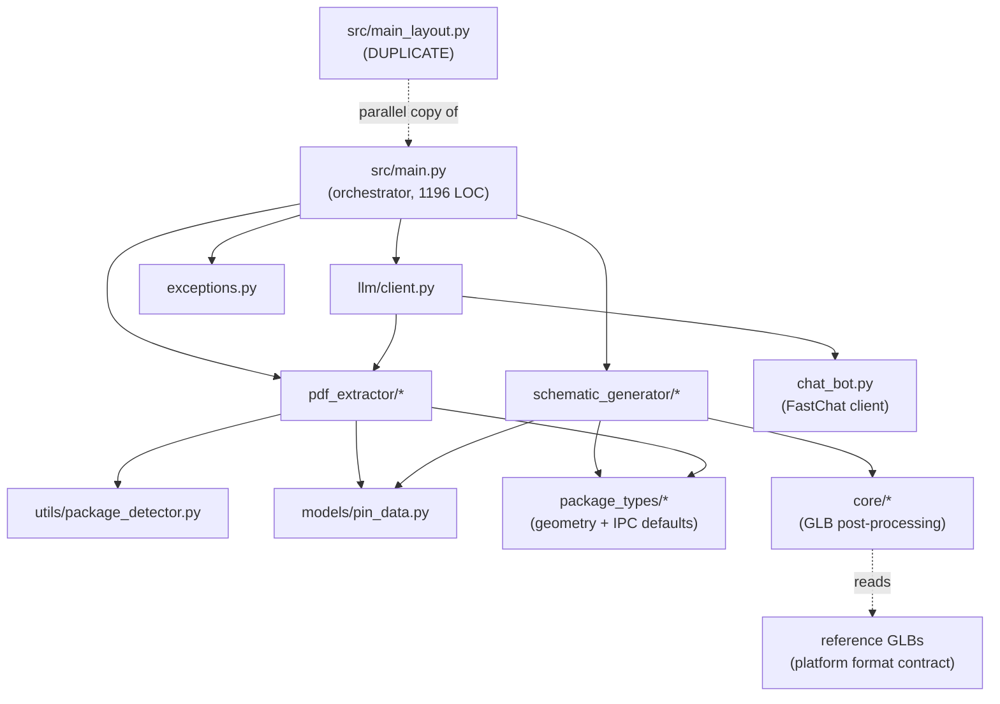
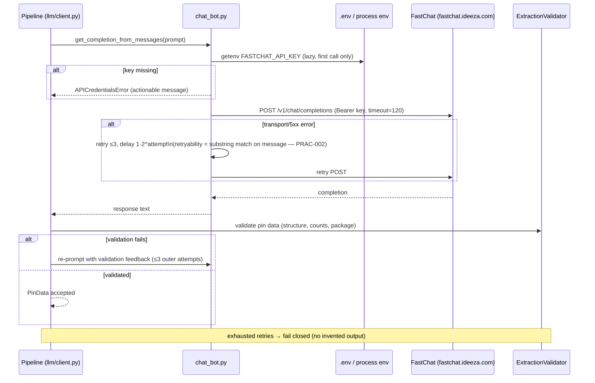
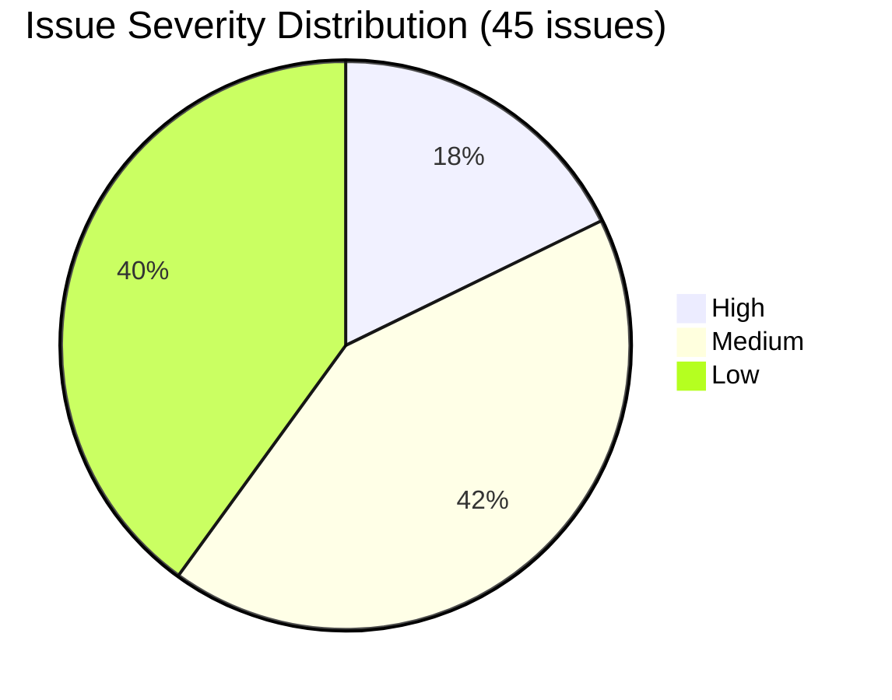
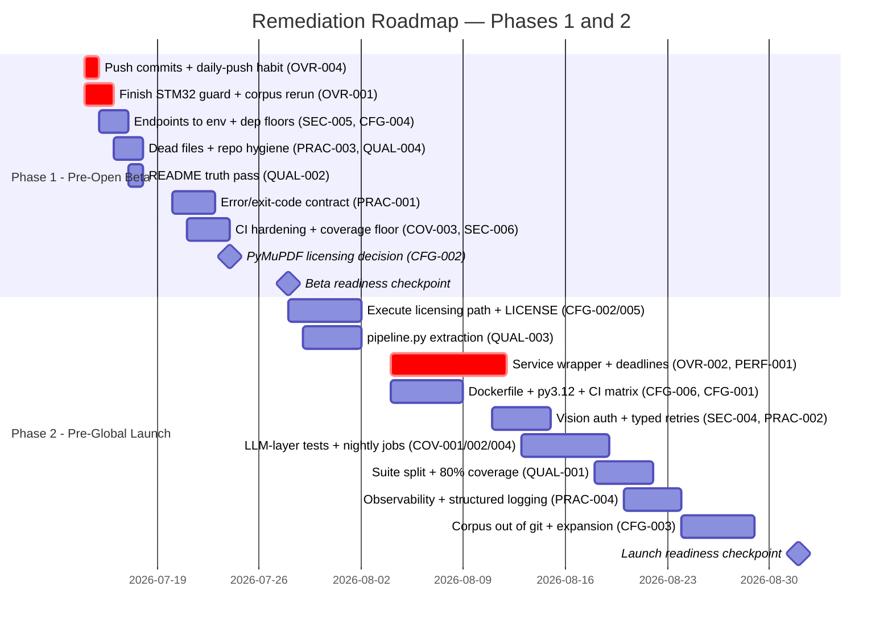

# Engineering Review — datasheet-parser-new

**Date of review:** 2026-07-14
**Reviewer:** Claude Code — AI Engineering Review
**Project phase:** Alpha Testing
**Scope:** Full repository at commit `0c206ec` (branch `main`, 33 commits ahead of origin) plus one uncommitted in-flight change (`src/pdf_extractor/deterministic_table_parser.py`)
**Prior review:** `datasheet-parser-new_review.md` (retained untouched; issue IDs BUG-xxx/SEC-001/SEC-002/ARCH-xxx referenced there are cross-checked here — this review continues its numbering where categories overlap)

---

## Table of Contents

1. [Repository & Project Overview](#section-1--repository--project-overview)
2. [Architecture Overview](#section-2--architecture-overview)
3. [What Is Done Well](#section-3--what-is-done-well)
4. [Issue Analysis](#section-4--issue-analysis)
5. [Performance Audit](#section-5--performance-audit)
6. [Recommended Fix Precedence](#section-6--how-to-solve-issues-recommended-fix-precedence)
7. [Testing Setup & Recommendations](#section-7--testing-setup--recommendations)
8. [Recommended Remediation Roadmap](#section-8--recommended-remediation-roadmap)
9. [Additional Recommendations](#section-9--additional-recommendations)
10. [Executive Summary & Final Scorecard](#section-10--executive-summary--final-scorecard)

---

## Executive Summary (short form — full version in Section 10)

`datasheet-parser-new` converts electronic-component datasheet PDFs into pin data, schematic-symbol GLBs, and PCB-footprint GLBs for the IDEEZA platform. The **core extraction and geometry pipeline is genuinely strong**: deterministic-first parsing with a validated LLM fallback, fail-closed geometry generation, a 139-function regression suite, and — unusually for an alpha project — two real verification harnesses, including a ground-truth comparison against official vendor footprints (currently 5/5 matching). The dominant risks are **not** in the algorithmic core. They are: unauthenticated vision endpoints with all service URLs hardcoded in source; a single-maintainer process risk (33 unpushed commits, one uncommitted half-applied bug fix); an **AGPL-3.0 dependency (PyMuPDF) under an MIT-declared commercial project**; a CI pipeline that gates nothing but unit tests; and ~1.7 GB of virtualenvs, dead files, and stale documentation that make the repository hostile to a second contributor. All are fixable in weeks, not months.

---

# SECTION 1 — Repository & Project Overview

## 1.1 Purpose & Pipeline Summary

A Python CLI that takes a component datasheet PDF and produces platform-ready 3D artifacts:

```
PDF ──▶ page detection ──▶ content extraction ──▶ pin extraction ──▶ dimension extraction ──▶ GLB generation
        (rules+scoring)    (text/tables/images)   (deterministic     (text → vision →         (schematic symbol +
                                                   parser first,      JEDEC defaults,          PCB footprint via
                                                   LLM fallback)      physics gates)           cadquery, + metadata
                                                                                               extras injection)
```

Outputs are binary glTF (`.glb`) files whose node hierarchy and `extras` metadata match the IDEEZA platform's reference format (pin positions, pad geometry, drill sizes, dimension provenance, wire-attachment points).

## 1.2 Tech Stack & Versions

| Layer | Technology | Version facts |
|---|---|---|
| Language | Python | `requires-python = ">=3.9"` (pyproject); CI pins **3.9 only**; README claims "3.8 or higher" (`README.md:25`) — three-way inconsistency (CFG-001) |
| PDF parsing | pdfplumber ≥0.11, PyMuPDF ≥1.24 | PyMuPDF is **AGPL-3.0** (CFG-002); lock pins pdfplumber 0.11.8 / pymupdf 1.26.5 |
| 3D geometry | cadquery ≥2.4 (lock: 2.5.2) | OCP/OpenCascade backend — heavyweight install |
| GLB post-processing | pygltflib ≥1.16 | |
| Text LLM | `openai` SDK ≥1.0 (lock: 2.44.0) against a **FastChat** server (`https://fastchat.ideeza.com/v1`, model `llama-3`) | `src/chat_bot.py:17` |
| Vision LLM | Two Qwen endpoints, plain `requests` | `https://qwen.ideeza.com/describe_image/` (`dimension_extractor.py:49`), `https://qwen1.ideeza.com/describe_image_llm` (`image_ocr_client.py:54`) — **no authentication sent** (SEC-004) |
| Config | python-dotenv; single env var `FASTCHAT_API_KEY` | `IMAGE_AI_URL` defined in `.env.example` but unused (SEC-005) |
| Tooling (declared) | pytest, pytest-cov, black, ruff, mypy | ruff/mypy/black configured in pyproject but **never run in CI** |
| Dependency locking | `requirements.txt` is a uv-generated exact-pin lock for py3.9 | No `uv.lock`/`poetry.lock`; `pip install -e .` resolves from pyproject floor-pins instead (CFG-004) |

## 1.3 Annotated Directory Tree

```
/
├── src/                          # 13.8k LOC application package (imported as `src.*`)
│   ├── main.py            (1196) # CLI + full pipeline orchestration; 7 broad except blocks; 109 print() calls
│   ├── main_layout.py      (508) # DUPLICATE alternate CLI (vision layout mode) — superseded by main.py --layout-mode
│   ├── main.py.backup      (515) # DEAD backup file
│   ├── chat_bot.py         (412) # FastChat/OpenAI client, prompts, retry+backoff
│   ├── exceptions.py       (148) # Exception hierarchy + ErrorCodes
│   ├── pdf_extractor/            # page detection, content/table extraction, deterministic pin parser,
│   │                             #   dimension extraction (text + vision + physics gates), variant selection
│   ├── llm/                      # client.py (validated LLM extraction), image_ocr_client.py (752 LOC, vision OCR),
│   │                             #   page_verifier.py
│   ├── schematic_generator/      # pin layout, schematic symbol builder, PCB footprint builder (cadquery),
│   │   └── schematic_builder.py.bak (472)  # DEAD .bak file
│   ├── core/                     # GLB post-processing: hierarchy optimizer, extras injection (footprint +
│   │                             #   schematic), reference-hierarchy validation, unvalidated-output watermark
│   ├── package_types/            # JEDEC package geometry + IPC footprint defaults (896-LOC package_geometry.py)
│   ├── models/pin_data.py   (40) # Pin/PinData/PackageInfo dataclasses
│   └── utils/package_detector.py # package family/text detection
├── tests/test_suite.py    (2507) # THE test suite: 139 test functions (143 collected), flat, no conftest/fixtures
├── run_full_flow_eval.py         # batch corpus eval: every PDF → both GLBs, measured pin grids + schematic checks
├── run_ground_truth_eval.py      # regression vs official SnapEDA/UltraLibrarian .kicad_mod footprints
├── run_batch_2d_test.py          # older batch harness
├── compare_dims.py, verify_glb_dims.py, test_dimension_api.py,
│   test_tssop_investigation.py, test_pygltflib_hierarchy.py     # 5 loose ad-hoc root scripts
├── test_scripts/                 # 28 ad-hoc scripts named test_* — NOT collected by pytest
├── pdfs/                         # 50 git-tracked datasheet PDFs (+ noTOC/ copies, *_dimensions.json caches)
├── docs/                         # 5 internal specs (variant selection, hierarchy, extraction metrics…)
├── daily_log.md            (579+)# excellent running engineering log through 2026-07-13
├── datasheet-parser-new_review.md (1496) # prior engineering review (IDs referenced by code comments)
├── .github/workflows/ci.yml      # test-only CI (py3.9)
├── pyproject.toml, requirements.txt, README.md (stale), .env(.example), .gitignore
│
│   ── WORKING-TREE CLUTTER (untracked but present) ──
├── datasheet/ (985 MB), chandra_env/ (761 MB)   # two full virtualenvs on disk
├── ~20 loose *.glb/.gltf/.stl at root (up to 7.5 MB each)
├── output/, compare/, schematic_tests/, benchmarks/, api_result/, chandra_output/, pins/
├── ATMEGA328P-PU/, MCP3208-CI_P/, MM74HC594M/, TLO62CDR/, ul_74HC595/, ESP32-C3-WROOM-02-N4/
│                                 # downloaded vendor footprints (used by ground-truth eval — keep, but relocate)
└── flow_eval*.json, ground_truth_report.json     # eval outputs at root
```

## 1.4 Development Environment & Tooling

- **Run:** `python3 -m src.main <pdf> <output> [--both|--pcb-2d] [--part-number X] [--model llama-3] [--min-confidence N] [--package-index N] [--force-best-effort] [--verbose]`. Note: the `output` positional is a **file-name prefix**, not a path or directory (`NE555.glb` → `NE555_schematic.glb` + `NE555_footprint.glb`), which is documented only in a docstring (`src/main.py:78-90`).
- **Test:** `python3 -m pytest tests/test_suite.py` (~2 min, geometry-heavy). Integration marker exists; 8 tests carry it; CI excludes them and no environment ever runs them.
- **CI:** GitHub Actions — checkout, py3.9, install lock, pytest twice (once plain, once with coverage). No lint, no type check, no security scan, no artifact upload, no coverage threshold.
- **No** Dockerfile, Makefile, pre-commit config, or contribution guide.

## 1.5 Current State Assessment

| State | Evidence |
|---|---|
| **Fully built & verified** | Page detection, deterministic table parsing, LLM fallback with fail-closed validation, dimension extraction with physics gates (span reconciliation, JEDEC snapping, family consistency), DIP/SOIC/SSOP/TSSOP/SOT-23/MSOP/WSON/QFN/LQFP footprint generation per IPC-7351 (b_max/L_max pads, lead-derived drills), schematic symbols with full platform metadata, dimension provenance (`dimsSource`), grid-array fail-closed refusal. Verified by: 143 passing tests, corpus eval v4 (27/31 PASS + 4 expected outcomes), ground-truth eval (5/5 vendor matches, worst pin delta 0.15 mm). |
| **In flight (uncommitted)** | STM32F103X6 regression fix: `_has_multiple_package_columns()` added to `deterministic_table_parser.py` but **not yet wired into `_parse_table_rows()`** — the parser can still mix pin-number columns on multi-package tables it cannot resolve (OVR-001). |
| **Scaffolded / partial** | BGA/LGA (schematic only; footprint intentionally refused), `--layout-mode`/`main_layout.py` (parallel implementation of unclear status), dimension caching (ad-hoc JSON per PDF). |
| **Missing entirely** | Service/API wrapper for platform integration, observability (metrics/telemetry), container image, secret management, 2-terminal discrete packages (SMB/SOD — fails closed), module packages (castellated), rail merging in schematic symbols, LICENSE file. |

## 1.6 Status of Prior-Review Items Referenced in Code

| Prior ID | Status observed |
|---|---|
| BUG-001 (API key loaded at import time) | **Fixed** — lazy load with actionable error (`chat_bot.py:26-42`) |
| SEC-002 (hardcoded vision URLs) | **Open** — URLs still hardcoded; `IMAGE_AI_URL` env documented-unused (`.env.example`) |
| ARCH-005 (unvalidated output unmarked) | **Fixed** — `core/validation_marker.py` watermarks `--force-best-effort` output |
| ARCH-006 (fail-closed geometry) | **Implemented and extended** — unknown families and grid arrays refuse generation |

---

# SECTION 2 — Architecture Overview

## 2.1 High-Level System Architecture



The system is a **staged-pipeline monolith**: five sequential stages with a deterministic-first / LLM-fallback strategy at the pin-extraction stage and a three-source cascade (text → vision → JEDEC defaults) at the dimension stage. All external calls go to three private IDEEZA endpoints.

## 2.2 End-to-End Data Flow

```mermaid
flowchart LR
    PDF["PDF file"] --> CAND["Page candidates\n(confidence ≥ threshold,\nhas_table / has_diagram flags)"]
    CAND --> CONTENT["ExtractedContent\ntext_content + tables + images"]
    CONTENT --> DET{"Deterministic\nparser finds\nunambiguous\npin table?"}
    DET -- yes --> PINS["PinData\n(pins, package, variant)"]
    DET -- no --> LLMX["LLM extraction\n→ ExtractionValidator\n→ retry w/ feedback (≤3)"]
    LLMX -- validated --> PINS
    LLMX -- exhausted --> FAIL1["Abort (fail closed)\nor --force-best-effort\n→ watermarked output"]
    PINS --> VSEL["Variant selection\n(part-number designators,\npackage index)"]
    VSEL --> DIMS{"Dimension sources"}
    DIMS -- "1. text (deterministic)" --> GATE
    DIMS -- "2. vision (Qwen)" --> GATE
    GATE["Physics gates:\nspan vs body (E−E1),\nJEDEC 300/600-mil snap,\nfamily pitch/span limits,\nplausibility"] -- pass --> FLAT["flat dims + dims_source"]
    GATE -- fail --> JEDEC["JEDEC family defaults\n(footprint_defaults.py)"]
    JEDEC --> FLAT
    FLAT --> BUILD["cadquery builders"]
    BUILD --> GLB["GLB + extras\n(pinData, pad geometry,\ndrill, dimsSource)"]
    GLB --> VAL["Hierarchy validation vs\nreference GLB → reject file\non mismatch"]
```



**Key property:** every downstream consumer can distinguish verified data from assumed data — `dims_source` travels from the extractor into the GLB root (`dimsSource` extra), and unvalidated `--force-best-effort` output is watermarked.

## 2.3 Module Dependency Map



Two structural notes: (1) 19 modules use a `try: from ..x import y / except ImportError: from src.x import y` dual-import pattern — a symptom of the package being run both as `src.*` module and via ad-hoc scripts (OVR-005); (2) `main_layout.py` duplicates the orchestration layer rather than reusing it (OVR-003).

## 2.4 Persistence & Artifact Map (no database)

There is **no database**. All persistence is file-based:

| Artifact | Producer | Format | Lifecycle concern |
|---|---|---|---|
| `*_schematic.glb`, `*_footprint.glb` | builders + extras injection | binary glTF 2.0 | 1–7.5 MB each; no size budget |
| `pdfs/<name>_dimensions.json` | dimension extractor (manual cache) | JSON | No cache key (PDF hash) or invalidation — stale results possible after extractor changes (OPT-004) |
| `flow_eval*.json`, `ground_truth_report.json` | eval harnesses | JSON | Written to repo root |
| Validation watermark | `core/validation_marker.py` | GLB extra | Good: unvalidated output is self-describing |

## 2.5 CLI Surface & External Service Map (no HTTP API)

**CLI contract (`src/main.py:976-1096`):**

| Flag | Type / default | Purpose | Notes |
|---|---|---|---|
| `input` | positional | PDF path | validated via `validate_input_file` |
| `output` | positional | **file-name prefix** | surprising semantics; undocumented in README |
| `--both` | flag | schematic + footprint | mutually exclusive with `--pcb-2d` (enforced, `main.py:1085`) |
| `--pcb-2d` | flag | footprint only | |
| `--layout-mode` | flag | vision-assisted layout | overlaps `main_layout.py` |
| `--model` | str, `llama-3` | FastChat model | |
| `--part-number` | str | variant disambiguation | drives designator/device-column selection |
| `--min-confidence` | int, 5 | page detection threshold | auto-adjusted by page count |
| `--package-index` | int | manual variant override | |
| `--force-best-effort` | flag | emit watermarked output on validation failure | |
| `--verbose` | flag | detailed progress | non-verbose mode is nearly silent |

**README documents two flags that do not exist:** `--verify-ambiguity` (`README.md:86`) and `--format step` (`README.md:89`) — QUAL-002.

**External service dependency table:**

| Service | Endpoint | Auth | Timeout | Retry | Where |
|---|---|---|---|---|---|
| FastChat LLM | `fastchat.ideeza.com/v1` | Bearer (env) | 120 s | 3× exp backoff + 3× validation-feedback loop above it | `chat_bot.py:46-110`, `llm/client.py` |
| Qwen vision (dims) | `qwen.ideeza.com/describe_image/` | **none** | 120 s | none | `dimension_extractor.py:404` |
| Qwen OCR | `qwen1.ideeza.com/describe_image_llm` | **none** | configurable | none | `image_ocr_client.py:229,584` |

## 2.6 Outbound Authentication & LLM Call Flow



The two Qwen endpoints follow no such flow — they are called with plain unauthenticated `requests.post` (SEC-004).

## 2.7 Deployment / CI Topology (current)

```mermaid
flowchart TD
    DEV["Developer laptop (single maintainer)\nmacOS, system python3.9\n33 unpushed commits, live .env key"] -->|push (infrequent)| GH["GitHub origin/main"]
    GH --> CI["GitHub Actions: py3.9\npip install lock → pytest ×2\n(no lint / types / security / coverage gate)"]
    DEV -->|manual runs| EVAL["Eval harnesses\n(corpus + ground truth)\nnot automated"]
    DEV -.->|"intended future: service integration"| PLATFORM["IDEEZA platform\n(no wrapper exists yet)"]
    style PLATFORM stroke-dasharray: 5 5
```

## 2.8 Architectural Pattern Assessment

The pattern is a **layered, staged-pipeline monolith** with two safety spines: *deterministic-first extraction* (rules run before any LLM, and the LLM path is validation-gated with fail-closed semantics) and *contract-first output* (generated GLBs are validated against reference hierarchy and self-describe their provenance).

**Verdict: appropriate — for what it is today.** For a batch CLI that produces CAD artifacts, a monolith is the right call; microservices would add nothing. The architecture's real strengths are the gates between stages, which repeatedly caught real defects during alpha (documented in `daily_log.md`). Two structural gaps matter for its stated destination (user-facing platform integration): there is **no service boundary** — no queueing, concurrency control, per-request isolation, or resource limits around a pipeline whose single-part latency is 9–187 s (OVR-002) — and configuration (endpoints, model names) is compiled into the source rather than injected (SEC-005), which blocks environment separation (dev/staging/prod).

---

# SECTION 3 — What Is Done Well

Specific, verified strengths — each of these is above the bar for an alpha-phase project:

1. **Fail-closed geometry philosophy, consistently applied.** Unknown package families raise `SchematicGenerationError` instead of rendering guessed geometry (`src/main.py:600-655`, `enforce_known_package_type`); grid-array packages refuse footprint generation with a clear error while keeping the schematic valid (`pcb_footprint_builder.py:107-123`); `--force-best-effort` output is explicitly watermarked (`core/validation_marker.py`). The failure mode "silently wrong CAD data reaches a user" has been systematically engineered out.

2. **Deterministic-first extraction with honest ambiguity handling.** `deterministic_table_parser.py` resolves multi-package pin tables by family column (`_package_pin_column`, LM358's LCCC vs SOIC columns) and by device column (`_part_number_pin_column`, MCP3204 vs MCP3208), and never guesses a family from pin count (`_infer_family` docstring, lines 230-246, documents *why*). LLM output is not trusted: it passes `ExtractionValidator` with feedback re-prompts and aborts when validation cannot be satisfied.

3. **Physics-based dimension gates.** `dimension_extractor.py` rejects extraction results that are geometrically impossible rather than merely unusual: lead spans incompatible with body width (`_reconcile_spans`, (E−E1)/2 > 2.2 mm), DIP rows snapped to the JEDEC 300/600-mil grid (`_normalize_through_hole_span`), family pitch/span consistency (`_consistent_with_family`), wide-SOIC bodies only at ≥14 pins. Each gate traces to a real defect documented in `daily_log.md` — these are earned defenses, not speculative ones.

4. **Real verification harnesses, not just unit tests.** `run_full_flow_eval.py` measures actual pin grids *inside generated GLBs* (pin count, pitch, row spacing, centering, schematic metadata completeness) across a 31-PDF corpus; `run_ground_truth_eval.py` compares generated footprints against official SnapEDA/UltraLibrarian `.kicad_mod` files with centroid-normalized per-pin deltas (currently 5/5 matching, worst delta 0.15 mm). Very few alpha projects verify against external ground truth at all.

5. **IPC/JEDEC standards encoded with sources.** Pad sizing from tolerance extremes (`b_max`/`L_max`, `pcb_footprint_builder.py:226-260`), drill from lead diagonal + clearance per IPC-2222 (`:247-255`), IPC-7351 toe/heel/side constants named and commented. The geometry code reads like it was written by someone who checked the standards.

6. **Dimension provenance end-to-end.** `dims_source` ("text" / "vision" / "text+vision" / "jedec_default" / "unverified") is attached at extraction (`dimension_extractor.py:105-113`) and lands as `dimsSource` on the GLB root (`core/pcb_footprint_extras.py:364-376`) — downstream consumers can build trust policy on it.

7. **Regression-test discipline.** Every defect fixed during alpha landed with a named regression test explaining the root cause in a comment (e.g., `test_fused_name_number_column_parses_all_pins`, `test_through_hole_span_snaps_to_jedec_grid`, `test_multi_package_pin_table_selects_family_column`). 143 tests pass; test names document the system's failure-mode history.

8. **Engineering log.** `daily_log.md` (579+ lines) records what was done, what broke, root causes, and lessons per session — better project memory than most production teams maintain.

---

# SECTION 4 — Issue Analysis

Severity legend: 🔴 Critical · 🟠 High · 🟡 Medium · 🟢 Low.
IDs continue the prior review's numbering where categories overlap (prior SEC-001/SEC-002 remain reserved).

## 4.1 — Overall Issues

| Field | Detail |
|---|---|
| **Issue ID** | OVR-001 |
| **Category** | Overall / Correctness |
| **Severity** | 🟠 High |
| **Location** | `src/pdf_extractor/deterministic_table_parser.py` — `_has_multiple_package_columns()` (added, uncommitted) vs `_parse_table_rows()` (not wired) |
| **Description** | Known in-flight regression: STM32F103X6's pin table (columns `BGA100`/`LQFP48`/`LQFP64`/`LQFP100`) became visible to the deterministic parser after a page-detector vocabulary change; with no resolvable column the parser mixes numbering schemes ("BGA-25"). The guard function exists in the working tree but is not yet called. |
| **Impact** | STM32F103X6 footprint currently refused (eval v4 FAIL); any other multi-package datasheet without family/part-number resolution can produce garbage pin sets that only downstream gates catch. |
| **Recommended Fix** | Wire the guard: in `_parse_table_rows`, after both column resolvers return None, `if _has_multiple_package_columns(table): return None`. Add the STM32-shaped regression test, rerun corpus eval, commit. (~1 h; fix was already designed.) |
| **Fix Priority** | Pre-Beta |

| Field | Detail |
|---|---|
| **Issue ID** | OVR-002 |
| **Category** | Overall / Architecture |
| **Severity** | 🟠 High |
| **Location** | Repository-wide — no service module exists; consumer integration implied by `core/reference_glb_hierarchy.py` and platform GLB contract |
| **Description** | The stated destination is user-facing platform integration, but only a CLI exists. There is no wrapper providing request isolation, queueing, concurrency limits, per-stage timeouts, or failure telemetry around a pipeline with 8.6–187 s per-part latency (measured, `flow_eval_v4_report.json`). |
| **Impact** | Direct platform invocation of the CLI will produce unbounded queue times, no backpressure, and undiagnosable field failures. |
| **Recommended Fix** | Thin service wrapper (FastAPI + a work queue, or platform-side job runner) exposing: submit(pdf, part_number) → job id; status/result endpoints; hard wall-clock budget per stage; structured result including `dimsSource` and validation status. Keep the pipeline library-shaped underneath. |
| **Fix Priority** | Pre-Launch |

| Field | Detail |
|---|---|
| **Issue ID** | OVR-003 |
| **Category** | Overall / Duplication |
| **Severity** | 🟡 Medium |
| **Location** | `src/main_layout.py` (508 LOC) vs `src/main.py --layout-mode` |
| **Description** | A second, parallel CLI implements the vision-layout pipeline with its own hardcoded endpoint (`main_layout.py:204`) and its own copies of orchestration logic. No test references it; README does not mention it. |
| **Impact** | Bug fixes land in one path only (e.g., today's gates exist only in the `main.py` path); drift is already real. |
| **Recommended Fix** | Delete `main_layout.py` after confirming `--layout-mode` covers its use case, or extract shared orchestration into a `pipeline.py` both import. |
| **Fix Priority** | Pre-Launch |

| Field | Detail |
|---|---|
| **Issue ID** | OVR-004 |
| **Category** | Overall / Process |
| **Severity** | 🟡 Medium |
| **Location** | Git state: `main` ahead of `origin/main` by 33 commits (verified 2026-07-14) |
| **Description** | Five days of intensive fixes (c605ca3 … 0c206ec) exist only on one laptop, plus one uncommitted file. |
| **Impact** | Single hardware failure loses the entire alpha-hardening effort; CI has not exercised any of these commits. |
| **Recommended Fix** | Push immediately; adopt push-at-least-daily; consider requiring PRs once a second contributor exists. |
| **Fix Priority** | Pre-Beta |

| Field | Detail |
|---|---|
| **Issue ID** | OVR-005 |
| **Category** | Overall / Packaging |
| **Severity** | 🟢 Low |
| **Location** | 19 files under `src/` use `try: from ..x import y / except ImportError: from src.x import y` (e.g., `deterministic_table_parser.py:14-21`, `dimension_extractor.py` gate imports) |
| **Description** | Dual-import fallback compensates for the package being executed both as `src.*` and from loose scripts. |
| **Impact** | Masks real import errors as the fallback path; confuses static analysis. |
| **Recommended Fix** | Standardize on the installed package (`pip install -e .`, absolute `src.*` imports), delete fallbacks; fix loose scripts to add the repo root to `sys.path` once. |
| **Fix Priority** | Post-Launch |

| Field | Detail |
|---|---|
| **Issue ID** | OVR-006 |
| **Category** | Overall / Traceability |
| **Severity** | 🟢 Low |
| **Location** | `datasheet-parser-new_review.md` (prior review) vs code comments citing BUG-001/SEC-002/ARCH-005/ARCH-006 |
| **Description** | Prior-review findings are partially fixed but there is no status ledger; §1.6 of this review reconstructs it manually. |
| **Impact** | Fixed issues re-investigated; open ones (SEC-002) forgotten. |
| **Recommended Fix** | Maintain a short `REVIEW_STATUS.md` table (ID → status → commit). |
| **Fix Priority** | Post-Launch |

## 4.2 — Optimization Issues

| Field | Detail |
|---|---|
| **Issue ID** | OPT-001 |
| **Category** | Optimization |
| **Severity** | 🟡 Medium |
| **Location** | `schematic_generator/pcb_footprint_builder.py` `save_glb()` and `pinout_diagram_builder.py` `save_glb()` — post-export chain |
| **Description** | Each artifact is fully parsed and re-serialized three times after cadquery export: `optimize_glb_hierarchy()` (load+save), bodyline name normalization (load+save), extras injection (load+save). GLBs are 1–7.5 MB. |
| **Impact** | Seconds of redundant I/O and parse per artifact; triple the failure surface for file corruption on interruption. |
| **Recommended Fix** | Merge the three passes into one load → transform×3 → save in a single `finalize_glb()` in `src/core/`. |
| **Fix Priority** | Post-Launch |

| Field | Detail |
|---|---|
| **Issue ID** | OPT-002 |
| **Category** | Optimization |
| **Severity** | 🟡 Medium |
| **Location** | `run_full_flow_eval.py:105-117` (`main()` sequential loop) |
| **Description** | The corpus eval runs 31 PDFs strictly sequentially: 28.2 min measured (v4). Each PDF is an independent subprocess — embarrassingly parallel. |
| **Impact** | The team's primary verification loop costs ~30 min per iteration, discouraging its use after every change (this exact gap let the STM32 regression land unnoticed for several hours). |
| **Recommended Fix** | `concurrent.futures.ProcessPoolExecutor(max_workers=4)` around `run_one`; keep per-PDF JSON lines append-safe. Expected: <10 min. |
| **Fix Priority** | Post-Launch (cheap; do earlier if convenient) |

| Field | Detail |
|---|---|
| **Issue ID** | OPT-003 |
| **Category** | Optimization |
| **Severity** | 🟢 Low |
| **Location** | `deterministic_table_parser.py` — `_infer_family()` called in both `_parse_table_rows()` (line ~447) and `_build_pin_data()` (line ~263); `part_number_hint.py` full-text scans per candidate |
| **Description** | Family inference (regex scans over full document text) runs twice per table candidate; part-number scoring re-tokenizes the full text per call. |
| **Impact** | Milliseconds-to-seconds waste on large PDFs; noise in profiles. |
| **Recommended Fix** | Compute family once in `_parse_table_rows` and pass it into `_build_pin_data`. |
| **Fix Priority** | Post-Launch |

| Field | Detail |
|---|---|
| **Issue ID** | OPT-004 |
| **Category** | Optimization / Caching |
| **Severity** | 🟢 Low |
| **Location** | `pdfs/*_dimensions.json` (6 files, written/read by dimension flow) |
| **Description** | Vision-extraction results are cached per PDF *filename* with no content hash, no extractor-version key, and no invalidation. |
| **Impact** | After extractor logic changes (frequent this month), stale caches can silently serve outdated dims in local runs. |
| **Recommended Fix** | Key cache entries on (PDF SHA-256, extractor version/git hash); store under `~/.cache/datasheet-parser/`, not next to the source PDFs. |
| **Fix Priority** | Post-Launch |

## 4.3 — Security Issues

| Field | Detail |
|---|---|
| Field | Detail |
|---|---|
| **Issue ID** | SEC-004 |
| **Category** | Security / Authentication |
| **Severity** | 🟠 High |
| **Location** | `pdf_extractor/dimension_extractor.py:404` and `llm/image_ocr_client.py:229,584` — `requests.post(...)` with only `{"accept": "application/json"}` |
| **Description** | Both Qwen vision endpoints are called over the public internet with **no authentication whatsoever**. |
| **Impact** | (a) The endpoints are open compute for anyone who discovers the URLs; (b) pipeline integrity: a DNS/MITM position or a compromised endpoint can feed poisoned dimension data — the physics gates limit but do not eliminate the effect (they pass plausible-but-wrong values); (c) no per-client attribution when abuse happens. |
| **Recommended Fix** | Put the vision endpoints behind the same bearer-token scheme as FastChat; send the token from env; pin TLS (verify=True is default — keep it) and log request IDs. |
| **Fix Priority** | Pre-Launch (endpoint change is infra-side; client change is trivial) |

| Field | Detail |
|---|---|
| **Issue ID** | SEC-005 |
| **Category** | Security / Configuration (prior SEC-002, still open) |
| **Severity** | 🟡 Medium |
| **Location** | `chat_bot.py:17`, `dimension_extractor.py:49`, `image_ocr_client.py:54`, `main_layout.py:204`; unused `IMAGE_AI_URL` in `.env.example` |
| **Description** | All three service URLs are compiled into source; the env override documented in `.env.example` is dead. A commented-out test URL sits at `chat_bot.py:18`. |
| **Impact** | No dev/staging/prod separation; endpoint changes require code releases; the prior review flagged this and it regressed into "documented but unimplemented". |
| **Recommended Fix** | `os.getenv("FASTCHAT_BASE_URL", default)`, `os.getenv("VISION_API_URL", default)`, `os.getenv("OCR_API_URL", default)`; wire `IMAGE_AI_URL` or delete it from `.env.example`. |
| **Fix Priority** | Pre-Beta |

| Field | Detail |
|---|---|
| **Issue ID** | SEC-006 |
| **Category** | Security / Supply chain |
| **Severity** | 🟡 Medium |
| **Location** | `.github/workflows/ci.yml` — no scanning step; `requirements.txt` (uv lock, py3.9) |
| **Description** | No dependency vulnerability scanning anywhere (no pip-audit/safety/Dependabot config). The lock pins ~60 packages including PDF parsers that regularly receive CVEs. |
| **Impact** | Known-vulnerable versions persist silently; PDF parsing is exactly the attack surface that matters once user uploads arrive. |
| **Recommended Fix** | Add `pip-audit -r requirements.txt` as a CI job + enable GitHub Dependabot security updates. |
| **Fix Priority** | Pre-Beta |

| Field | Detail |
|---|---|
| **Issue ID** | SEC-007 |
| **Category** | Security / Input handling |
| **Severity** | 🟢 Low (today) — rises to High when user uploads arrive |
| **Location** | `main.py:1091-1096` (input validation = existence/extension only); PyMuPDF/pdfplumber parse the full untrusted file |
| **Description** | The pipeline parses arbitrary PDFs with native-code libraries. Fine for a trusted local corpus; unacceptable as-is for user-uploaded files in the platform flow. |
| **Impact** | Malicious PDF → parser exploit → code execution in whatever context the service runs. |
| **Recommended Fix** | For the service deployment: parse inside a sandboxed worker (container with no network egress except the LLM endpoints, non-root, memory/CPU limits, timeout kill); keep parsers patched (SEC-006). |
| **Fix Priority** | Pre-Launch |

| Field | Detail |
|---|---|
| **Issue ID** | SEC-008 |
| **Category** | Security / Process |
| **Severity** | 🟢 Low |
| **Location** | Repo root — no `.pre-commit-config.yaml`; CI has no secret-scanning step |
| **Description** | Nothing prevents a local `.env` credential or the next secret from being committed. |
| **Impact** | One `git add -A` away from publishing a live key in history. |
| **Recommended Fix** | pre-commit with gitleaks + ruff; gitleaks job in CI. |
| **Fix Priority** | Post-Launch (cheap — bundle with SEC-006) |

## 4.4 — Standard Coding Practice Issues

| Field | Detail |
|---|---|
| **Issue ID** | PRAC-001 |
| **Category** | Coding Practice / Error handling |
| **Severity** | 🟠 High |
| **Location** | `src/main.py:462, 594, 801, 887, 933, 958, 1157` — seven `except Exception as e:` blocks |
| **Description** | The orchestrator catches all exceptions at seven points, mostly printing and continuing (`print(f"Error generating footprint: {e}")`, `main.py:958` area). Combined with `--both`'s split success handling, exit codes have already been observed inconsistent during evals (exit 0 with a rejected footprint in some paths, exit 1 in others). |
| **Impact** | Programming errors (AttributeError, TypeError) are indistinguishable from expected domain failures; automation cannot trust exit codes; real stack traces reach nobody unless `--verbose`. |
| **Recommended Fix** | Catch `DatasheetParserError` subclasses for expected failures; let unexpected exceptions propagate to a single top-level handler that prints the trace and exits 2. Define and document exit codes: 0 = all requested artifacts, 1 = domain failure (fail-closed), 2 = internal error. |
| **Fix Priority** | Pre-Beta |

| Field | Detail |
|---|---|
| **Issue ID** | PRAC-002 |
| **Category** | Coding Practice / Error handling |
| **Severity** | 🟡 Medium |
| **Location** | `src/exceptions.py:55-72` — `LLMExtractionError.is_retryable` |
| **Description** | Retryability is decided by substring search on the stringified error: `"500" in error_message` also matches "processed 500 pins" or any part number containing 500; `"connection"` matches prompt text echoed into messages. |
| **Impact** | Wrong retry decisions in both directions — wasted 120 s retries on permanent errors, or no retry on transient ones whose message wording differs. |
| **Recommended Fix** | Catch the SDK's typed exceptions (`openai.APIConnectionError`, `openai.RateLimitError`, `openai.APIStatusError` with `status_code >= 500`) at the call site (`chat_bot.py:69-101`) and set an explicit `retryable: bool` on the raised `LLMExtractionError`. |
| **Fix Priority** | Pre-Launch |

| Field | Detail |
|---|---|
| **Issue ID** | PRAC-003 |
| **Category** | Coding Practice / Dead code |
| **Severity** | 🟡 Medium |
| **Location** | `src/main.py.backup` (515 LOC), `src/schematic_generator/schematic_builder.py.bak` (472 LOC) |
| **Description** | Two dead backup files inside the package tree; `main.py.backup` contains the *old* un-timed `requests` pattern and old endpoints — actively misleading. |
| **Impact** | grep/static analysis noise, onboarding confusion, risk of editing the wrong file. Git history already preserves both. |
| **Recommended Fix** | `git rm src/main.py.backup src/schematic_generator/schematic_builder.py.bak`. |
| **Fix Priority** | Pre-Beta (one minute) |

| Field | Detail |
|---|---|
| **Issue ID** | PRAC-004 |
| **Category** | Coding Practice / Logging |
| **Severity** | 🟡 Medium |
| **Location** | `src/main.py` — 109 `print()` calls, **zero** `logger` usage; library modules use `logging` correctly (e.g., `pinout_diagram_builder.py`, `dimension_extractor.py`) |
| **Description** | The orchestrator bypasses the logging system entirely while the libraries beneath it use it; there is no way to get timestamped, level-filtered, or machine-parseable output from a run. |
| **Impact** | Service integration (OVR-002) has no log stream to collect; debugging field issues means re-running with `--verbose` prints. |
| **Recommended Fix** | Replace prints with a module logger + a console handler configured once in `main()`; keep user-facing summary prints only for the final result block. |
| **Fix Priority** | Pre-Launch |

| Field | Detail |
|---|---|
| **Issue ID** | PRAC-005 |
| **Category** | Coding Practice / Special-casing |
| **Severity** | 🟢 Low |
| **Location** | `deterministic_table_parser.py:500` — `choose_last = bool(part_number and re.search(r"6050\b", part_number.upper()))` |
| **Description** | A part-specific hack (MPU-6050 duplicate-row handling) hardcoded inside the generic parser. |
| **Impact** | Invisible special-case behavior; the next MPU-6500-style datasheet needs another hack. |
| **Recommended Fix** | Replace with a general rule (e.g., prefer the candidate row whose name is not a duplicate of another pin's name) or a documented per-part override table. |
| **Fix Priority** | Post-Launch |

| Field | Detail |
|---|---|
| **Issue ID** | PRAC-006 |
| **Category** | Coding Practice / Encapsulation |
| **Severity** | 🟢 Low |
| **Location** | `deterministic_table_parser.py:243` — `detector._detect_from_text(...)  # pylint: disable=protected-access`; same pattern in `dimension_extractor.py` family gate |
| **Description** | Cross-module calls into `PackageDetector`'s private API, acknowledged by lint suppressions. |
| **Impact** | The "private" method is de-facto public contract without the signature stability that implies. |
| **Recommended Fix** | Promote to `detect_family_from_text()` public method with a docstring; delete the suppressions. |
| **Fix Priority** | Post-Launch |

| Field | Detail |
|---|---|
| **Issue ID** | PRAC-007 |
| **Category** | Coding Practice / Dead config |
| **Severity** | 🟢 Low |
| **Location** | `chat_bot.py:18` — `#BASE_URL = "https://fastchattest.ideeza.com/v1"` |
| **Description** | Commented-out alternate endpoint kept as a toggle-by-editing-source mechanism. |
| **Impact** | Encourages editing source to switch environments — the exact anti-pattern SEC-005 fixes. |
| **Recommended Fix** | Delete the comment once `FASTCHAT_BASE_URL` env override exists. |
| **Fix Priority** | Post-Launch (bundle with SEC-005) |

## 4.5 — Quality & Maintainability Issues

| Field | Detail |
|---|---|
| **Issue ID** | QUAL-001 |
| **Category** | Quality / Test structure |
| **Severity** | 🟠 High |
| **Location** | `tests/test_suite.py` — 2,507 lines, 139 flat test functions, no `conftest.py`, no fixtures directory, module-level imports mid-file (e.g., lines 322, 664, 768, 1898) |
| **Description** | The entire test suite is one file that mixes unit tests, geometry regression tests, and GLB round-trip tests. Shared setup is duplicated inline; imports appear at five different points in the file; the suite takes ~2 min because fast logic tests cannot be run without the cadquery-heavy ones. |
| **Impact** | Slow feedback loop (developers skip running it — the STM32 regression proves the cost); merge conflicts guaranteed once a second contributor exists; no way to run "just the parser tests" cleanly. |
| **Recommended Fix** | Split by layer: `test_pdf_extractor.py`, `test_dimensions.py`, `test_footprint_builder.py`, `test_schematic_builder.py`, `test_glb_extras.py`, `test_pipeline.py`; move shared helpers (`_glb_pad_positions`, `_row_spacing_and_pitch`, table fixtures) into `conftest.py`; mark cadquery-bound tests `@pytest.mark.geometry` so `-m "not geometry"` gives a <10 s logic loop. |
| **Fix Priority** | Pre-Launch |

| Field | Detail |
|---|---|
| **Issue ID** | QUAL-002 |
| **Category** | Quality / Documentation |
| **Severity** | 🟡 Medium |
| **Location** | `README.md:25` ("Python 3.8 or higher"), `:86` (`--verify-ambiguity` — flag does not exist), `:89` (`--format step` — does not exist), `:157` ("client.py … placeholder LLM client" — it is fully implemented) |
| **Description** | The front-door document is wrong about the Python floor, documents two nonexistent flags, omits the real ones (`--both`, `--part-number`, `--force-best-effort`), and describes the LLM integration as unimplemented. |
| **Impact** | Any new developer or evaluator is misled within the first five minutes; support burden lands on the one person who knows the truth. |
| **Recommended Fix** | Rewrite Usage from `argparse` reality (generate with `--help` output), fix the version floor to 3.9, replace the LLM section with the FastChat architecture + env setup. |
| **Fix Priority** | Pre-Beta |

| Field | Detail |
|---|---|
| **Issue ID** | QUAL-003 |
| **Category** | Quality / Separation of concerns |
| **Severity** | 🟡 Medium |
| **Location** | `src/main.py` (1,196 LOC) — argparse, path derivation, pipeline stages, validation policy, retry policy, printing, and exit-code logic in one module |
| **Description** | The orchestrator is a god-module: `enforce_known_package_type` (domain policy), `_both_output_paths` (path logic), stage functions, and CLI parsing coexist; testing any stage means importing the whole CLI. |
| **Impact** | The 7 broad exception handlers (PRAC-001) are a symptom — control flow is too tangled for precise handling; unit tests target helpers only (COV-002). |
| **Recommended Fix** | Extract `src/pipeline.py` with a `run_pipeline(config) -> PipelineResult` pure-ish core; `main.py` becomes argparse + result printing (~150 LOC). This is also the prerequisite for the service wrapper (OVR-002). |
| **Fix Priority** | Post-Launch (schedule with OVR-002) |

| Field | Detail |
|---|---|
| **Issue ID** | QUAL-004 |
| **Category** | Quality / Repository hygiene |
| **Severity** | 🟡 Medium |
| **Location** | Working tree: `datasheet/` (985 MB venv), `chandra_env/` (761 MB venv), ~20 loose GLB/STL at root, `test_scripts/` (28 uncollected scripts), 5 loose root analysis scripts, eval JSONs at root, `2026-07-06-implement-the-following-plan.txt` |
| **Description** | ~1.8 GB of environment + generated artifacts + one-off scripts live in the project root, alongside the real code. `.gitignore` keeps most untracked, but the tree itself is the daily working surface. |
| **Impact** | Onboarding cannot distinguish tool from artifact; IDE indexing and searches degrade; the 28 `test_*` scripts look like a test suite and are not. |
| **Recommended Fix** | Delete both venvs (recreate with `python -m venv .venv`); `mkdir eval_output/ && git mv` report JSONs; archive or delete `test_scripts/`; move the 5 root analysis scripts into `tools/`; relocate vendor footprint folders into `tests/ground_truth/`. |
| **Fix Priority** | Pre-Beta |

| Field | Detail |
|---|---|
| **Issue ID** | QUAL-005 |
| **Category** | Quality / Indirection |
| **Severity** | 🟢 Low |
| **Location** | `schematic_generator/pcb_2d_builder.py` and `schematic_builder.py` (8-line re-export shims); `adapter.py` naming (`build_schematic_from_pin_data` lives in "adapter") |
| **Description** | Two backward-compatibility shims rename the same builder (`PcbFootprintBuilder as Pcb2dBuilder`, `build_pcb_footprint as build_pcb_2d_schematic`), so the same object appears under four names across the codebase. |
| **Impact** | Readers must hold a mental alias table; grep finds half the call sites per name. |
| **Recommended Fix** | Migrate callers to the canonical names and delete the shims (mechanical change; ruff can find call sites). |
| **Fix Priority** | Post-Launch |

| Field | Detail |
|---|---|
| **Issue ID** | QUAL-006 |
| **Category** | Quality / Documentation |
| **Severity** | 🟢 Low |
| **Location** | 15 modules with missing/empty module docstrings incl. `main.py`, `exceptions.py`, `pcb_footprint_builder.py`, `pin_layout.py`, `package_geometry.py`, `image_ocr_client.py` |
| **Description** | Function-level docs are strong where present, but the module-level "why does this file exist" line is absent from the largest files. |
| **Impact** | New readers open 896-LOC files with no orientation. |
| **Recommended Fix** | One-paragraph module docstring per file; enforce via ruff `D100` once added to CI. |
| **Fix Priority** | Post-Launch |

| Field | Detail |
|---|---|
| **Issue ID** | QUAL-007 |
| **Category** | Quality / Data modeling |
| **Severity** | 🟢 Low |
| **Location** | `src/models/pin_data.py` (40 LOC) — `PinData`, `PackageInfo`, `Pin` dataclasses |
| **Description** | Core invariants are not enforced by the model: `package.pin_count` vs `len(pins)` can disagree; the multi-package `packages` field is an untyped list of dicts; pin `number` is sometimes int, sometimes str across the codebase. |
| **Impact** | Validators re-check the same invariants ad hoc; the int/str pin-number ambiguity has already required defensive `str(pin.get("number"))` casts (`pinout_diagram_builder.py`). |
| **Recommended Fix** | Pydantic models (pydantic is already in the lock via openai) with validators for count consistency and normalized pin-number type. |
| **Fix Priority** | Post-Launch |

## 4.6 — Performance Issues

| Field | Detail |
|---|---|
| **Issue ID** | PERF-001 |
| **Category** | Performance / Latency amplification |
| **Severity** | 🟡 Medium |
| **Location** | `llm/client.py` (`extract_pin_data`, outer retry ≤3 with feedback) × `chat_bot.py:69-101` (inner retry ≤3, exp backoff) × `timeout=120` (`chat_bot.py:76`) |
| **Description** | Nested retry loops multiply: worst case 9 LLM calls × 120 s timeout ≈ **18 minutes** hang for one PDF against a dead-slow endpoint, plus backoff delays. |
| **Impact** | One unhealthy FastChat instance stalls any batch or service queue; there is no total-wall-clock budget per document. |
| **Recommended Fix** | Add a per-document deadline (e.g., 5 min) checked between attempts; cap combined attempts (inner×outer ≤ 4); make the inner retry skip when the outer loop will re-prompt anyway. |
| **Fix Priority** | Pre-Launch |

| Field | Detail |
|---|---|
| **Issue ID** | PERF-002 |
| **Category** | Performance / Sequential I/O |
| **Severity** | 🟡 Medium |
| **Location** | `dimension_extractor.py` `_scan_pages()` — sequential `requests.post` per rendered page when no hint pages exist |
| **Description** | The vision fallback scans pages one at a time with 120 s timeouts. A 60-page datasheet without detector hints can spend many minutes in this loop. |
| **Impact** | The 186.8 s worst case in eval v4 is dominated by this path; user-facing latency is unpredictable. |
| **Recommended Fix** | Bound scanned pages (mechanical drawings live in the last third of a datasheet — scan back-to-front with an early stop), and/or parallelize 3–4 posts with a thread pool. |
| **Fix Priority** | Pre-Launch |

| Field | Detail |
|---|---|
| **Issue ID** | PERF-003 |
| **Category** | Performance / Compute |
| **Severity** | 🟡 Medium |
| **Location** | `pinout_diagram_builder.py` / `pcb_footprint_builder.py` — cadquery `.text()` solid glyph generation per pin label |
| **Description** | Measured pipeline cost (eval v4, 31 PDFs): median 42.8 s, max 186.8 s per part; profiling during alpha showed solid text glyph generation (one boolean solid per character × 2 labels × N pins) dominates builder time. |
| **Impact** | ~40 s/part floor regardless of extraction speed; scales linearly with pin count (64-pin LQFP is the slow case). |
| **Recommended Fix** | Cache glyph solids per (character, size) within a build; longer term, emit label text as glTF text metadata (the platform already reads `pinName`/`value` extras — the 3D glyph geometry may be redundant; confirm with the frontend team). |
| **Fix Priority** | Post-Launch |

| Field | Detail |
|---|---|
| **Issue ID** | PERF-004 |
| **Category** | Performance / Asset size |
| **Severity** | 🟢 Low |
| **Location** | Output GLBs: 1.07–7.5 MB observed (`74HC595_footprint.glb` 1.07 MB; root `output.glb` 7.5 MB) |
| **Description** | Text-glyph meshes are exported untriangulated-optimized; no decimation or quantization pass exists. |
| **Impact** | Platform load time and storage per part; hundreds of parts → gigabytes. |
| **Recommended Fix** | Add `gltfpack`/meshopt or Draco compression as an optional final step; measure platform-side load budget first. |
| **Fix Priority** | Post-Launch |

| Field | Detail |
|---|---|
| **Issue ID** | PERF-005 |
| **Category** | Performance / Connections |
| **Severity** | 🟢 Low |
| **Location** | `dimension_extractor.py:404`, `image_ocr_client.py:229,584` — module-level `requests.post` |
| **Description** | Every vision call opens a fresh TCP+TLS connection; no `requests.Session` reuse. |
| **Impact** | Tens of redundant TLS handshakes per document in scan-heavy paths. |
| **Recommended Fix** | One `requests.Session` per extractor instance. |
| **Fix Priority** | Post-Launch |

## 4.7 — Configuration & Dependency Issues

| Field | Detail |
|---|---|
| **Issue ID** | CFG-001 |
| **Category** | Config / Runtime version |
| **Severity** | 🟠 High |
| **Location** | `README.md:25` (3.8+), `pyproject.toml` (`>=3.9`, classifiers 3.9–3.12), `.github/workflows/ci.yml` (3.9 only), lock compiled for 3.9 |
| **Description** | Python 3.9 reached **end-of-life in October 2025** — the project's only tested runtime no longer receives security fixes. Classifiers advertise 3.10–3.12 support that has never been exercised; the numpy 2.0.2 pin and cadquery build matrix behave differently on newer Pythons. |
| **Impact** | Shipping a service on an EOL interpreter in 2026; silent breakage the day someone installs on 3.12. |
| **Recommended Fix** | Move development + CI to 3.11 or 3.12; regenerate the lock; CI matrix {3.10, 3.12}; drop the 3.8 claim from README. |
| **Fix Priority** | Pre-Launch |

| Field | Detail |
|---|---|
| **Issue ID** | CFG-002 |
| **Category** | Config / Licensing |
| **Severity** | 🟠 High |
| **Location** | `pyproject.toml` dependencies — `PyMuPDF>=1.24.0` (lock: 1.26.5); project declares `license = {text = "MIT"}` |
| **Description** | PyMuPDF is **AGPL-3.0** (Artifex dual licensing). Using it inside a proprietary, network-accessed commercial service (the IDEEZA platform) triggers AGPL's network-interaction clause unless a commercial license is purchased. The project simultaneously declares itself MIT — the declaration is not currently satisfiable. |
| **Impact** | Legal exposure at commercial launch; retroactive remediation (rip-out or license purchase) is far costlier than deciding now. |
| **Recommended Fix** | Decide before beta: (a) buy the Artifex commercial license, or (b) replace PyMuPDF — `pypdfium2` (Apache/BSD) covers rendering + text; pdfplumber already covers tables. An audit of the ~15 `fitz` call sites suggests option (b) is ~2–4 days. |
| **Fix Priority** | Pre-Launch (decision Pre-Beta) |

| Field | Detail |
|---|---|
| **Issue ID** | CFG-003 |
| **Category** | Config / Repository contents |
| **Severity** | 🟡 Medium |
| **Location** | `git ls-files pdfs` → 50 tracked PDFs (vendor datasheets, TI/ST/Microchip/Nordic/Espressif) |
| **Description** | Fifty copyrighted vendor datasheets are committed to git history. Most vendors permit personal-use distribution but not redistribution in a product repository. |
| **Impact** | Repo weight (every clone carries them forever) + copyright exposure if the repo becomes public or is shared with partners. |
| **Recommended Fix** | Move the corpus out of git: a manifest of source URLs + SHA-256 hashes, fetched by an eval bootstrap script; `git filter-repo` if history size matters later. |
| **Fix Priority** | Pre-Launch |

| Field | Detail |
|---|---|
| **Issue ID** | CFG-004 |
| **Category** | Config / Dependency management |
| **Severity** | 🟡 Medium |
| **Location** | `pyproject.toml` (floor pins `>=`) vs `requirements.txt` (exact uv lock); CI installs the lock, `pip install -e .` alone does not |
| **Description** | Two sources of truth: a fresh `pip install -e .` resolves latest-compatible versions (untested), while CI uses the lock. openai floor is `>=1.0.0` while the lock has 2.44.0 — a fresh env could legally get a 1.x with a different API surface. |
| **Impact** | "Works in CI, breaks on a new machine" class of failures. |
| **Recommended Fix** | Raise pyproject floors to tested majors (`openai>=2.40`, `pdfplumber>=0.11.8`, …); document that installs must use the lock; consider `uv sync` as the canonical setup command. |
| **Fix Priority** | Pre-Beta |

| Field | Detail |
|---|---|
| **Issue ID** | CFG-005 |
| **Category** | Config / Project metadata |
| **Severity** | 🟢 Low |
| **Location** | No `LICENSE` file at repo root; `pyproject.toml` authors = "Your Name <your.email@example.com>", URLs = `github.com/yourusername/...` |
| **Description** | The project declares MIT but ships no license text; author/URL metadata is template placeholder. |
| **Impact** | Legally ambiguous licensing state; broken metadata if ever published to an index. |
| **Recommended Fix** | Add the LICENSE file (after resolving CFG-002 — MIT may be the wrong declaration), fix authors/URLs. |
| **Fix Priority** | Pre-Launch |

| Field | Detail |
|---|---|
| **Issue ID** | CFG-006 |
| **Category** | Config / Environment reproducibility |
| **Severity** | 🟢 Low |
| **Location** | No `Dockerfile` / devcontainer; cadquery+OCP install is the known-hard step (two 800 MB+ venv attempts sit in the tree as evidence) |
| **Description** | Environment setup is undocumented and demonstrably painful; the service deployment (OVR-002) will need a container anyway. |
| **Impact** | Onboarding friction; drift between dev and future prod environments. |
| **Recommended Fix** | Multi-stage Dockerfile (micromamba for cadquery/OCP, pip for the rest); use it in CI to make CI ≡ prod. |
| **Fix Priority** | Pre-Launch |

## 4.8 — Coverage Issues

| Field | Detail |
|---|---|
| **Issue ID** | COV-001 |
| **Category** | Coverage / Untested layer |
| **Severity** | 🟠 High |
| **Location** | `llm/image_ocr_client.py` (752 LOC — zero tests), `llm/page_verifier.py` (220 LOC — zero tests), `chat_bot.py` retry logic; 8 `@pytest.mark.integration` tests exist but CI runs `-m "not integration"` and no other environment runs them |
| **Description** | The entire LLM/vision integration layer is untested everywhere: unit tests mock nothing (they avoid the layer), and the integration marker is excluded in CI and never executed manually per any record. The retry/backoff/error-mapping code paths (`chat_bot.py:69-110`) have never run under test. |
| **Impact** | The layer most likely to break (external services, SDKs, prompts) has zero regression protection; SDK major-version bumps (openai 1.x→2.x already happened) land blind. |
| **Recommended Fix** | Mock-based unit tests for `chat_bot` (typed-exception retry matrix), `image_ocr_client` (response parsing, timeout handling) using `responses`/`respx` or plain monkeypatching; one nightly CI job that actually runs the 8 integration tests against staging endpoints. |
| **Fix Priority** | Pre-Launch |

| Field | Detail |
|---|---|
| **Issue ID** | COV-002 |
| **Category** | Coverage / Orchestration |
| **Severity** | 🟡 Medium |
| **Location** | `src/main.py` error branches: `--force-best-effort` substitution path (`:636-655`), `--package-index` overrides, the seven exception handlers, exit-code semantics |
| **Description** | Tests cover helpers (`_both_output_paths`, `enforce_known_package_type` partially) but not the orchestration flows; no test asserts exit codes for the failure modes. |
| **Impact** | The inconsistent `--both` exit codes observed during evals are exactly the kind of defect this gap hides. |
| **Recommended Fix** | Subprocess-level CLI tests with a stub pipeline (monkeypatched extractors) asserting exit codes + produced files per flag combination. |
| **Fix Priority** | Pre-Launch |

| Field | Detail |
|---|---|
| **Issue ID** | COV-003 |
| **Category** | Coverage / Enforcement |
| **Severity** | 🟡 Medium |
| **Location** | `.github/workflows/ci.yml` — coverage computed (`--cov=src`) but no threshold, no artifact, no trend |
| **Description** | Coverage is measured and discarded; a PR deleting half the tests would pass CI. |
| **Impact** | Coverage can only ratchet down silently. |
| **Recommended Fix** | `--cov-fail-under=60` now (measured baseline first), raise to 70 pre-beta / 80 pre-launch; upload the report as a CI artifact. |
| **Fix Priority** | Pre-Beta |

| Field | Detail |
|---|---|
| **Issue ID** | COV-004 |
| **Category** | Coverage / E2E automation |
| **Severity** | 🟢 Low |
| **Location** | `run_full_flow_eval.py`, `run_ground_truth_eval.py` — manual-only |
| **Description** | The two strongest verification tools run only when a human remembers. The STM32 regression (OVR-001) was caught hours late for exactly this reason. |
| **Impact** | Regressions ship between manual eval runs. |
| **Recommended Fix** | Nightly scheduled CI job (or self-hosted runner given LLM access) running both harnesses on a 6–8 PDF smoke subset; diff against the previous report and fail on status change. |
| **Fix Priority** | Pre-Launch |

| Field | Detail |
|---|---|
| **Issue ID** | COV-005 |
| **Category** | Coverage / Dead surface |
| **Severity** | 🟢 Low |
| **Location** | `src/main_layout.py` — zero tests, zero README mentions |
| **Description** | 508 LOC of alternate entry point with no coverage of any kind. |
| **Impact** | Untested code that still imports and can be invoked. |
| **Recommended Fix** | Resolve via OVR-003 (delete or merge) rather than writing tests for it. |
| **Fix Priority** | Pre-Beta (deletion decision) |

---

## Issue Summary Table

| Category | 🔴 Critical | 🟠 High | 🟡 Medium | 🟢 Low | Total |
|---|---|---|---|---|---|
| Overall | 0 | 2 | 2 | 2 | 6 |
| Optimization | 0 | 0 | 2 | 2 | 4 |
| Security | 0 | 1 | 2 | 2 | 5 |
| Coding Practice | 0 | 1 | 3 | 3 | 7 |
| Quality & Maintainability | 0 | 1 | 3 | 3 | 7 |
| Performance | 0 | 0 | 3 | 2 | 5 |
| Config & Dependency | 0 | 2 | 2 | 2 | 6 |
| Coverage | 0 | 1 | 2 | 2 | 5 |
| **Total** | **0** | **8** | **19** | **18** | **45** |

**Severity Distribution:**



---

# SECTION 5 — Performance Audit

## 5.1 Measured Baseline (eval v4, 31 PDFs, 2026-07-13)

| Metric | Value |
|---|---|
| Per-PDF wall time | min 8.6 s · **median 42.8 s** · max 186.8 s |
| Full-corpus batch | 28.2 min (strictly sequential) |
| Unit suite | ~2 min (143 tests, geometry-bound) |

## 5.2 Performance-Critical Paths & Complexity

| Path | Cost profile | Notes |
|---|---|---|
| Page detection (`page_detector.py`) | O(pages × patterns) regex + per-page `extract_tables()` | pdfplumber table detection is the hidden cost — it runs on every candidate page |
| Content extraction | O(selected pages) with dual-library parsing (PyMuPDF primary, pdfplumber fallback per page) | Bounded by candidate count; fine |
| Deterministic parsing | O(tables × rows) — microseconds | Negligible; this is why deterministic-first is also the *fast* path |
| LLM extraction | 1–9 network calls × ≤120 s (PERF-001) | The variance driver: a validated first-shot costs ~5–20 s; pathological retries cost minutes |
| Vision dimension scan | O(scanned pages) sequential posts (PERF-002) | Dominates the 186.8 s worst case |
| cadquery build | O(pins) boolean solids; text glyphs dominate (PERF-003) | ~40 s floor for high-pin-count parts |
| GLB post-processing | 3× full parse/serialize of 1–7.5 MB files (OPT-001) | Seconds, deterministic |

## 5.3 Missing Infrastructure

- **No caching** of LLM/vision responses keyed by content (OPT-004's ad-hoc JSONs are the only artifact).
- **No rate limiting / circuit breaker** toward the three external endpoints — a stuck endpoint is discovered by a 120 s timeout, 9 times (PERF-001).
- **No pagination/streaming concerns apply** (no DB, no HTTP API yet) — but the future service must impose a per-job wall-clock budget.
- **No connection reuse** (PERF-005), **no concurrency** anywhere in batch paths (OPT-002).
- **No memory profiling**; cadquery/OCP holds native memory — long-running service workers should be recycled per N jobs (leak risk is in native code you don't control).

## 5.4 Recommended Profiling Strategy

1. `py-spy record -o profile.svg -- python -m src.main pdfs/STM32F103RBT7.PDF out --both` — flame graph of the worst-case part; confirms the glyph-generation hypothesis (PERF-003).
2. Instrument stage boundaries with `time.perf_counter()` and emit a per-stage timing dict (this becomes the service's latency telemetry later — build it once).
3. Track the eval reports' `seconds` field over time (they are already recorded — plot them per commit to catch performance regressions the same way geometry regressions are caught today).

---

# SECTION 6 — How to Solve Issues: Recommended Fix Precedence

Ordering logic: **(1)** secret/credential exposure first — cheap and irreversible-if-leaked; **(2)** the in-flight correctness regression and process risk (unpushed work) — blockers for any trustworthy baseline; **(3)** legal/licensing decisions whose cost grows with delay; **(4)** correctness robustness (error handling, retry semantics); **(5)** CI gates that keep everything above from regressing; **(6)** integration prerequisites; **(7)** hygiene and debt. Security precedes optimization throughout.

| # | Issue(s) | Action | Effort | Impact | Owner |
|---|---|---|---|---|---|
| 1 | OVR-004 | Push 33 commits; adopt daily-push habit | S | High | Any |
| 2 | OVR-001 | Wire `_has_multiple_package_columns` guard + regression test + corpus rerun | S | High | Backend |
| 3 | CFG-002 | **Decide** PyMuPDF licensing (buy vs replace with pypdfium2) | S (decision) / L (replacement) | High | CTO + Backend |
| 4 | SEC-005, PRAC-007 | Externalize all three endpoints to env vars | S | High | Backend |
| 5 | PRAC-003, COV-005, OVR-003 | Delete dead files (`main.py.backup`, `.bak`, `main_layout.py` after confirmation) | S | Medium | Backend |
| 6 | QUAL-004 | Repo hygiene sweep (venvs, artifacts, scripts → tools/) | S | Medium | Any |
| 7 | QUAL-002 | README truth pass | S | Medium | Any |
| 8 | COV-003, SEC-006, SEC-008 | CI hardening: ruff + mypy + pip-audit + gitleaks + coverage floor | M | High | DevOps |
| 9 | PRAC-001 | Exception-handling redesign + exit-code contract in `main.py` | M | High | Backend |
| 10 | PRAC-002 | Typed-exception retryability in `chat_bot.py` | S | Medium | Backend |
| 11 | CFG-004 | Align pyproject floors with lock; document `uv sync` | S | Medium | DevOps |
| 12 | PERF-001 | Per-document deadline + retry cap | S | Medium | Backend |
| 13 | COV-001 | Mock-based tests for chat_bot / image_ocr_client; nightly integration job | M | High | Backend/AI Team |
| 14 | SEC-004 | Auth on Qwen endpoints (infra) + client bearer support | M | High | DevOps/AI Team |
| 15 | CFG-001 | Python 3.11/3.12 migration + CI matrix + lock regen | M | Medium | DevOps |
| 16 | QUAL-001 | Split test suite, conftest, geometry marker | M | Medium | Backend |
| 17 | COV-002 | CLI orchestration tests (exit codes per flag) | M | Medium | Backend |
| 18 | PERF-002 | Bound/parallelize vision page scan | S | Medium | AI Team |
| 19 | CFG-003 | Datasheet corpus out of git (manifest + fetch script) | M | Medium | DevOps |
| 20 | CFG-006 | Dockerfile; CI uses it | M | Medium | DevOps |
| 21 | OVR-002, QUAL-003 | Extract `pipeline.py`; build service wrapper | L | High | Backend |
| 22 | COV-004 | Nightly eval-harness smoke job | S | Medium | DevOps |
| 23 | CFG-005 | LICENSE file + real metadata (after #4) | S | Low | Any |
| 24 | OPT-001 | Single-pass GLB finalization | M | Low | Backend |
| 25 | OPT-002 | Parallel batch eval | S | Low | Any |
| 26 | PERF-003, PERF-004 | Glyph caching; asset compression (confirm platform need first) | L | Medium | Backend |
| 27 | PRAC-004 | print → logging in main.py | S | Low | Backend |
| 28 | Remaining 🟢 (OVR-005/006, OPT-003/004, SEC-007 prep, PRAC-005/006, QUAL-005/006/007, PERF-005) | Debt batch | M cumulative | Low | Any |

---

# SECTION 7 — Testing Setup & Recommendations

## 7.1 Current State — honest assessment

**Exists and is good:** 139 test functions (143 collected) covering the deterministic parser, dimension gates, package geometry, footprint/schematic builders, and GLB extras — nearly all written as regression tests against real observed defects. Two eval harnesses provide corpus-level and ground-truth verification no unit test could.

**Absent:** any test of the LLM/vision layer (COV-001); orchestration/exit-code tests (COV-002); conftest/fixtures/factories (QUAL-001); coverage enforcement (COV-003); automated eval runs (COV-004); load/security testing; any test execution on Python ≠ 3.9.

## 7.2 Recommended Additions by Type

| Type | Priority targets | Tooling |
|---|---|---|
| **Unit** | `chat_bot.py` retry matrix (typed exceptions → retry/no-retry); `image_ocr_client.py` response parsing + timeout paths; `exceptions.py` retryability (after PRAC-002); `part_number_hint` scoring edge cases | pytest + monkeypatch (no new deps) |
| **Integration** | The existing 8 `@pytest.mark.integration` tests, actually executed nightly against staging FastChat/Qwen; add one per external endpoint asserting contract shape | pytest -m integration, scheduled workflow |
| **E2E** | CLI subprocess tests: each flag combination → exit code + expected files (stub pipeline); one real tiny-PDF smoke (NE555, ~9 s) in CI with LLM mocked via env-pointed fake server | pytest + subprocess; `respx`/local HTTP stub |
| **Performance** | Per-commit tracking of eval `seconds` field; alert on >25% median regression; py-spy flame graph archived per release | existing eval reports + small diff script |
| **Security** | pip-audit (deps), gitleaks (secrets), bandit or ruff `S` rules (SAST-lite); DAST N/A until an HTTP service exists — add OWASP ZAP baseline when it does | CI jobs |

## 7.3 CI/CD Gates

**Before merge (PR gate):** ruff check + format check → mypy (start permissive, `--ignore-missing-imports`) → pytest `-m "not integration and not geometry"` (<10 s logic loop) → full pytest → `--cov-fail-under=<baseline>` → pip-audit → gitleaks.
**Before deploy (when the service exists):** container build → E2E smoke on 3 PDFs (deterministic-path parts: NE555, MCP3208, 74HC595) → eval-report diff vs last release (no status downgrades) → manual approval.
**Nightly:** integration tests + 8-PDF eval smoke + ground-truth eval.

## 7.4 Coverage Targets

| Milestone | Target (line, `src/`) | Rationale |
|---|---|---|
| Now (baseline) | measure & freeze (~est. 55–65%) | stop the ratchet going down |
| Pre-Open Beta | **70%** | close COV-001's untested-layer gap |
| Pre-Global Launch | **80%** + branch coverage on `pdf_extractor/` | the extraction gates are the product |

## 7.5 Conventions

Keep the house style that already works: regression tests named after the defect with a comment explaining the root cause. Add: one test file per source package (QUAL-001), `conftest.py` for GLB measurement helpers and table fixtures, `pytest.mark.geometry` for cadquery-bound tests, and factories for `PinData` (a `make_pin_data(pins=8, family="SOIC")` helper eliminates ~30 duplicated inline constructions observed in `test_suite.py`).

---

# SECTION 8 — Recommended Remediation Roadmap

## Phase 1 — Pre-Open Beta ✅ Must Complete

**Entry state:** today. **Exit criterion:** an external user can run the pipeline (or a thin wrapper of it) without encountering silent-wrong output, and no live credential or unrecorded work is at risk.

1. **Process safety (day 1):** push all 33 commits (OVR-004); adopt daily-push habit.
2. **Close the in-flight regression:** wire the multi-package-column guard, regression test, full corpus rerun green (OVR-001).
3. **Config externalization:** endpoints to env vars (SEC-005); align dependency floors with the lock (CFG-004).
4. **Dead weight removal:** `main.py.backup`, `schematic_builder.py.bak`, `main_layout.py` decision (PRAC-003, OVR-003, COV-005); repo hygiene sweep (QUAL-004).
5. **Truthful front door:** README rewrite from argparse reality (QUAL-002).
6. **Error contract:** exception-handling redesign + documented exit codes (PRAC-001).
7. **CI hardening:** ruff + mypy + pip-audit + gitleaks + coverage floor at measured baseline (COV-003, SEC-006, SEC-008).
8. **Licensing decision made** (not necessarily executed): PyMuPDF buy-vs-replace decided and scheduled (CFG-002).

**Minimum testing before beta access:** full suite green in CI on every commit; corpus eval 31/31 expected outcomes; ground-truth eval 5/5; coverage ≥70%.

## Phase 2 — Pre-Global Launch 🚀 Must Complete

1. **Execute the licensing decision** (CFG-002) + LICENSE file and real metadata (CFG-005).
2. **Service boundary:** extract `pipeline.py` (QUAL-003), build the job-based service wrapper with per-stage deadlines and backpressure (OVR-002); containerize (CFG-006); Python 3.11/3.12 migration with CI matrix (CFG-001).
3. **External-call robustness:** authenticated vision endpoints (SEC-004); typed retryability (PRAC-002); per-document deadline (PERF-001); bounded/parallel vision scan (PERF-002); sandboxed PDF parsing for user uploads (SEC-007).
4. **Test depth:** LLM-layer mock tests + nightly integration runs (COV-001); CLI orchestration tests (COV-002); nightly eval smoke (COV-004); suite split with fast logic loop (QUAL-001); coverage to 80%.
5. **Observability:** structured logging replacing prints (PRAC-004); per-stage latency + failure-rate metrics wired into the platform's monitoring; alerting on eval-smoke regressions.
6. **Compliance & content:** datasheet corpus out of git (CFG-003); privacy/ToS review of sending user PDFs to internal LLM endpoints (data-flow documentation for GDPR).
7. **Corpus expansion:** eval corpus to 100+ datasheets across ≥6 vendors before public claims of coverage.

## Phase 3 — Post-Launch / Long-Term 🔭 Recommended

- Real LGA/BGA pad-grid support (currently fail-closed); 2-terminal discretes (SMB/SOD); module packages; schematic rail merging (platform parity).
- Architecture debt: single-pass GLB finalization (OPT-001); dual-import cleanup (OVR-005); pydantic models (QUAL-007); shim removal (QUAL-005); `PackageDetector` public API (PRAC-006); MPU-6050 hack generalization (PRAC-005).
- Performance program: glyph caching / metadata-only labels with frontend (PERF-003); asset compression (PERF-004); session reuse (PERF-005); parallel batch eval (OPT-002); content-hash caching (OPT-004).
- DX: module docstrings (QUAL-006), CONTRIBUTING.md, devcontainer, REVIEW_STATUS ledger (OVR-006).

## Visual Roadmap



Dates assume the current single-developer cadence with AI-assisted execution; the Phase-1 span (2 weeks) matches the velocity actually demonstrated in `daily_log.md` during 2026-07-12/13 (9 commits, 4 production gates closed in 2 days).

---

# SECTION 9 — Additional Recommendations

**Observability & Monitoring.** Today: 109 prints and discarded logs. The pipeline already computes everything worth observing — stage timings (eval harness), validation failures, `dims_source` distribution, fail-closed refusal reasons. Emit these as structured JSON events from `pipeline.py`; the platform can aggregate: *fail-closed rate*, *vision-vs-text provenance ratio* (a rising vision share = degrading text extraction = upstream PDF drift), *per-stage p95 latency*. Alert on: eval-smoke status change, provenance-ratio shift >20%, endpoint error rate.

**DevOps & CI/CD Maturity.** Single test-only workflow; no container, no releases, no rollback story. Milestones: (1) CI gates (Phase 1), (2) container as the unit of deployment (Phase 2), (3) versioned releases with the eval report attached as a release artifact — the eval JSON is this project's natural "changelog of correctness".

**Scalability.** At 10× load (hundreds of parts/day): the sequential 43 s median is fine **if** jobs are queued and parallel workers are horizontal — the pipeline is stateless per document, so scaling is worker-count. First breakpoints: FastChat/Qwen throughput (unknown limits — measure before load arrives, PERF-001's deadline protects against the failure mode), and cadquery's per-process memory (recycle workers). At 100×: pre-compute common parts (the corpus of real-world components is heavy-tailed — cache by part number + package, most requests will be repeats).

**API design (CLI contract).** The `output`-as-prefix positional (`main.py:78-90`) violates least surprise; `--out-dir` + derived names would be cleaner. Exit-code semantics undefined (PRAC-001). When the service API is designed, version it from day one (`/v1/jobs`), return `dimsSource` + validation status in the job result, and treat the GLB extras schema as a versioned contract with the frontend (it already functions as one — undocumented).

**Developer Experience.** Onboarding today requires oral history: README is wrong (QUAL-002), setup path for cadquery undocumented (two failed-looking venvs in the tree are the evidence), no CONTRIBUTING.md. The `daily_log.md` + `docs/` specs are excellent — index them from the README. Add `make setup / make test / make eval` (or a `justfile`) as the single entry point.

**Licensing & Compliance.** Beyond PyMuPDF (CFG-002): cadquery (Apache-2.0), pdfplumber (MIT), pygltflib (MIT), openai SDK (MIT/Apache) are all clean. The 50 vendor datasheets in git (CFG-003) and the missing LICENSE file (CFG-005) complete the legal triage. Data privacy: user-uploaded PDFs will transit to internal LLM endpoints — document this flow for GDPR/ToS before beta; do not log PDF content.

**Documentation gaps blocking others.** (1) GLB extras schema — the de-facto platform contract lives only in code and one reference file; write `docs/GLB_CONTRACT.md`. (2) Environment setup for cadquery/OCP. (3) Operational runbook: what to do when eval smoke fails, how to add a package family, how to rotate keys.

---

# SECTION 10 — Executive Summary & Final Scorecard

## Final Scorecard

| Category | Score (1–10) | Summary |
|---|---|---|
| Architecture | **7** | Right-shaped staged monolith with genuinely excellent safety gates (fail-closed, provenance, reference-contract validation); loses points for the missing service boundary and duplicated entry point. |
| Code Quality | **6** | Core extraction/geometry modules are careful, commented, standards-literate; dragged down by the god-orchestrator, dead files, dual-import hack, and print-based CLI layer. |
| Security | **5** | Unauthenticated vision endpoints, hardcoded URLs (regressed prior finding), zero dependency/secret scanning. Nothing exploitable *today* — but every control is missing for what it's about to become. |
| Performance | **6** | Median 43 s/part is acceptable for the domain; no pathological algorithms; loses points for unbounded retry amplification (18-min worst case) and zero concurrency. |
| Test Coverage | **6** | 143 well-aimed regression tests + two verification harnesses (ground truth!) are far above alpha norms — but the entire LLM/vision layer and the orchestrator have zero coverage, and nothing enforces the level. |
| Documentation | **5** | Outstanding engineering log and internal specs; a front-door README that is factually wrong in four places; the platform GLB contract is undocumented. |
| DevOps / CI-CD | **4** | CI exists and runs real tests, but gates nothing else; no container; 33 unpushed commits reveal the process gap. |
| Maintainability | **6** | Strong module boundaries in the core; the working tree (1.8 GB clutter, 28 stray scripts, stale docs) actively fights a second contributor. |
| **Overall** | **6 / 10** | Strong core, unhardened shell. |

## Executive Summary

`datasheet-parser-new` has solved the hard problem: deterministic, verifiable conversion of vendor datasheets into platform-ready CAD artifacts, with an engineering culture (fail-closed gates, ground-truth regression, provenance tagging, defect-driven tests) that most production teams lack. The correctness core is beta-ready today — 27/31 corpus datasheets pass with the remaining four failing *by design or with known cause*, and generated footprints match official vendor references to 0.15 mm. What is **not** ready is everything around that core: the vision endpoints are unauthenticated and every service URL is compiled into source; five days of critical fixes exist on one laptop; the only tested runtime is an EOL Python; an AGPL dependency contradicts the project's own MIT declaration ahead of commercial deployment; CI would not catch a deleted test suite; and the repository's documentation and hygiene would mislead any second engineer within minutes. These are two-to-six week problems, not architectural ones. The recommended posture: hold external exposure until the eight Phase-1 items land (≈2 weeks at demonstrated velocity), make the PyMuPDF licensing decision this week because its cost compounds, and fund the service wrapper as the single Phase-2 investment that converts a good pipeline into a deployable product.

## Top 5 Most Important Actions Right Now

1. **Push the 33 unpushed commits — today.** Minutes of work protecting five days of un-backed-up hardening that CI has never even seen.
2. **Finish and commit the multi-package-column guard (OVR-001).** It is the only known correctness regression, the fix is already designed, and the corpus eval that validates it is already built.
3. **Decide the PyMuPDF/AGPL question before beta (CFG-002).** Every week of delay increases replacement cost or legal exposure; the decision (buy vs. ~3-day pypdfium2 migration) needs one CTO conversation.
4. **Harden CI into a real gate (COV-003, SEC-006, SEC-008 + ruff/mypy).** One day of work makes every subsequent fix permanent — today, nothing prevents silent regression of anything this review found.
5. **Externalize the three service endpoints and fix the README (SEC-005, QUAL-002).** Together they make the project deployable to a second environment and comprehensible to a second person — the two definitions of leaving alpha.

---

*End of review. Generated by Claude Code — AI Engineering Review, 2026-07-14. No repository files were modified; this report and its predecessor (`datasheet-parser-new_review.md`, retained) are the only review artifacts.*
